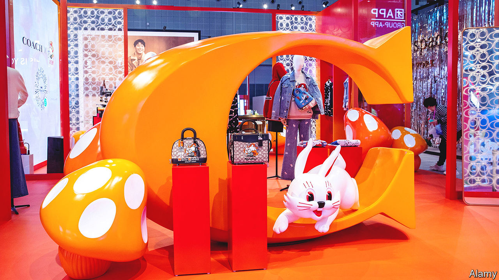

###### Bunny power

# A famous brand of Chinese sweets reinvents itself again 

##### Get your White Rabbit designer handbag while stocks last 

 

> Jun 1st 2023 

Among the self-flying planes, swanky electric cars and model space-stations on display at an exhibition of Chinese wares in Shanghai in May was a decidedly untechnical relic of the past: White Rabbit creamy candies. For many older Chinese the milky flavour recalls a Communist-era childhood when few other treats were available. 

The sweets predate the Communist Party takeover in 1949. This year they turn 80. As one of the few pre-Communist products still thriving, they have a thing or two to teach China’s new tech upstarts about longevity. 

The rabbit has reinvented itself many times, most recently in November when it teamed up with Coach, a high-end American fashion firm, to produce giant bunnies on handbags (pictured) costing up to 7,500 yuan ($1,050), as well as flouncy dresses, denim jackets and a gold White-Rabbit necklace (hopped up at 9,500 yuan). Tapping into nostalgia in the Chinese market, the collaboration gives Coach a boost in the complex warren of Chinese consumerism, while enabling White Rabbits to breed new followers across the Pacific. 

China’s first domestic toffees were produced in 1943 with Mickey Mouse on the wrapper. When such Americana fell out of favour in the 1950s, the rodent was replaced by , a big white rabbit, which gave the brand its name. The stylised blue-and-white cartoon bunny became an icon: in 1972 Zhou Enlai, then China’s prime minister, presented White Rabbits to Richard Nixon on his first visit to Communist China. Soviet leaders visiting Beijing also enjoyed such gifts.

The fortunes of the sweet soured after Mao Zedong died in 1976. As foreign goods poured in, White Rabbits lost their domestic dominance. Guan Sheng Yuan, the state-owned company that makes them, touted the treat’s nutritional properties—seven sweets were equivalent to drinking a glass of milk, according to a popular slogan—but parents became harder to lure with such claims. 

The confectionery even fell foul of China’s food-safety scandals in 2008 when thousands of children became ill drinking Chinese powdered milk contaminated with melamine, and dairy products were removed from shops at home and abroad. White Rabbits are now made using imported milk powder.

The bunnies fought back. In 2018 the first batches of White Rabbit lip balm sold out within hours. The following year the manufacturer teamed up with Godiva, a chocolate company, to make White Rabbit ice cream and people queued for hours to buy the newly launched White Rabbit milk tea at a pop-up shop in Shanghai. The company has since launched perfumes, a shower gel and hand cream. In 2021 Guan Sheng Yuan opened a shop in Shanghai selling all manner of branded products.

The sweet-maker has capitalised on the trend for , a phrase meaning “national wave”, applied to trendy Chinese-made consumer goods that appeal to the nostalgia and patriotism of the young. Liushen, a traditional mosquito repellent, collaborated with kfc to make a refreshing herbal drink for the summer. The Forbidden City in Beijing even produced a range of lipsticks named for the colours of ancient artefacts. 

White Rabbit’s collaboration with luxury brands received a boost this year from the arrival of the year of the rabbit in the Chinese zodiac. Sales in the first quarter were up by 10% year on year, according to Guan Sheng Yuan. To see in the new year, sk-II, a Japanese skincare brand, launched a limited-edition White Rabbit face serum (the bottles warned consumers: “Do not eat”). Foreign markets provide an additional carrot. The candies have diversified into a whole range of flavours, such as peanut, red-bean, mustard and durian, and are exported to more than 50 countries. That’s a whole different rabbit-hole. ■


