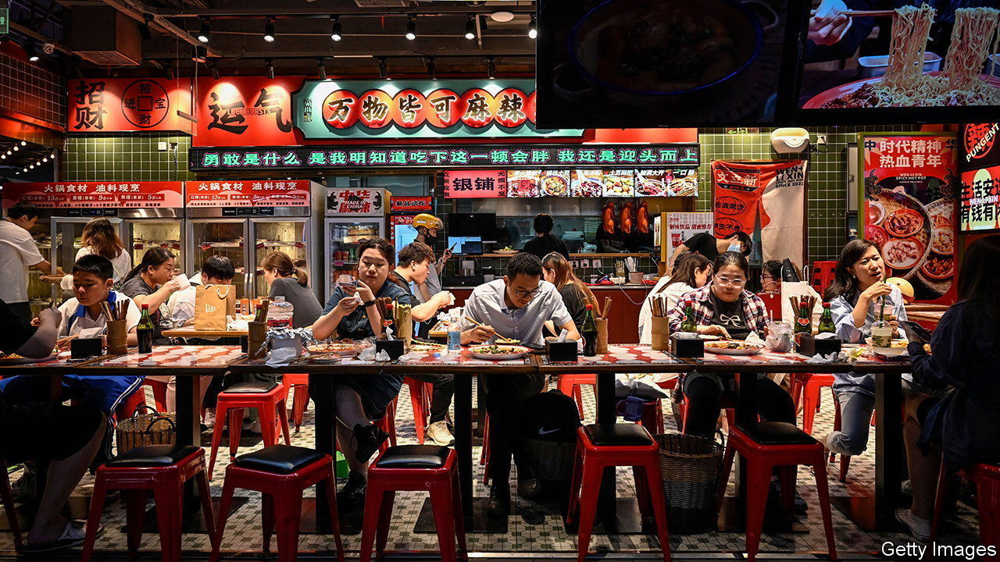

###### Surfing the second wave

# China goes from zero-covid to zero restrictions 

##### It has given up on any form of testing 

 

> Jun 1st 2023 

There can be few things as symbolic of post-zero-covid China as a photo that popped up on social media in April. It showed that one of the many mobile booths used for administering covid tests in Shanghai had been turned into a bar. A year ago hundreds of thousands of Shanghai residents were being forcibly removed from their homes and taken to fever wards on the outskirts of the city. Now they are busy sipping beer. 

It is even more striking because the virus is surging again, in the form of a new sub-variant known as xbb. Cases are expected to reach record highs of 65m a week by the end of June. Yet authorities have no plans to reimpose new restrictions. On the contrary, they are urging citizens to fill the malls and restaurants, spending money. 

China closed its borders for nearly three years and its two-month lockdown of Shanghai in 2022 seemed to promise years more isolation. But since the sudden end of the policy in December it has struggled to strike a balance between zero-covid and zero restrictions. With few rules in place, the first wave of the virus swept over the country in January, infecting perhaps a billion people. More than a million people may have died. But without a reliable tally of deaths, the state proclaimed the reopening “a miracle in human history”.

This new wave is playing out in a similar way to the January outbreaks. Office workers in Shanghai are being told to report for duty even if they have recently tested positive. Queues for bars and restaurants spill into the streets. Beaches on Hainan, a southern island, have been packed with young people looking for sun. 

Officials have cheered on the consumption binge, and retail and hospitality have done well so far this year. Pricier purchases such as new homes are, however, struggling to recover. Growth in new-home sales appears to be slowing. 

As the second wave takes hold there appear to be few efforts to vaccinate people, even the elderly. Hospitals are filling up. But natural immunity is higher this time around, so many people are just treating it as the proverbial “bad cold”. Your correspondent finally succumbed for the first time last week. When he turned down an invitation to a barbecue at the weekend, the host was not worried about the potential for infection and said it would still be fine for him to attend. ■


