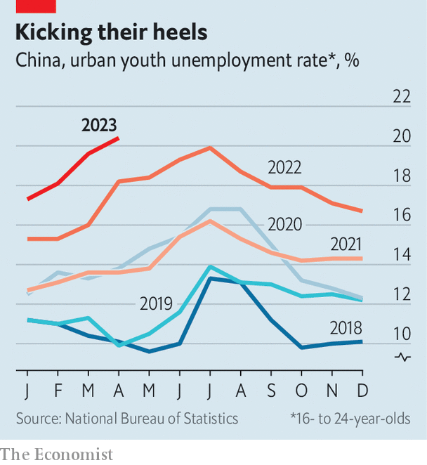

###### The job search goes on

# China’s young want to work. For the government 

##### Youth unemployment is now shockingly high 

 

> May 31st 2023 

China is a land of remarkable statistics. But an official figure published on May 16th still managed to stand out. The unemployment rate among China’s , aged between 16 and 24, exceeded one in five in April.

The figure boggles the mind for a variety of reasons. China is running short of . It is trying, without much success, to raise the birth rate. Its economic future hangs on increased education, which could improve the quality of its workers even as their quantity declines. China is also famous for mobilising resources, including manpower. Yet it is wasting large numbers of the best-educated cohort it has ever produced.

Youth unemployment is puzzling, as well as surprising. It has increased even as China’s economy has reopened after the sudden end of its zero-covid regime in December. It has jumped up while the overall unemployment rate has edged downwards (from 6.1% in April 2022 to 5.2% a year later). And it is likely to rise further in the next few months. This year, a record 11.6m students will graduate from university, an increase of almost 40% since 2019. They include Wang Lili, who will leave one of China’s top-100 universities this year with a degree in management. “The market is terrible,” she laments. “Many graduates are very anxious.” 

The number of unemployed youth (about 6.3m in the first three months of this year) is small relative to China’s 486m-strong urban workforce. But they attract most of the attention, points out Xiangrong Yu of Citigroup, a bank, and his colleagues. The anxiety and disappointment felt by college students—and spread through social media—could “affect the confidence of the entire society”, write Zhuo Xian and his co-authors at the Development Research Centre (drc), a government think-tank. 

Although the problem has outlasted the pandemic, it is partly caused by it. When covid struck, many Chinese chose to extend their studies. In 2020, for example, the Ministry of Education told universities to increase the number of Master’s students by over 20%. That has created a bulge of newly minted graduates entering the labour force in subsequent years.

 


China’s reopening may have tempted many of those who had dropped out of the job market to re-engage before firms were ready to hire them. The bottleneck has been aggravated by mismatches in timing, skills and aspirations. Some graduates delayed their job hunt last year to prepare for entrance exams for higher degrees or the civil service. But employers last year wanted to fill their ranks early because of fears of a winter covid wave. So later job-seekers missed the best recruitment months and many are now competing for the same jobs as students leaving university in 2023.

Some of them boast qualifications that are out of sync with the new demands of the economy. Platforms like Alibaba, property firms like Evergrande, and online tutors like New Oriental were once dream employers for graduates. But in the time it takes to earn a bachelor’s degree, they have lost favour with the government.

China’s leaders now fear what they call the “disorderly expansion of capital” in sectors like property and education, as well as the market power and cultural reach of tech firms. Recruitment has therefore slowed. Only 5.5% of students graduating this year expect to go into the education and training industries, according to a survey by Zhaopin, a recruitment portal. 

Some graduates now adopt a “spray and pray” approach, as Ms Wang (not her real name) puts it, submitting applications willy-nilly. The government is keen to steer talent into “hard tech” industries, such as aerospace, biotechnology and electric vehicles. They are promoted in the latest five-year plan and have grown faster than industry as a whole, says Louise Loo of Oxford Economics, a consultancy. Employment may follow. According to the recent Zhaopin survey, 57% of engineers graduating this year had already received a job offer, compared with only 41% of their counterparts in the humanities.

One of the oddities of China’s labour market is that less-educated youth are less likely to be unemployed. Youngsters with vocational qualifications or just a high-school education may have more practical skills and a more burning need for a job. “Everyone says a degree is a stepping stone,” said one hapless graduate in an online comment translated by  a media-monitoring website, “but I’m slowly coming to realise it’s more like a pedestal I can’t get down from.”

Students’ aspirations may be changing. The proportion choosing to continue their studies (at home or abroad) fell by almost half in this year’s Zhaopin survey. Students are also keen on stability and security. The share who rank state-owned enterprises (soes) as their first choice has increased for three years in a row to 47%, compared with 27% who favour a foreign-financed or domestic private firm. The remaining quarter wish to work for the government or public institutions.

The government’s response to record youth unemployment may reinforce these trends. The State Council, China’s cabinet, has urged local governments to recruit as many graduates as their budgets allow. It has also called on enterprises to create at least 1m internships for unemployed youth, in return for subsidies and tax breaks. The offer is open to all firms, but soes are most likely to heed the call. These initiatives risk drawing some of China’s better-educated minds into some of the least efficient parts of its economy. 

But for young folk, stop-gap measures do at least alleviate some of the worry and confusion. Ms Wang, for example, has combined her studies over the past two years with an internship at a foreign firm. That gave her “something to do every day”, she says, and also led to a satisfying job offer—in human resources. With luck, she will enjoy a long career helping China use those resources better. ■


