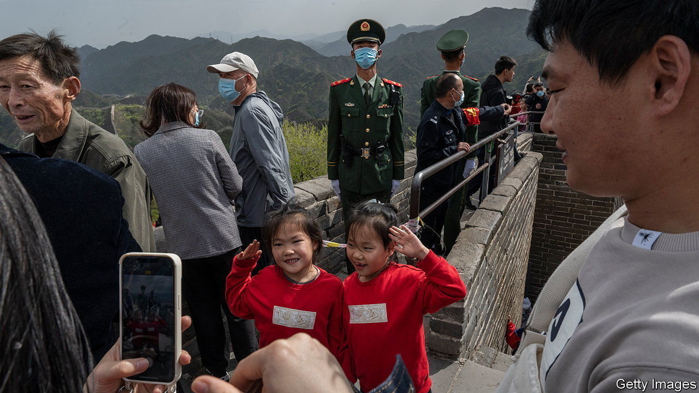
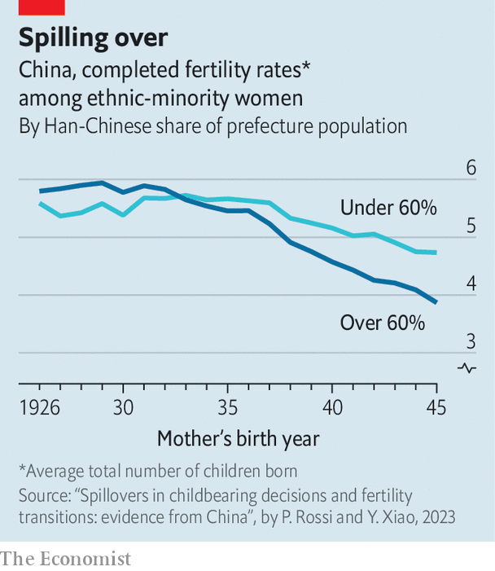

###### Stuck in the trap

# New research helps explain why China’s low birth rates are stuck 

##### Spillover effects may be to blame 

 

> Jun 1st 2023 

The scars left by China’s population-control policies are clear. Last year, its population started to fall for the first time since 1962; its working-age population has been declining for a decade. A shrinking workforce acts as a drag on growth, and a swelling number of elderly puts pressure on the welfare system. 

Family-planning regulations like the one-child policy are widely blamed for depressing birth rates. But a less explored idea is that falling birth rates can ripple through the population causing the decline to be self-reinforcing. There has been little hard evidence to back this up, but a new paper about changes in China 50 years ago appears to offer some proof. Pauline Rossi of Ecole Polytechnique in Paris and Yun Xiao of the University of Gothenburg show in the  that birth-control policies have “spillover effects”, meaning that if some couples reduce their number of children, it may lead others to follow suit. 

 


Professors Rossi and Xiao examine fertility data for women born between 1926 and 1945. This cohort was of reproductive age when the “later, longer and fewer” (llf) campaign of the 1970s, the first of China’s family-planning policies, began. It encouraged couples to marry later, wait longer between children and have fewer of them. Much of China’s fertility decline happened during this period. In 1969, the total fertility rate (the average number of children a woman is expected to have over her lifetime at current birth rates) was 6.2, according to the World Bank; a decade later, when the one-child policy was introduced, it had already fallen to 2.7.

Crucially, the llf campaign targeted only the main ethnic group, the Han. That allowed the authors to study how ethnic-minority groups, who were exempt from it, responded. After controlling for other factors, they found that the policy did not affect minorities who lived apart from the Han. For those who lived among the Han, however, it led to a decline in fertility—what the authors suggest is evidence of spillovers. The greater the share of Han in the prefecture, the stronger the effect.

Spillover effects may work in two ways. First, couples who have fewer children have more resources to invest per child. Other couples may feel compelled to emulate them if they want to compete, especially in areas such as education. A second way is through social conformity. As some couples have fewer children, this may influence others to limit the number of children they have, too. The authors found that minorities culturally closer to the Han were affected more by the llf.

China is not the only place affected by spillovers. They have been found in South Korea, too, another country with a low fertility rate and punitively expensive education. Many children there attend private tuition classes, known as , late into the evening. Seongeun Kim of Sejong University and others found that when wealthy families spent less on private classes, it led lower-income families to do the same. Spillovers may happen where people have strong economic or social incentives to keep up with others. 

For China, the implications are grim. The government has belatedly tried to prod couples into having more children, with little success. Even though the one-child policy ended in 2016 and China switched to a three-child policy in 2021, birth rates have not rebounded. The fertility rate fell to 1.2 in 2021, a record low. The high cost of having children means couples want fewer of them. Low birth rates are in turn reinforced by spillovers, leading more couples to follow suit. Without external impetus, China cannot escape this trap. 

What can be done? Theoretically, if spillovers work in reverse, getting one segment of the population to have more children could have an impact. To this end, China’s leaders have tried to crack down on private tutoring in order to slow the education arms race. They could also incentivise couples through payments or benefits for extra kids. But experience suggests that such  yield meagre results. China is finding that it was much easier to use force to restrict the number of births than it is to increase it. ■


