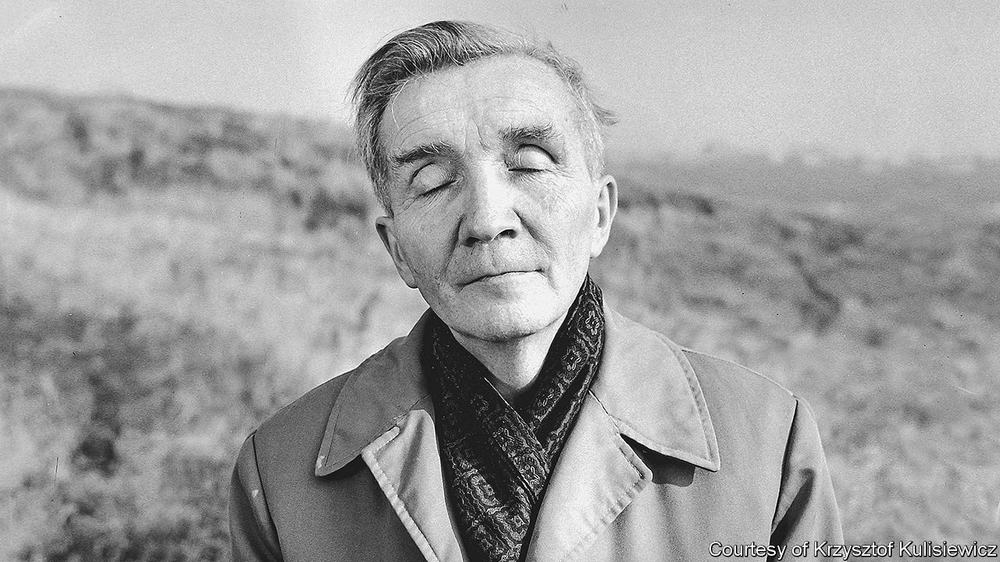
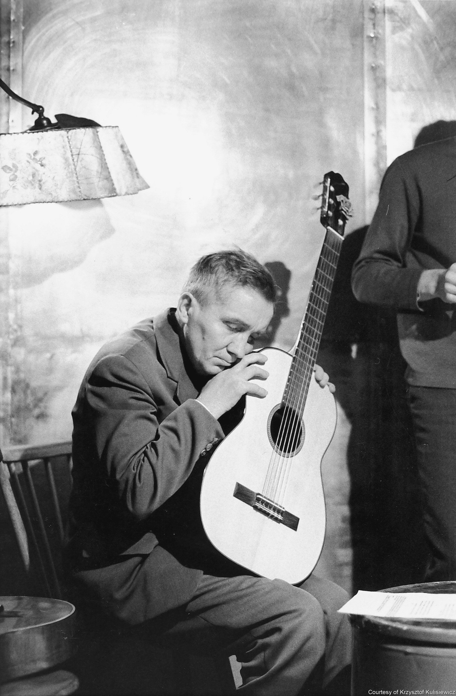

###### Culture and the Holocaust

# Aleksander Kulisiewicz preserved the music of the Nazi camps 

##### Makana Eyre tells his story in “Sing, Memory” 

 

> Jun 1st 2023 

 By Makana Eyre.  

One night in October 1942 SS guards burst into a barracks at Sachsenhausen concentration camp, savagely beating anyone within reach. Random acts of violence and murder were usual—but the gathering was not. The prisoners had formed a secret choir to perform “Jüdischer Todessang” (“Jewish death song”) by Rosebery d’Arguto, once a famous composer and conductor in Berlin, now an inmate. They began with bass notes, writes Makana Eyre, each one an “omen of death, like the footsteps of the men on their way to their demise”. It ended, unfinished, with the guards’ onslaught.

Among those watching the performance admiringly was a Polish prisoner called Aleksander Kulisiewicz (pictured). A singer and writer, Kulisiewicz had been arrested by  after Germany invaded Poland in 1939 and was sent to Sachsenhausen in May 1940. There, music would help save his life, mentally transporting him out of the horror of the camp and giving him a reason to live. He had been a wilful and precocious teenager, running away from a middle-class Catholic upbringing to perform in nightclubs. He quickly became a key figure in the camp’s rich and hidden cultural life.

Out of sight of the guards, or ignored by them, the inmates wrote, composed and performed, each act a powerful statement of resistance. Thanks to his extraordinary memory, Kulisiewicz could collect these assorted poems and compositions; he also performed himself and wrote song after song. “Notturno 1941” praises the Allied bombers flying overhead en route to Berlin. In another, he laments: “But on the barbed wire/A sad, charred body droops.”

Mr Eyre, an American journalist who lives in Paris, skilfully recounts the remarkable story of Kulisiewicz’s survival and of the archive he went on to build. He is a deft storyteller, with a limpid style, moving his characters to centre stage, aside, then back again. He weaves a compelling, well-informed narrative and illuminates the inner dynamics of the camp’s power structure. 

 


“The hierarchy of prisoners at Sachsenhausen was highly complex,” he explains. German prisoners, many of them convicts and communists, were at the top, some exerting power as wardens. Below them were fellow “Aryans”, such as Dutch and Norwegians, then eastern Europeans, and, at the bottom, Jews and Russian POWs. But the system was fluid, giving Kulisiewicz room to manoeuvre and stay alive through almost five years of incarceration. At Sachsenhausen, as at every camp, having something to barter was vital. When he needed a tiny sum to buy a stamp he asked a Czech priest for help. The priest agreed, in exchange for Kulisiewicz’s margarine ration. 

In April 1945, as the  approached, the SS guards evacuated over 30,000 prisoners from Sachsenhausen on foot. They were marched across Germany. When Danusia, a young woman prisoner known for her kindness, was unable to continue and stepped out of the column, Roland Tillard, a French prisoner who often accompanied Kulisiewicz on his accordion, moved to protect her. They were both shot and their bodies kicked into a ditch. Eventually the guards fled, frantically disposing of their uniforms. 

Kulisiewicz survived and returned to his family in Poland. There he contracted tuberculosis. He ran a high fever and seemed delirious, but a nurse realised he was reciting lyrics and poems. Over three weeks she typed out everything that he dictated from his sick bed, including the words of “Jüdischer Todessang”. 

Those notes were the start of the archive that became his life’s work. From 1945 until he died in 1982, he gathered everything he could find about art, music, poetry and theatre in the camps. Kulisiewicz’s archive was a collection of rare value, but it languished after his death. Polish and American institutions did not want it. After a temporary spell at the , it went to the United States Holocaust Memorial Museum in Washington, DC, where it is now housed—its artefacts testimony to the power of artistic creation, even as the creators died one by one.

Many of the  have been quantified: the 6m lives, the Jewish communities that vanished, the synagogues reduced, like their worshippers, to ashes. But no one can know what the dead might have created: the stories and lyrics they might have written, the plays they could have staged, the songs they would have sung. “Sing, Memory” is a moving story of courage and determination amid overwhelming loss, all the more powerful for its heartbreaking sense of what might have been. ■


