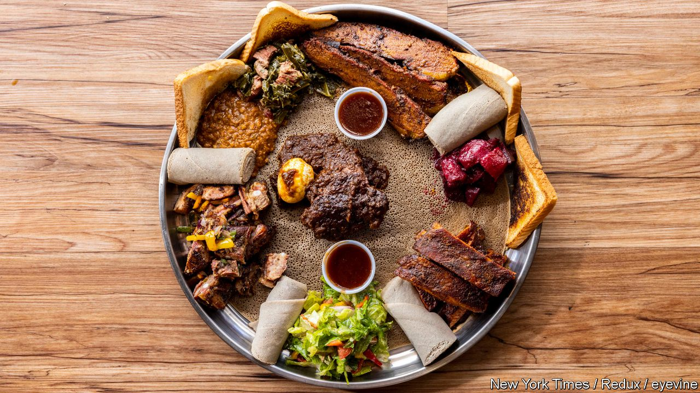

###### World in a dish

# Immigrants are changing Central Texas barbecue for the better 

##### A dispatch from the world’s first “Tex-Ethiopian smokehouse” 

 

> Jun 1st 2023 

CENTRAL TEXAS-STYLE  joints have a particular aesthetic, born of history but now veering slightly into kitsch. Restaurants are often plain, with bare wood tables and chairs, along with a few well-chosen pieces of Texas-themed decor. Meat is minimally seasoned, smoked over hardwood and served on butcher paper with almost nothing else: perhaps a few Saltines, pickles or onion slices, and tiny cups of sauce and beans.

Smoke’N Ash in Arlington breaks almost . The decor is minimal, but the flag on the wall is red, yellow and green, rather than red, white and blue with a star. Fridges containing southern desserts such as peach cobbler stand next to shelves stacked with wicker serving trays and round-bellied clay pitchers. 

Here perfectly cooked meat is maximally seasoned with a riot of warm spices; it is served with small piles of lentils, collard greens and rolled a soft and sourish Ethiopian flatbread (see picture). At the plate’s centre is a scoop of rice topped with pepper relish. The restaurant marries the backgrounds of the couple who run it: Patrick Hicks was born in Waco, about 100 miles south of Arlington; his wife Fasicka comes from Addis Ababa, Ethiopia’s capital. Their restaurant is just one example of how immigrants and first-generation Texans are changing barbecue for the better.

The first question about the Hicks’s project is why the marriage of those two cuisines, which at first seems improbable, works so well (setting aside the excellence in execution). One reason might be that they have complementary austerities. Ethiopian cuisine is , but often meatless; Central Texas barbecue is meat-centric, but in classic form seasoned with nothing more than salt and pepper. Each fills gaps in the other.

The second question is how new a phenomenon it really represents. German and Czech immigrants helped define Central Texan barbecue more than a century ago. They opened butchers’ shops, smoking their unsold meat to preserve it. Eventually their smoked meat became more popular than their fresh offerings. Mr and Mrs Hicks may have opened the world’s first “Tex-Ethiopian smokehouse”, as they call it, but they are heirs to a long and deeply American—and Texan—tradition.

Nor are they alone. At Blood Bros. BBQ in Houston, Quy Hoang and brothers Terry and Robin Wong, who grew up together in a working-class suburb, serve Texas barbecue with East and South-East Asian influences. In Austin, Valentina’s serves “Tex-Mex-BBQ”; KG BBQ, started by an Egyptian who fell in love with barbecue on a visit to America, serves ribs with pomegranate and brisket shawarma. These restaurants are not gimmicks or high-minded fusion. They represent contemporary Texas and are tributes to barbecue’s broad .

Inevitably these populations will help define , as their predecessors did. Purists may quail, but as Daniel Vaughn—who, as ’s barbecue editor, surely has the world’s best job—explains: “Variety is what’s going to keep barbecue interesting and alive.” ■


