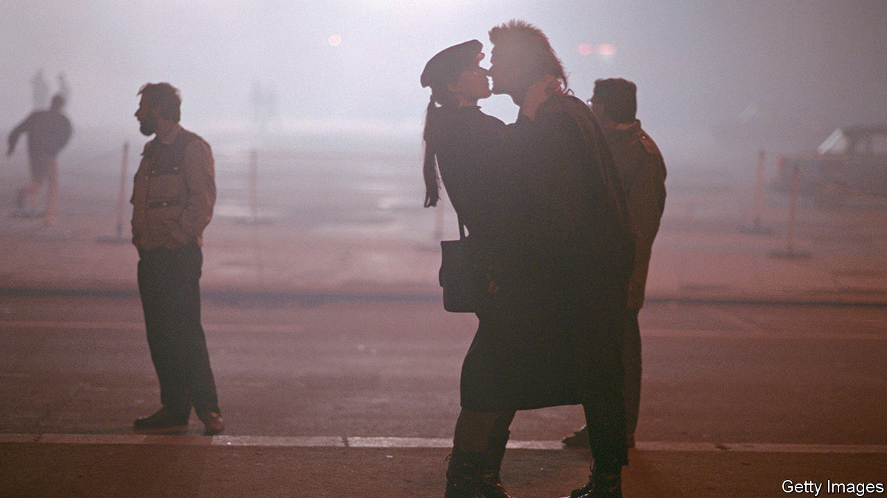

###### An affair to remember

# Jenny Erpenbeck’s new novel follows lovers in crumbling East Germany 

##### “Kairos” is a story of history both grand and intimate 

 

> Jun 1st 2023 

By Jenny Erpenbeck. Translated by Michael Hofmann.

The ancient GreekS took the word to mean “the opportune moment”; in Christian texts the term has been translated as “spiritual opportunity”. More simply, can mean “the right time”. It certainly seems that way for Hans, in his early 50s, and 19-year-old Katharina, who meet on a bus in  in July 1986. Their encounter is a  of desire and anguish. The relationship plays out momentously—and, over the course of the next four years, destructively—as the  begins to crumble. 

“Kairos” is a continuation of Jenny Erpenbeck’s series of novels about Germany over the past century. Taken together, the books constitute a supreme undertaking with parallels to Edgar Reitz’s epic television series, “Heimat”. From her first book, “Visitation” (2010), in which a lakeside summer house is witness to decades of turbulence, to the fatalistic rootlessness of “” (2014) and “” (2015), a 21st-century story of African migrants navigating the once-divided capital city, Ms Erpenbeck has proved time and again that she is a fearless, astute examiner of a country’s soul. 

Hans and Katharina conduct their clandestine relationship at a time when secrecy and paranoia is woven into the political fabric. Hans, a freelance writer and radio broadcaster, is married with a teenage son. His wife has tolerated his many affairs, but the relationship with Katharina seems a more decisive threat to their stability. 

Ms Erpenbeck was born in East Berlin in 1967 and was an apprentice bookbinder before working in theatre. The similarly aged Katharina is a state-approved trainee typesetter who seeks to move into theatre design. During an internship in Frankfurt away from Hans—a character indifferent and possessive by turns—Katharina commits a youthful transgression. Thereafter the torturous, hypocritical nature of their affair becomes ever more apparent. 

As the certainties and protection of the Soviet system begin to disintegrate, so the atmosphere of the book grows darker and more anxious. “How will creatures of the new age cope with the future, when they no longer know the foundations on which this future rests?” wonders Hans, who grew up in a family which embraced  to the end (though he, as a young man, violently rejected its depredations). Narrated alternately by Hans and Katharina in the close third person, and with a sublime translation by the great Michael Hofmann, “Kairos” powerfully examines individual as well as collective history. ■


