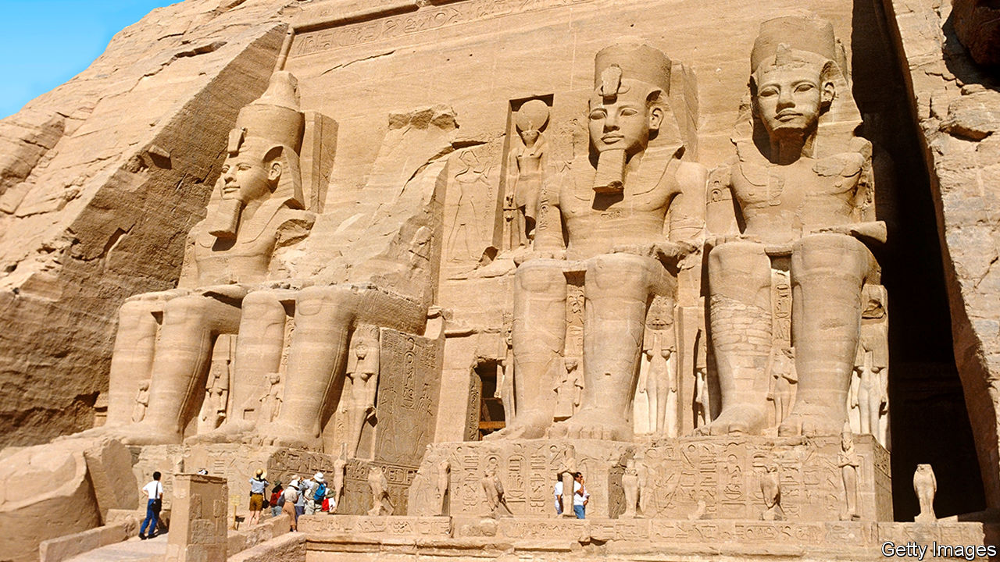

###### Look on my works

# Ramesses the Great was a superb self-promoter 

##### The Egyptian pharaoh got his title by declaring it was so, as a new biography shows 

 

> Jun 1st 2023 

 By Toby Wilkinson. 

Unlike  or , Ramesses the Great did not earn his sobriquet through feats of arms. His most famous military engagement—the battle of Kadesh in 1274BC—ended in a bloody draw. Making the best of a murky situation, his propagandists celebrated his personal courage, but they could not conceal how close he had come to disaster. Ramesses had walked into a trap set by Hittite spies, who deceived him into believing their main force was many miles away. 

If greatness is attached to Ramesses II’s name, it is in large part because he insisted on telling the world—repeatedly and on a massive scale—just how great he was. Over the course of his 66-year reign he excelled both as a builder and as a self-promoter, which amounted to much the same thing. As Toby Wilkinson,  and Egyptologist, chronicles in this compact and highly readable biography, Ramesses sought to dominate the landscape through “quantity rather than quality, durability rather than finesse”.

His efforts left an impression on both contemporaries and future generations. He not only enlarged the magnificent temples dedicated to the gods at Karnak and Luxor, but initiated vast new complexes, including the memorial temple known as the Ramesseum and the temple complex at Abu Simbel, carved deep into sandstone cliffs. Whether appropriating an earlier pharaoh’s project or initiating one of his own, Ramesses’s busy sculptors advertised their employer’s piety and achievements. They made sure he was a looming presence through enormous statues, some of which were as high as 90 feet (27 metres) tall. The ruins of one such colossus inspired , a meditation on the transience of earthly glory (whose thesis its subject would surely have rejected).

Though he was brought up to believe himself a deity, Ramesses’s bombast was not simply a matter of ego. “For all his vainglory, Ramesses seems to have been a pragmatist,” Mr Wilkinson writes. Projecting confidence was an essential part of the job and a political necessity, since neither his own subjects nor foreign rivals were inclined to reward humility. “His Majesty was a youthful master,” his poets bragged, “vigorous and without equal.”

In fact, Ramesses was probably overcompensating. It is thought that his grandfather, Ramesses I, had been a lowly stablemaster before he rose through the military ranks to become the chosen successor of Pharaoh Horemheb. Given these plebeian origins, Ramesses calculated that ostentatious displays were necessary to remind his subjects that he was not only divinely appointed, but a god incarnate.

Ramesses apparently regretted the fact that his résumé included no clear-cut military triumph—the frequency with which the battle of Kadesh was cited on his monuments suggests a nagging sense of martial potential unfulfilled. But it reflects well on his statesmanship that he managed to turn stalemate into profit, his greatest deficit contributing to his greatest success. “A peace dividend,” Mr Wilkinson observes, “would be Ramesses’s freedom to indulge in his favourite pastime, building on a grand scale.”

The author succeeds in bringing this distant age to life through telling detail and insightful analysis, though the man at the centre inevitably remains something of an enigma. Whenever he can, the author takes advantage of opportunities to peer beneath the mask. The “attention lavished by Ramesses on his chief wives suggests a genuine fondness,” he says, and offers a rare glimpse “of his true character and personality”. But, as with almost everything else in his life, this fondness also served to bolster his status, conferring a kind of immortality through the more than 100 children he sired. Even in the bedchamber it was impossible to separate personal preference from . ■


