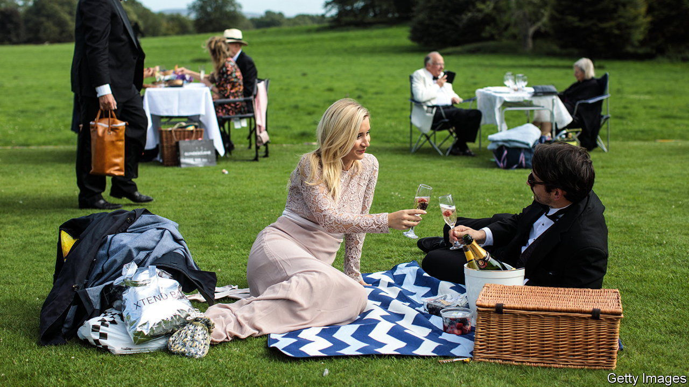

###### Back Story

# The comic opera of England 

##### Glimpsing the state of the nation at Glyndebourne, just not as you might expect 

 

> May 28th 2023 

You lug your wicker hamper across the stiletto-punctured lawn and bag a spot beside the ha-ha. You say “ha-ha” a lot because this is the only chance you get. Smoothing your frock or dinner jacket, you head inside for the opera—in this case, “L’elisir d’amore”, Donizetti’s comic delight of 1832—re-emerging at the long interval to picnic and covet your neighbour’s candelabra. Before the gong sounds for the second act, you stroll around the lily-pad-crowded lake, to a soundtrack of popping corks and the distant bleating of doomed lambs.

Held on a Tudor estate in the blissful countryside of East Sussex, the summer opera festival at Glyndebourne, which opened on May 19th, tends to be described—often by foreigners—as the epitome of Englishness. In reality, it is more of a caricature: dressing up, drinking and ogling old houses are widespread English pastimes, but black-tie opera and Pol Roger are minority pursuits. In 2023, however, Glyndebourne does indeed offer a state-of-the-nation tableau, just not in the way you might expect. 

The weather was kind on the opening weekend, so patrons didn’t need to summon the sangfroid to picnic in the rain, as occasionally they must. But a , a scourge of the times, complicated the trip. It nixed the train back to Victoria station, meaning Londoners had to petition for ticket refunds and drive. (A bank of electric-charging points has been installed in the car park, but it lacks another useful amenity: someone, perhaps a jobbing , to do up your bow tie.)

The opera-house stage, meanwhile, is a battlefield in the culture wars as well as a set for melodramas. Opera’s plots abound in  and ethnic stereotypes; left alone or revised, they are liable to upset somebody. Confessing that the “social assumptions” in some past productions “may offend audiences today”, Glyndebourne has vowed to do better. Settling into his seat, one regular dispensed with a printed synopsis as he already knew the story—that is, he groaned, unless they had changed it. Donizetti got off lightly, but the festival’s “Don Giovanni” has been accused of neutering the titular rake.

Then there is the old-fashioned politics, and recent scarcity, of money. Producing high-end opera is horribly expensive—and companies everywhere are feeling the pinch. Audiences are ageing. In America, philanthropy is erratic. In Britain,  has been slashed, leading Glyndebourne to cancel its usual autumn tour (it will instead put on some affordable shows at its home base). The glorious summer festival receives no subsidy, but tickets are pricey and go mostly to paid-up members. It will be sad if what, at its best, is the supreme art form is ever more a preserve of the rich. 

Enjoying this European art in an English idyll, it is natural, too, to reflect on the underlying bonds. Glyndebourne’s story marries English eccentricity with continental talent: founding it with his wife in 1934, John Christie, then the estate’s master, drafted in starry refugees from Germany and Austria to give it some oomph. Gus Christie, his grandson and the current boss, has worried publicly about the impact of Brexit on the economy and the opera’s finances.

As it happens, the plot of “L’elisir d’amore” features a huckster who peddles a bogus cure for all known ailments, intending, like a cynical politician, to be off the stage before he is rumbled. In his case the panacea is a potion that his marks are soon guzzling and slathering on themselves. One of them is Nemorino, sung here by Matteo Desole, a peasant in love with a landowner (he is bailed out by a rich uncle).

Mr Desole nailed “Una furtiva lagrima”, the work’s best-known number. Nardus Williams shone as his sassy beloved, Adina. Maxime Nourissat did a hilarious silent turn as the quack’s sidekick. Especially in a scene of tipsy womenfolk, the choreography was droll. As usual, the acting was strong. 

Still, as he often did,  got it right about Glyndebourne. “That something so enchanting could happen in England at all,” the Russian-British thinker wrote in 1984, was “a source of lasting astonishment and delight.” He loved it, in other words, not because it was typical, but because it was exceptional. The true quintessence of England in summer does not recline in Glyndebourne’s gardens (“Please do not picnic on the croquet lawn”); rather it basks on pebbly beaches and pub pavements where the English get sozzled and sunburnt on balmy afternoons.■


