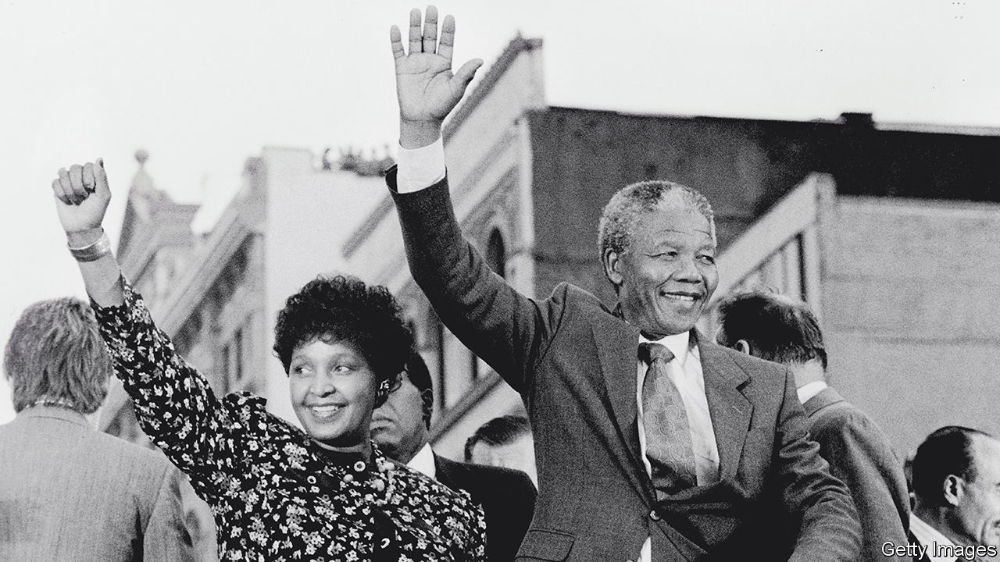

###### South Africa after apartheid

# Winnie Madikizela-Mandela has been subject to historical revisionism 

##### South Africa would have been worse off had she influenced the transition to democracy, as a new book shows 

 

> Jun 1st 2023 

By Jonny Steinberg. 

THE END OF minority white rule in South Africa three decades ago prompted worldwide celebrations. Multiracial politics led to the election in 1994 of , the country’s first black president. He became a beacon of liberal democracy and, for some, the triumph of Africans over a form of colonial rule. For most, there was relief that a civil war, a widely feared prospect, had been avoided. 

It was a joyful period, though not a peaceful one. In the four years after Mandela walked out of Victor Verster prison in 1990, ethnic and political violence took some 15,000 lives, mostly in poor townships outside big cities. (Much of it was stirred up by apartheid agents.) Still, the violence was contained: apartheid had been negotiated out of existence with a stutter, not brought to collapse in a dreadful bang.

How do historians explain that mostly successful outcome? Many, including Jonny Steinberg, a South African author, rightly focus on the wisdom of leaders. In “Winnie and Nelson” he has produced a revealing new study of two of the main personalities of the era. 

Mandela had long feared the sort of violence that Algeria suffered during and after its anti-colonial war of liberation. Among the white rulers it was the last apartheid president, , who offered a path to talks. De Klerk made a concession by unilaterally unbanning the African National Congress. The ANC suspended its armed struggle. The men shared the Nobel peace prize in 1993.

A rival explanation, however, has  in the past decade or so. As Mr Steinberg writes, “the standard story of what had happened when apartheid ended” is angrily disputed. Many of the “born frees”—young people who have no direct memory of apartheid—deny the transition counts as a happy miracle or the shared achievement of humane leaders. Instead, it was a stitch-up: no wonder whites venerate Mandela, they say, for they led him to do their bidding. 

According to this line of argument, when Mandela took office, aged 75, he was enfeebled after nearly three decades in prison, vain and anxious to strike a deal before he died. He won political power for the majority, but only with his hands tied. He failed to achieve a transfer of economic power. Today white people account for just 8% of the country’s population but still retain much wealth. (To take just one measure: over 70% of farmland today is estimated to remain in white hands.) In this telling Mandela had become a “dummy adversary”, as whites dictated the outcome. 

There is little sense to this argument, even if many who are disaffected now voice it. To take it seriously requires imagining that some alternative transition of power might have been possible, at least without tipping the country into that much-feared civil war. Could, for example, , Mandela’s charismatic second wife and a militant, uncompromising and belligerent figure, have done more to shape the handover of power? This is one question that lurks behind the powerful narrative Mr Steinberg tells of her and her husband’s life. 

Among some young populists in South Africa today, Winnie (, almost five years after Mandela) is admired because of her perceived ruthlessness. She was willing to threaten and use violence long after her husband had turned against those methods. A woman who talked of the power that comes from being feared, she called for revolution into old age. As Mr Steinberg writes, she has become a “sentinel” for the idea that somehow the transition is incomplete. The likes of Julius Malema and his party, the Economic Freedom Fighters, often laud Winnie and call for the revolution to be completed.

Yet Winnie was never really in a position to influence the transition. As Mr Steinberg shows, she barely survived decades of abuse and repression at the hands of apartheid security agents. (She was exiled within the country, kept under house arrest and tortured.) For many, her reputation was shattered after a trial in 1991, when she was convicted of kidnapping and being an accessory to the assault of a 14-year-old boy, Stompie Moeketsi, who was murdered by a close associate.

In fact, as Mr Steinberg sets out in his study of the Mandelas’ marriage, she was badly broken long before that. He takes care to avoid assessing her as simply a monster—instead he describes her remarkable strength in the “norms she transgressed” and says that she was “the most singular, the most astonishing woman”. He draws on letters between jailed husband and wife, diaries, contemporary interviews and long, revealing transcripts and notes made for years by informants and spies who had bugged both their prison cells and homes. 

The picture that he sketches is a damning one. Yes, early on she was brave, flamboyant, wonderfully theatrical and able to deploy her beauty to generate global attention for the ANC’s cause. But as the years passed, and the police detained or killed those whom she relied on, she grew pitiless, depressed and dependent on alcohol. 

Nor was she trusted by her own side. Security police were able to introduce informants into her household, in some cases as lovers, for many years. So isolated was she that she persisted with at least one affair even after the man was exposed as a police agent. By the 1980s, in Soweto, she in effect presided over a gang, the Mandela United Football Club, that deployed rape, beatings and murder to assert its power.

Winnie was ultimately a tragic and undisciplined figure. Mr Steinberg’s book includes many details about her private life not widely published before. Despite his repeated efforts to show sympathy for a person who was cruelly victimised, the main impression of his book is that South African democracy was lucky that she was marginalised. Thank goodness that she, and thuggish people around her, were unable to influence the transition more. As imperfect as the results in South Africa may be, they are much better than any likely alternative. For that, it is Mandela—and the wise and humane people round him—the world still has to thank. ■


