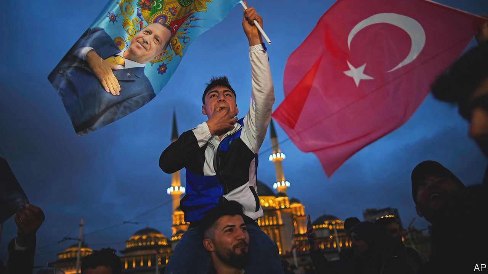
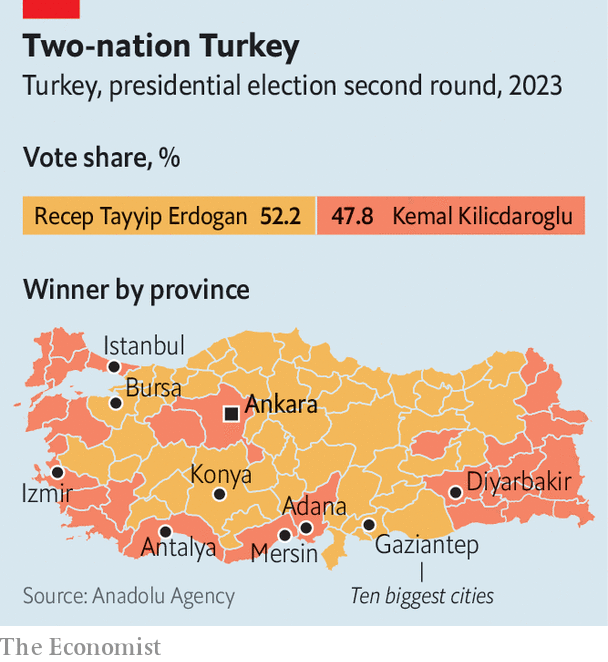

###### Five more years

# Recep Tayyip Erdogan is re-elected as Turkey’s president 

##### The best chance in a decade to repair its democracy is lost 

 

> May 28th 2023 

In Sekeroba, a village on the outskirts of the Nur Mountains in southern Turkey, a woman stood outside the rubble of her former house and waved a Turkish flag mounted on a long metal bar. “We love him,” she said, referring to Recep Tayyip Erdogan, the country’s longtime leader. “For the call to prayer, for our homes, and for our headscarves.” Cars screamed past, honking approvingly. A group of men fired shotgun rounds in the air.

Scenes like this played out across Turkey on the evening of May 28th after Mr Erdogan scored a convincing victory in the  of the country’s presidential elections. But the backdrop to the celebrations in Sekeroba was different from most. Less than four months ago, powerful earthquakes ripped through the village. Almost 180 people died. Rescue teams never showed up, though food and supplies began arriving within days. People tried to pry the wounded from the rubble with their bare hands. As in many places across the south, where the quakes claimed more than 50,000 lives, the botched response to them made no dent in support for Mr Erdogan. Turkey’s leader took 82% of the vote in Turkoglu, the district to which Sekeroba belongs, four percentage points better than five years ago. 

Nationwide, his performance was not as impressive, but it was enough to earn him a third term as president. Turkey’s leader got 52.2% of the vote, compared with 47.8% for his challenger, Kemal Kilicdaroglu. Having governed the country for 20 years, as prime minister and then as president, Mr Erdogan will now be able to do so for another five, perhaps more. 

Turkey’s opposition had the best shot in a generation of unseating Mr Erdogan. Six opposition parties had settled on a comprehensive reform programme and on a joint presidential candidate. The economy had been  that exceeded 86% last year, largely the result of a disastrous monetary policy that set low interest rates in the bizarre belief that this would bring prices down. The February earthquakes exposed shoddy building methods and a lack of preparedness.

A moment missed

But the opposition came up short, both in elections to parliament on May 14th, where Mr Erdogan’s coalition retained its majority in the assembly, and in the presidential runoff. Turkey’s strongman won by depicting the opposition as a threat to Turkish culture and national security. He used the backing Mr Kilicdaroglu received from the country’s main Kurdish party to accuse his opponent of teaming up with the  (PKK), an armed separatist group. 

Many analysts had expected the economy to be Mr Erdogan’s undoing. But in places like Sekeroba people compare their economic situation today with that of two decades ago, not that of two years ago. “Before 2002, we didn’t have a single cobblestone street here,” says the village headman, Seyfettin Bolat. “There’s inflation, but at least we’re not hungry like we were then.” The streets are paved. Those torn apart by the earthquake have been repaired. Sekeroba boasts its own sports complex. Those displaced by the quake, now living in containers or tents, are expecting to move into one of the nearly 700 homes the government is building nearby. Most people say they trust only one man, Mr Erdogan, with their votes, and with the earthquake recovery effort. 

 


Party allegiances die hard in Turkey, and identity politics trumps inflation. Mr Erdogan’s performance in the second round was a mere 0.4% worse than his performance in 2018, and a 0.4% improvement on 2014. Divisions are increasingly entrenched: between bigger cities, where support for Mr Kilicdaroglu is higher, and the countryside, which votes mostly for Mr Erdogan; between secular and religious; and between the country’s western coast and the Anatolian interior (see map). 

A chance to  and its economy has been lost. The opposition promised to dismantle Mr Erdogan’s executive presidency, a blueprint for one-man rule; to release at least some of Turkey’s political prisoners; and to hand back power to nominally independent state institutions, and to parliament. Mr Erdogan has no such plans. He has already ruled out releasing Selahattin Demirtas, the former leader of the pro-Kurdish HDP party, who has languished in prison since 2016 on trumped-up terror charges. “Such a thing is not possible under our government,” he told supporters during a victory speech on May 28th. Part of the crowd responded by calling for Mr Demirtas’s execution. 

Of the powers Turkey’s president retains, none has been more advantageous to his own political interests and more harmful to the health of his country’s economy than his control over the central bank. By bringing interest rates down way below the rate of inflation, Mr Erdogan has offered borrowers free money and continued to prop up growth, which reached 4% year-on-year in the three months to March. By burning through billions of dollars each week to defend the exchange rate, the bank helped Mr Erdogan avert a currency crisis ahead of elections. 

The bill for such policies is starting to come due. The bank’s net foreign reserves are now negative for the first time since 2002. Including swaps with local lenders and foreign countries, they are estimated to be over $70bn in the red. With elections out of the way and its coffers depleted, the bank’s defence of the lira appears to have slowed. In the three days since Mr Erdogan’s victory, the currency has lost nearly 4% of its dollar value. Unless Turkey’s leader reverses course, the currency will continue to plunge.

Mr Erdogan may have realised that his policies cannot be sustained. As  went to press, rumours swirled that he would appoint Mehmet Simsek, a voice of economic orthodoxy and one of the architects of Turkey’s boom in the 2000s, to a senior post in his new cabinet. Foreign investors have seen this movie many times. Mr Erdogan has appointed market-friendly names to top jobs before, only to defenestrate them as soon as economic reforms get in the way of political interests. Local elections are scheduled for next March. Even if he is appointed to a top job, Mr Simsek may not last very long. ■

