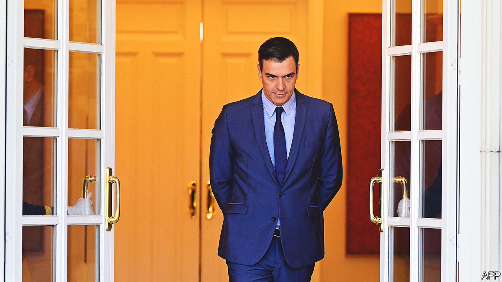

###### Going for broke

# Spain’s prime minister gambles on a snap general election 

##### After his drubbing in local polls, momentum is firmly with the conservative opposition 

 

> May 29th 2023 

PEDRO SÁNCHEZ is no stranger to comebacks. Ejected as leader of his Socialist party in 2016, he toured the country to build support and regained control the next year. And he is no rookie gambler; a motion of no confidence he called as leader of the opposition, in 2018, installed him as a surprise prime minister. Nor is he a bad political horse-wrangler. After elections in 2019, he assembled an awkward minority government with the radical-left Podemos party that has held together since then.

All these qualities are now on display as Mr Sánchez makes another gamble. On May 29th he announced snap elections for July 23rd, after his party had suffered heavy reverses in regional and municipal elections a day earlier. The conservative opposition People’s Party (PP) not only won the regions of Valencia (a former bastion it had lost) and Aragón (an even harder target). It even won in the south-western region of Extremadura, held by the Socialists almost continuously since democracy was restored in Spain in 1978 after the death of Francisco Franco. Other regions and symbolic cities also swung from left to right. 

Alberto Núñez Feijóo, the PP’s leader, has pursued a course of moderation in tone and in policy. He has profited from the final demise of Ciudadanos, a liberal centre-right party which went into a death spiral after its decision, in 2019, not to go into government with Mr Sánchez. The PP seems to have scooped up all its voters, explaining its big gains. But it would still need the support of the hard-right Vox party, which emerged in the last electoral cycle, to govern in most of the regions where it has overtaken the Socialists. To avoid that, Mr Feijóo has offered Mr Sánchez a deal under which whatever party has come top in each region should be allowed to govern, even if it lacks a majority, in order to shut out the extremist parties from a share in power. But it seems Mr Sánchez would rather force the PP to govern with Vox, and so paint July’s elections as a referendum on the rise of the hard right.

Mr Sánchez has his own problem. His coalition partner, Podemos, was pummelled and now needs to team up with Sumar, a new leftist group, or risk more of the same. After the weekend’s elections, the momentum is solidly with the right. Mr Sánchez has little time to discover another talent: that of a general rewriting his strategy while already fighting. He has given himself only eight weeks to do it. ■

