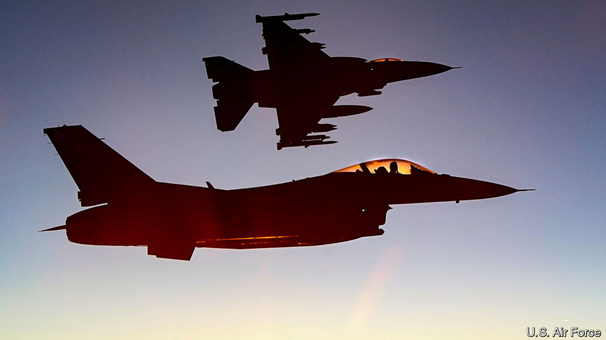

###### Better late than never

# Ukraine gets its F-16s 

##### The political backing may matter even more than the elderly fighter jets 

 

> Jun 1st 2023 

THE FIRST batch of the  that Ukraine is preparing to receive is expected to arrive in late September—too late to play a role in the counter-offensive that could begin at any moment. However, the decision, made by Joe Biden just before the  in Hiroshima in May, still has immediate significance. 

The Ukrainians  for Western fighter jets almost from the day of Russia’s invasion. But the answer from the Pentagon, which can block other F-16 user countries from supplying the American-made aircraft, was always negative. The reasons given were of two sorts. The first set were supposedly practical. It would take 18 months to train Ukrainian pilots and ground crew to fly and maintain aircraft as sophisticated and unfamiliar as the F-16. Ukrainian runways were not of a high enough standard. The cost would be prohibitive. Ukraine, so the chairman of America’s Joint Chiefs of Staff, General Mark Milley, patronisingly averred, should focus on other priorities. 

The second set of reasons involved worries that Russia would regard such a move as an escalation, an excuse that had also been used to delay providing Ukraine with long-range weapons (such as ) and with tanks. The fear of escalation was always the main consideration, but it was both contradictory to the first, and specious. If the F-16s would not do much to enhance Ukraine’s capabilities, why would they concern the Russians? And anyway, what was the Russian response likely to be? Giving the Ukrainians an aircraft that first entered service nearly 50 years ago was hardly likely to push Vladimir Putin into taking the catastrophic step of using nuclear weapons. 

Two things changed the American position. The first was growing pressure from allies. The British were particularly hawkish and the Dutch announced they were forming a coalition to get the F-16s to Ukraine and would start training its pilots. The second was a shift in war aims within the administration, moving from ensuring that Russia could not defeat Ukraine to backing a Ukrainian victory. It is this that should worry the Kremlin even more than the arrival of the F-16s themselves. 

Whether the jets really are the game-changer that the Ukrainians appear to believe is questionable. There is no doubt that if Ukraine gets 40 to 60 F-16s they will provide real capability benefits. The version of the F-16 it will receive is known as the Mid-Life Update (MLU), which has been operated by several European air forces for the past 25 years. Among the MLU upgrades are a data link that will enable Ukraine’s aircraft to combine with NATO’s ground-based air-defence radars, such as the Patriot. This will improve effectiveness against Russian cruise missiles, and generally help defend Ukraine’s airspace better than its diminishing fleet of Soviet-era MiG-29s, Su-27s and Su-24s. Unlike those planes, the F-16 can carry the full suite of air-to-air and air-to-ground missiles used by America and its allies.

But those expecting the F-16s to provide a quick ticket to air superiority may be disappointed. In the first place, any fourth-generation fighter that lacks stealth characteristics will be highly vulnerable to Russia’s fearsome S-400 surface-to-air missiles, one reason why within NATO all such aircraft are being phased out in favour of fifth-generation F-35s. Another is the obsolescent AN/AG66 pulse-Doppler radar of the F-16 MLU, which cannot match either the range or target acquisition of the radars carried by later versions of Russian Su-35s and MiG-31s.

At least one problem previously cited as a reason for holding back the F-16s has not gone away. Ukrainian pilots, we now know, can be trained in four months, while contract ground crews can keep the planes flying. But with gaping air intakes that suck up debris, the F-16s will struggle to take off from rough or damaged runways.

It is what the F-16s represent in terms of Western commitment, as much as what they can contribute to the war effort, that matters. They will help Ukraine win, but they are not the that many are fervently hoping for. ■


