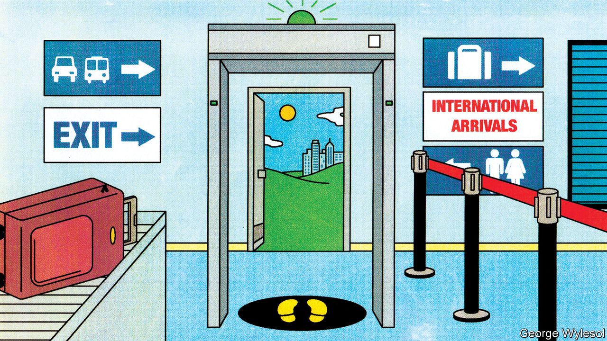
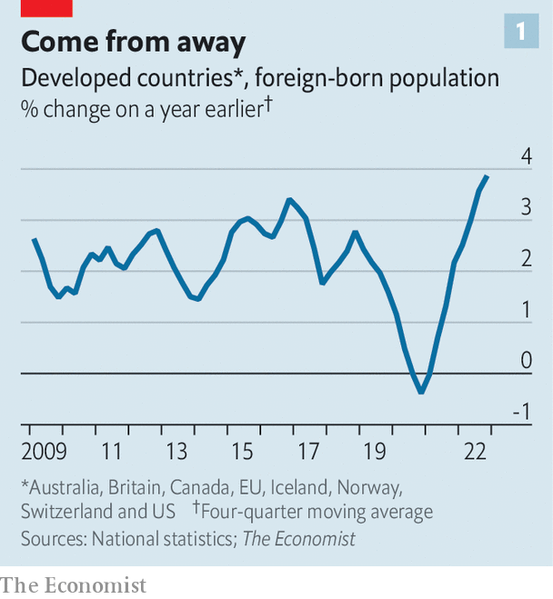
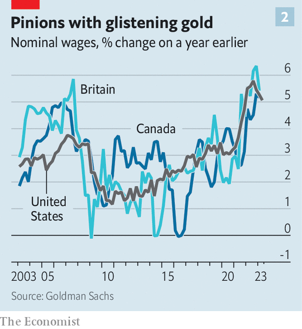

###### Exodus

# A new wave of mass migration has begun 

##### What does it mean for rich-world economies? 

 

> May 28th 2023 

Last year 1.2m people —almost certainly the most ever. Net migration (ie, immigrants minus emigrants) to Australia is twice the rate before covid-19. Spain’s equivalent figure recently hit an all-time high. Nearly 1.4m people on net are expected to  this year, one-third more than before the pandemic. In 2022 net migration to Canada was more than double the previous record and in Germany it was even higher than during the “migration crisis” of 2015. 

 


The rich world is in the middle of an immigration boom, with its foreign-born population rising faster than at any point in history (see chart 1). What does this mean for the global economy? 

Not long ago it seemed as if many wealthy countries had turned decisively against mass migration. In 2016 Britons voted for Brexit and then Americans for Donald Trump, political projects with strong anti-migrant streaks. In the global wave of populism that followed, politicians from Australia to Hungary promised to crack down on migration. Then covid closed borders. Migration came to a standstill, or even went into reverse, as people decided to return home. Between 2019 and 2021 the populations of Kuwait and Singapore, countries that typically receive lots of migrants, fell by 4%. In 2021 the number of emigrants from Australia exceeded the number of immigrants to the country for the first time since the 1940s.

The surge in migration has brought back a sense of normality to some places.  recently returned to its pre-pandemic level. In other places it feels like a drastic change. Consider Newfoundland and Labrador, Canada’s second-smallest province by population. Long home to people of Irish-Catholic descent—with accents to match—net migration to the province is running at more than 20 times the pre-pandemic norm. St John’s, the capital, feels more like Toronto every time you visit. Heart’s Delight, a small rural settlement, now has a Ukrainian bakery, Borsch. The provincial government is setting up an office in Bangalore to help recruit nurses. 

The new arrivals in Newfoundland are a microcosm of those elsewhere in the rich world. Many hundreds of Ukrainians have arrived on the island—a tiny share of the millions who have left the country since Russia invaded. Indians and Nigerians also appear to be on the move in large numbers. Many speak English. And many already have family connections in richer countries, in particular Britain and Canada. 

Some of the surge in migration is because people are making up for lost time. Many migrants acquired visas in 2020 or 2021, but only made the trip once covid restrictions loosened. Yet the rich world’s foreign-born population—at well over 100m—is now above its pre-crisis trend, suggesting something else is going on. 

The nature of the post-pandemic economy is a big part of the explanation. Unemployment in the rich world, at 4.8%, has not been so low in decades. Bosses are desperate for staff, with vacancies near an all-time high. People from abroad thus have good reason to travel. Currency movements may be another factor. A British pound buys more than 100 Indian rupees, compared with 90 in 2019. Since the beginning of 2021 the average emerging-market currency has depreciated by about 4% against the dollar. This enables migrants to send more money home than before. 

Many governments are also trying to attract more people. Canada has a target to welcome 1.5m new residents in 2023-25. Germany and India recently signed an agreement to allow more Indians to work and study in Germany. Australia is increasing the time period some students can work for after graduating from two to four years. Britain has welcomed Hong Kongers fleeing Chinese oppression—well over 100,000 have arrived. Many countries have made it easy for Ukrainians to enter. Even those countries hitherto hostile to migration, including Japan and South Korea, are now looking more favourably on outsiders as they seek to counteract the impact of ageing populations.

 


Economies that welcome lots of migrants tend to benefit in the long run. Just look at America. Foreign folk bring new ideas with them. In America immigrants are about 80% likelier than native-born folk to found a firm, according to a recent paper by Pierre Azoulay of the Massachusetts Institute of Technology and colleagues. Research suggests that migrants help to build trading and investment links between their home country and the receiving one. A slug of young workers also helps generate more tax revenue. 

Some economists hope that the wave of migration will have more immediate benefits. “High immigration is helpful for the Fed as it tries to cool down the labour market and slow down inflation,” says Torsten Slok of Apollo Global Management, an asset manager, expressing a common view. Such arguments may be a little too optimistic. Having more people does increase the supply of labour, which, all else being equal, reduces wage growth. But the effect is pretty small. There is little sign that the countries receiving the most migrants have the loosest labour markets. In Canada, for instance, pay is still rising by about 5% year on year (see chart 2). 

Your people shall be my people

Migrants also lift demand for goods and services, which can raise inflation. In Britain new arrivals appear to be pushing up rents in London, which already had a constrained supply of housing. A similar effect is apparent in Australia. Estimates by Goldman Sachs, a bank, imply that Australia’s current annualised net migration rate of 500,000 people is raising rents by around 5%. Higher rents feed into a higher overall consumer-price index. Demand from migrants may also explain why, despite higher mortgage rates, house prices in many rich countries have not fallen by much. 

Over the next year or so migration may come down a bit. The post-pandemic “catch-up” will end; rich-world labour markets are slowly loosening. In the very long term, a global slump in fertility rates means there may be a . Yet there is reason to believe that high levels of new arrivals will remain raised for some time. More welcoming government policy is one factor. And migration today begets migration tomorrow, as new arrivals bring over children and partners. Before long the rich world’s anti-immigrant turn of the late 2010s will seem like an aberration. ■


