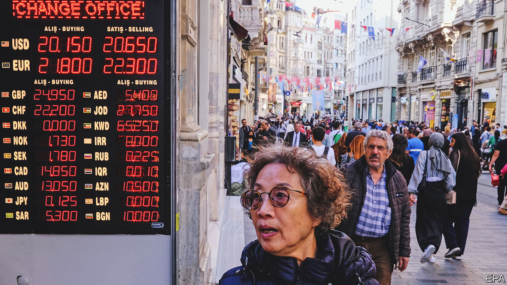
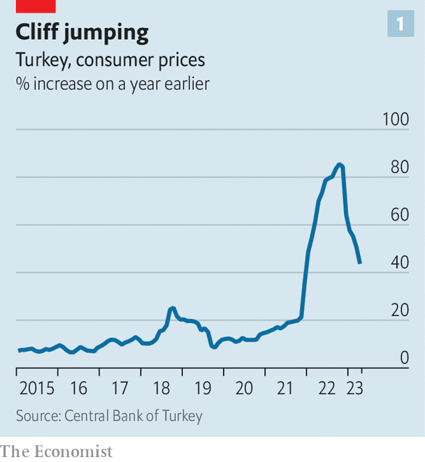

###### Monetary madness

# Turkey’s bizarre economic experiment enters a new phase 

##### How long can Recep Tayyip Erdogan hold out? 

 

> Jun 1st 2023 

It was supposed to bring respite. Instead, Turkey’s election, which surprised investors by re-anointing Recep Tayyip Erdogan as president on May 28th, has deepened the country’s economic malaise. In the past fortnight the lira has lost 5% of its value against the dollar, falling to a rate of 21 to one. Some economists think it could hit 30 by the year’s end, despite the government’s attempts to prop it up. The central bank’s net foreign-exchange reserves are now in the red, having been depleted as savers and investors flee the currency. 

 


Such difficulties are symptoms of eccentric monetary policy. In 2021, facing inflationary pressure that caused central banks everywhere to raise interest rates, Turkey cut them. Believing that low rates lower inflation—the opposite of economic orthodoxy—Mr Erdogan has repeatedly strong-armed Turkey’s central bank to slash its policy rate. Indeed, the overnight policy rate now stands at a cool 8.5%. According to official figures, annual inflation hit 86% in 2022 (see chart 1). 

Inflation has since softened—either to 44%, according to official estimates, or to something higher, according to independent ones. Mr Erdogan’s lackeys boast he was right all along. In fact, inflation has dropped because of a fall in energy prices, central-bank intervention in currency markets and “base effects”, where past price rises lift the base from which inflation is calculated. Regardless, Mr Erdogan looks likely to continue with his policy, at least for a time. In his victory speech he maintained that, alongside looser monetary policy, “inflation will also fall”. 

Mr Erdogan is right about something, however. Inflation in Turkey is a puzzle for economists, even if not in the way he suggests. The persistence of low interest rates and high inflation suggests Turkey’s real interest rate has been deeply negative for some time. This ought to become rapidly unsustainable, since it enables speculators to profit handsomely by borrowing in lira and investing in stable assets such as housing or other currencies, further depreciating the lira and turbocharging inflation. How, then, have real interest rates stayed negative for so long? And what does it mean for the future path of inflation? 

Fishing for answers

To start, one must first understand Mr Erdogan’s approach. This was best articulated in 2018, when Cemil Ertem, an adviser, provided an outline, referring to an equation baked into many economic models and named after Iriving Fisher, a pioneering economist. The “Fisher equation” states that the nominal interest rate is a sum of the real interest rate and the expected rate of inflation. Most economists believe the real rate is determined by factors, such as the long-term growth rate, over which policymakers have little sway. A lower nominal rate should, at least according to Mr Ertem’s interpretation, reduce inflation. Mr Ertem argued that this would happen if firms passed on lower borrowing costs to consumers as lower prices.

Yet when the theory was put to the test in late 2021, Mr Erdogan was proved wrong. After all, inflation continued to rise. The problem was that the other channels through which interest rates affect inflation dominated the cost channel by which Mr Ertem expected inflation to be reduced, says Selva Demiralp of Koc University. 

This still leaves the mystery of Turkey’s persistent deeply negative real interest rate. But it starts to unravel when other types of real rates, which have not been as negative, are considered. As Emre Peker of the Eurasia Group, a consultancy, argues, “the [policy] rate has become irrelevant.” 

In some cases, interest rates are distorted by government policy. In the commercial sector, for instance, banks are told not to lend above a certain interest rate. The result is that they simply avoid making most loans. Only favoured industries, such as construction, receive credit. Turkey has also required banks to hold bonds against foreign-exchange deposits, in effect subsidising state borrowing. 

 


In the sectors where interest rates are less distorted, though, nominal interest rates have moved in the opposite direction to the policy rate (see chart 2). Since investors do not believe the central bank will act to stop inflation in the future, inflation expectations have risen. This has fed into higher consumer-lending rates, especially for longer-term loans, because investors demand a higher return the lower the purchasing power they expect the lira to hold in the future. Therefore judged by consumer-loan rates, real interest rates may not be all that negative.

Similarly, returns on other assets are much higher than the central bank’s policy rate suggests. This is causing firms, households and investors to flee the currency. The government wants to support the lira, but there is only so much it can do. Your correspondent was blessed with many thanks when—short of time—he paid for a taxi in Istanbul using dollars at the market exchange rate, rather than the less generous black-market one. Suppliers are taking matters into their own hands, pricing items in dollars, points out Bekir, a shop owner in Istanbul’s Grand Bazaar. Assets other than foreign currencies are also attracting investment, as parties scramble to protect their savings. Ms Demiralp notes there are, for instance, “long lines outside car dealerships”. House prices have grown at triple the rate of official inflation. Some speculate about the potential for an attack on the lira from foreign investors.

The government has tried to stem currency flight. Exporting firms must sell 40% of their foreign currency revenues to the central bank. In late 2021 the government introduced a scheme whereby some lira deposits are protected against depreciation. In an extremely costly and not entirely sustainable situation, almost a quarter of all deposits are now covered. 

What, then, to make of the Fisher equation? Short-term policy rates have been quite negative, but they are much less relevant for borrowing, since market rates have either risen owing to higher inflation expectations, or credit has been rationed. In other areas the result has been a dash from the lira, prompting use of soft capital controls. If Mr Erdogan were to hold down market interest rates across the board, the result might well be hyperinflation.

Some economists think Mr Erdogan, armed with victory and facing a brewing currency crisis, may soften his approach. Turkey will have some economic respite over the summer, when energy consumption will fall and tourism revenue rise. Mr Erdogan has been able to keep the lira afloat thanks to one-off foreign-exchange agreements with friends including Russia and Saudi Arabia. Yet come autumn he may have to let up on his promise to continue the low-rate policy, perhaps via indirect means like softening limits on commercial-lending rates. Warm weather and friendly favours do not last for ever. ■


