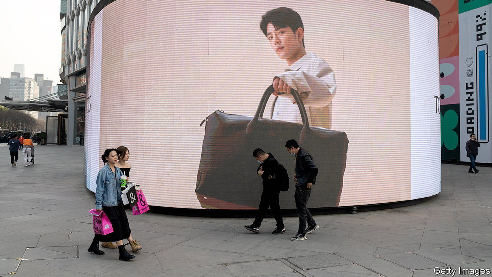
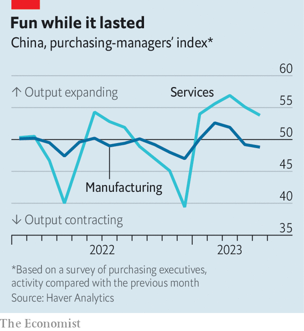

###### Tiny toolbox

# Why China’s government might struggle to revive its economy 

##### Low inflation should make things easier. But officials have other concerns 

 

> Jun 1st 2023 

China’s post-covid recovery was supposed to be world-shaking. Instead, it looks merely shaky. After the initial release of pent-up demand, economic data for April fell short of expectations. In response China’s stocks faltered, yields on government bonds fell and the currency declined. The country’s trade-weighted exchange rate is now as weak as it was in November, when officials were locking down cities. 

Will the data for May look better? On the last day of the month the National Bureau of Statistics reported its purchasing-managers indices (pmis). They showed that services output grew more slowly than in April and manufacturing activity shrank for the second month in a row. Another manufacturing index by Caixin, a business publication, was more encouraging, perhaps because it gives smaller weight to inland heavy industry, which may benefit less from a consumption-led recovery. 

 


Both sets of pmis also suggest the prices manufacturers pay for inputs and charge for outputs have declined. Some economists now think producer prices—those charged at the “factory gate”—may have fallen by more than 4% in May, compared with a year ago. Such price cuts are hurting industrial profits, which is in turn hampering manufacturing investment. This has raised fears of a deflationary spiral.

As a result, China’s economy faces the growing risk of a “double dip”, says Ting Lu of Nomura, a bank. Growth from one quarter to the next may fall close to zero, even if headline growth, which compares gdp with a year earlier, remains respectable.

Elsewhere in the world, weak growth is accompanied by uncomfortable inflation. This makes it harder for policymakers to know what to do. But China’s problems of faltering growth and falling inflation point in the same direction: towards easier monetary policy and a looser fiscal stance. 

Some investors worry that China’s government is not worried enough. The central bank seems unconcerned about deflation. Even without much stimulus, the government is likely to meet its modest growth target of 5% this year, simply because the economy last year was so weak. 

That stance will change soon, predicts Robin Xing of Morgan Stanley, a bank. In 2015 and 2019, he points out, policymakers were quick to respond when the manufacturing pmi fell below 50 for a few months. He is confident China’s central bank will cut reserve requirements for banks in July, if not before. He also thinks China’s policy banks, which lend in support of development objectives, will increase credit for infrastructure investment. That should be enough to make the slowdown a “hiccup”.

Others are less optimistic. The government will act, argues Mr Lu, but small tweaks will not lift the gloom for long. A bigger response faces other obstacles. Officials could cut interest rates, but that would squeeze the profitability of banks which must already worry about losses on property loans. They could transfer more money to local governments, but many have misspent funds on ill-conceived infrastructure in the past. They could hand out cash directly to households, but creating the apparatus to do so would take time. In the past, the government could quickly stimulate the economy through property and infrastructure investment. Since then, notes Mr Lu, its “toolbox has become smaller and smaller”. ■


