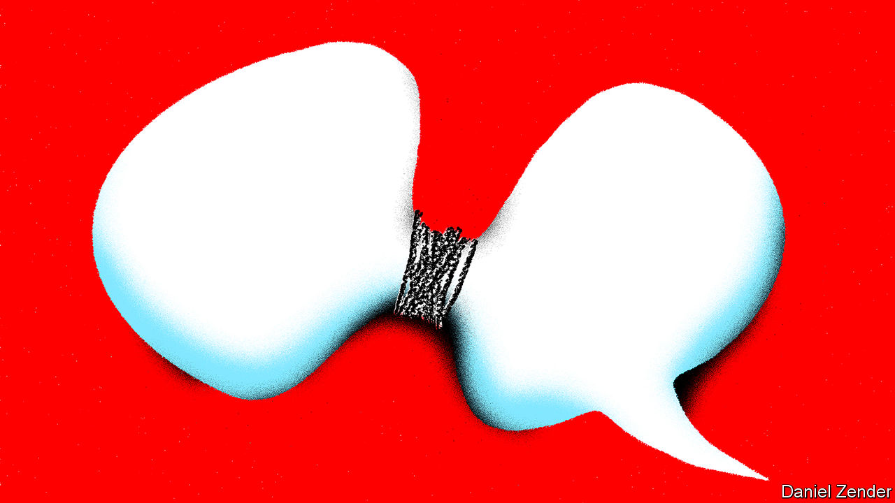
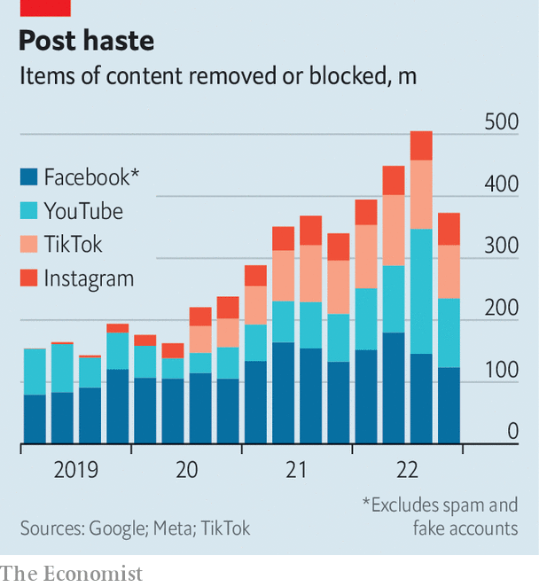

###### #Freespeech

# The speech police are coming for social media 

##### Facebook, Twitter and Instagram are in the firing line 

 

> May 29th 2023 

IN RECENT DAYS Ron DeSantis, Florida’s governor and Donald Trump’s chief rival for the Republican nomination, chose to announce his bid for the White House via Twitter. The live audio event, hosted by the social network’s owner, Elon Musk, descended into farce as Twitter’s servers struggled to cope with the few hundred thousand listeners who had tuned in. When he could be heard, Mr DeSantis said he had decided to announce on the platform because, unlike the “legacy media”, Twitter is a “beacon of free speech”.

The debate about who can say what online is again heating up globally. Twitter, the favoured network of politicians and the press, is under the mercurial new management of Mr Musk, a self-declared  who has restored the accounts of previously banned users such as Mr Trump. Meta, a larger rival, is reportedly preparing a text-based network of its own, to be launched this summer. Social-media platforms face a test over the next 18 months as America’s presidential election approaches, one of the world’s great festivals of online bile and misinformation.

Into this fray step politicians and judges with regulatory proposals. With Congress deadlocked, America’s state legislatures and its courts are drawing new lines around the limits of speech. In Europe legislatures have gone further. These moves are inspiring governments in less democratic parts of the world to write new rules of their own. What can be said and heard online is under scrutiny.

Policing the online public square is a daunting task. Things have calmed down a bit since Mr Trump left office and covid-19—and the associated wave of disinformation—died down, but in 2022 the world’s three largest social-media platforms—Facebook and Instagram, owned by Meta, and YouTube, owned by Google—removed or blocked 11.4bn posts, videos and user comments. Most are zapped by automated filters, but Meta and Google also employ more than 40,000 content-reviewers between them.

 


Most of this housekeeping is uncontroversial: 90% of the posts that Facebook, the largest network, took down last year were simply spam. But many moderation decisions are hard (see chart). In the latest quarter, Facebook removed or blocked 10.7m posts that it deemed hate speech and 6.9m that it considered bullying, both concepts where there is room for disagreement. To take one recent dilemma, Meta recently ordered a review of whether it has been overzealous in its policing of the Arabic word , which is generally translated as “martyr” but whose meaning can change in different contexts. The platforms have mostly been left to resolve such quandaries by themselves. 

Now, however, politicians are stepping in. In America Democrats and Republicans agree that social networks are doing a lousy job of moderation, and that it is time to change Section 230 of the Communications Decency Act, which shields online platforms from liability for content posted by users (with exceptions such as content linked to sex trafficking). But they disagree completely on what to do about it. 

Democrats, who accuse tech billionaires of stoking rage and misinformation for clicks, want platforms to remove more content. Republicans, who think woke California busybodies are gagging conservatives, want them to remove less. (By a ratio of three to one, voters suspect tech firms of favouring liberal viewpoints over conservative ones, according to the Pew Research Centre, an American think-tank.) The result is congressional deadlock.

The Supreme Court has had the chance to tinker with Section 230. But on May 18th, in rulings on two similar cases involving YouTube and Twitter, which had hosted content uploaded by terrorists, it declined to alter the status quo, rejecting the idea that online platforms have liability for crimes their users commit. NetChoice, a tech lobby group, described the decision as a “huge win for free speech on the internet”. Section 230 looks safe for now.

With no luck at the federal level, reformers on left and right are focusing on the states. Last year California passed a law forcing tech companies to collect less user information on children, among other things. Several states have passed or proposed laws requiring those under 18 to get parental permission before using social media. On May 17th Montana banned TikTok altogether, over its Chinese ownership (TikTok is suing and is expected to win).

States of denial

Most controversially, in 2021 Florida and Texas, both Republican-controlled, passed laws restricting social networks’ ability to moderate political speech. Courts have upheld Texas’s law and struck down Florida’s, paving the way for a return to the Supreme Court, which is expected to take up the cases later this year. “If the court opens up the door to regulation in this space, many [states] will jump at the opportunity,” says Evelyn Douek of Stanford University.

They will have two transatlantic models to follow. Passed in July 2022, the EU’s  (DSA) will kick in next year. Britain’s , four years in the making, is expected to be enacted later this year. Both take a different approach from America’s. Rather than altering who has liability for online content (the issue at the heart of the Section 230 debate), they force platforms to do a kind of due diligence, to keep bad content to a minimum.

Europe’s DSA requires online platforms to set up complaint-handling processes and demands that they tell users how their algorithms work, allowing them to change the recommendations they receive. Smaller platforms, defined as those with fewer than 45m users in the eu, will be let off some of these obligations to stop them from drowning in red tape (some larger rivals warn that this could make them a haven for harmful material). For those big enough to qualify for full oversight, the DSA represents “a significant financial burden”, says Florian Reiling of Clifford Chance, a law firm. There is grumbling in Washington that of the 19 platforms so far earmarked by the EU for the most intensive scrutiny, only one—Zalando, a German e-commerce site—is European.

Twitter, which has cut its staff by about 80% since Mr Musk took over in October, may be one of those that struggles to meet the DSA’s requirements. Mr Musk seems to have taken over from Mark Zuckerberg, Meta’s boss, as social media’s greatest villain in the eyes of some. On May 26th Thierry Breton, a European commissioner, tweeted that Twitter had left the EU’s voluntary code of practice against disinformation, adding what sounded like a threat: “You can run but you can’t hide.” 

Britain’s parallel legislative effort is shaping up to be more far-reaching. The Online Safety Bill was conceived in 2019 after the suicide of a 14-year-old who had binged on algorithmically recommended depressive material. Four prime ministers later, the text of the bill has almost doubled in length. An American tech firm dubs it “one of the most complex bills we face anywhere in the world”.

It goes further than the EU in its loosely worded requirement for platforms to proactively screen material. The larger social networks already check videos for matches with known child-abuse content. But subtler crimes, such as incitement to violence, are harder to detect automatically. The scale of some platforms—YouTube uploads 500 hours of video per minute—means that a strict requirement to pre-screen content could throttle the amount of new material uploaded. 

As in America, British conservatives worry about the over-moderation of right-wing views. The bill therefore imposes a duty to ensure that moderation “[applies] in the same way to a wide diversity of political opinion”. Similarly, the EU has promised that it will provide “protection for media against unjustified online content removal” as part of its forthcoming European Media Freedom Act, a response to crackdowns on the press in members states such as Hungary and Poland.

The most controversial part of Britain’s bill, which required platforms to identify content that is “legal but harmful” (eg, material that encourages eating disorders), has been dropped where adults are concerned. But there remains a duty to limit its availability to children, which in turn implies the need for widespread age checks. Tech firms say they can guess users’ ages from their search history and mouse movements, but that a strict duty to verify users’ ages would threaten anonymity.

Some suspect that their real objection is the price. “I don’t think ‘It costs money and is hard’ is an excuse,” says Keily Blair, chief operations officer of OnlyFans, a porn-centric platform which checks the age of its users and doesn’t see why others shouldn’t do the same. Yet some platforms are adamant: the Wikimedia Foundation, which runs Wikipedia, says it has no intention of verifying users’ ages.

The stricter the rules in jurisdictions such as Britain or the eu, the likelier tech companies will be to opt to offer different services there, rather than to apply the same rules worldwide. Some may even quit. WhatsApp, a Meta-owned messaging app, says it is unwilling to break its end-to-end encryption to meet a requirement in Britain’s bill that companies must scan private messages for child abuse. It may not come to that: the bill would let Ofcom demand the data only in cases where it determined that such a measure was proportionate. Still, threats to up sticks are becoming more common. On May 24th Sam Altman, the head of OpenAI, said he would consider leaving the eu if its regulation of artificial intelligence went too far. (He later rowed back his remarks.)

Network effects

Whether or not Britain or the eu use the full extent of their new powers, they set a handy precedent for countries that might use them oppressively. Britain’s bill, which proposes prison for executives of companies that break the rules, is “a blueprint for repression around the world”, according to the Electronic Frontier Foundation, a civil-liberties group. One American executive snipes that Britain’s claim to be “world-leading” in tech is true only in the sense that it is blazing a trail for non-democracies to pass repressive laws of their own.

They need little encouragement. Turkey ordered Twitter to censor information during its recent election; that free-speech enthusiast, Mr Musk, complied. Brazil has proposed a “fake news law” that would penalise social networks for failing to identify misinformation. Modelled on the European legislation, it has been dubbed the “DSA of the tropics”. India is to publish an internet-regulation bill in June which will reportedly make platforms liable for users’ content if they do not agree to identify and trace those users when directed. 

The international impact of the British and eu proposals is influencing the debate in America. “No matter how much you think that social networks have been corrupting to American politics,” says Matthew Prince, head of Cloudflare, an American networking firm, “they’ve been incredibly destabilising to other regimes that are against the United States’ interests.” ■

