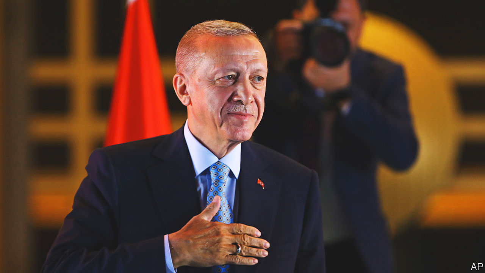

###### Erdogain

# How to make the re-election of Recep Tayyip Erdogan less bad news 

##### There is a chance for a partial reset 

 

> May 31st 2023 

IT CERTAINLY WASN’T fair. Nor was it entirely free. But, like it or not,  of Recep Tayyip Erdogan in Turkey’s presidential election is a fact. For the next five years Turkey, Europe and the wider world will have to deal with a prickly and authoritarian populist. That is bad news on many fronts: economically, democratically and regionally. And yet pragmatists have a duty to search for chinks of light in the gloom.

The first is that Mr Erdogan’s victory, by 52% to 48%, was clear enough that it has been accepted by the opposition. The last thing that Turkey needed, as its economy totters and wars rage in its backyard, was political turbulence. Now that he is safe, Mr Erdogan may at least consider muting the shrill and divisive politics that marked a campaign in which he accused his opponents of being in league with an international LGBTQ cabal and with the PKK, an armed separatist Kurdish group. 

At the same time, the margin was small enough that Mr Erdogan may now feel his position will be stronger if he accepts that some form of . The release of political prisoners or a renewed dialogue with the PKK would probably be too much to hope for. Still, it is possible that Mr Erdogan may start to listen not just to his opponents, but also to impartial experts and technocrats who were once close to him, especially over his ruinous economic policies. He certainly should.

Turkey has one of the world’s highest annual inflation rates, clocking in at over 40% in April (last autumn it was more than twice as high). This harm is mostly self-inflicted, a function of Mr Erdogan’s misguided belief that keeping interest rates low somehow suppresses inflation while at the same time .

With the election out of the way, he may now feel able to bow to reality and appoint an independent central-bank governor, with a new inflation-busting mandate. If he refuses to change course, disaster beckons. Having collapsed over the past decade, the Turkish lira has recently been propped up by the central bank. It spent billions of dollars a week to help Mr Erdogan avert a currency crisis before the elections. But money is running out. Turkey’s net national reserves are already negative.

The end of campaigning may also allow an improvement in the fraught relations between Turkey and its allies to the west. Blocking Sweden’s membership of NATO with the accusation that the country is a haven for PKK terrorists and Koran-burners probably played well with Mr Erdogan’s base. In victory, he can simply assert that Sweden has met Turkey’s conditions, drop his veto, and mend a rift with an organisation that is, after all, there to protect Turkey from Russia. In return, the West has some things to offer Turkey. A NATO-related one would be for America to lift the stay that Congress has imposed on the sale to Turkey of new F-16 fighter jets (and to sell it modernisation kits for the ones it already has). 

If Mr Erdogan showed that he is interested in a more harmonious relationship, the EU could also do its bit. Turkey’s accession to the club as a member is a pipe-dream, but the two sides could make progress on lesser agreements, including visa-free travel to the EU for Turkish citizens and an extension of their customs agreement to cover at least some services and agricultural goods. Interestingly, France’s president, Emmanuel Macron, swiftly called Mr Erdogan to congratulate him on his victory; and the German chancellor, Olaf Scholz, invited him to visit Berlin. The appetite for a modest reset is there, at least on the European side. Mr Erdogan has a history of making U-turns when it suits him. This is an opportunity he should not miss. ■

