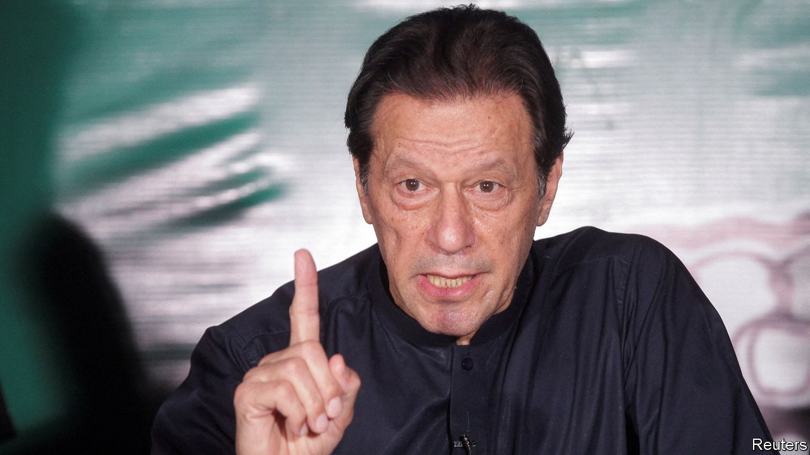

###### Soldiers, go home

# Pakistan’s perma-crisis 

##### Imran Khan, Pakistan’s most popular politician, must be free to contest timely elections 

 

> Jun 1st 2023 

Imran Khan was a terrible prime minister. In office from 2018-2022, the  appointed corrupt ministers, locked up his opponents and hounded the press. As Pakistanis rapidly went off him, he peddled desperate anti-American conspiracy theories. Had his government limped on to the general election due later this year, his Pakistan Tehreek-e-Insaf (pti) party would probably have been trounced.

That is how democracy is supposed to work. Bad governments get summarily ejected. Fear of a reckoning encourages politicians to do better. One government’s failures are a lesson to its successors. Yet , tragically, has experienced little if any of that. Its arrogant generals, the real power in the country of 240m, have not permitted a prime minister to complete a five-year term. Mr Khan, an erstwhile military favourite, was handed power after the generals toppled his predecessor, and was then himself dismissed last year following an army-orchestrated no-confidence vote. Thereby, the generals helped turn a failed politician into a populist hero, whose rabble-rousing has become a threat to order, even as Pakistan faces a balance-of-payments crisis. It is a textbook example of the incompetence, as well as power-hunger, of the men who presume to run the world’s fifth-most-populous country.

Were Mr Khan’s party allowed to contest the scheduled election, he would now probably be swept back to power in Islamabad. So the army intervened again. It had him charged with multiple crimes, from blasphemy to terrorism, and placed under , and then set about dismantling his party. Thousands of PTI activists have been arrested and most of the party’s senior leaders leant on to renounce Mr Khan. Whether the generals will even let the election go ahead is unclear.

Pakistan’s woeful governance is a direct consequence of such military meddling. The country’s political parties, as the PTI is now demonstrating, are shifting bands of opportunists, their members united by little more than an appetite to capitalise on whatever brief opportunity to get rich the generals afford them. Its governments, formed at the army’s behest and in the knowledge that they are unlikely to last a full term, have little incentive to take tough political decisions. No wonder the current administration of Shehbaz Sharif has balked at the eye-watering tax rises and subsidy cuts that the imf is demanding for its latest bail-out of Pakistan, which would be the 23rd. The courts, an instrument of army control, are often intimidated and corrupted by the generals’ fixer-spies. Ditto the media.

The cost of the dysfunction is incalculable. Dominated by the agriculturally rich state of Punjab, Pakistan was for a long time a match for its much bigger Indian rival. Its army arguably lost four wars against India, but narrowly. Its cricketers were better than their neighbour’s. In 1990 the two countries’ average income per head was almost the same. Now Indians are, on average, 50% richer than Pakistanis. And whereas India is fast becoming a global power, Pakistan, beset by economic, environmental and social crises that its governments scarcely seem to comprehend, has become a global menace. It is abysmally governed, violent, unstable and nuclear-armed. Owing to the public anger Mr Khan is whipping up, it is now also at risk of civil strife. All this in a country whose population is projected to be more than 100m bigger in 2050 than it is today.

This mess has only one solution. The generals must, once and for all, get out of politics. Pakistan otherwise has no chance of getting the better governments it needs and deserves. The time for this is now. The election should be held to schedule and Mr Khan and his party—unimpressive though they are—be free to contest it. It is for Pakistani voters to choose who should govern them. They could scarcely choose worse than their turkey-cocking generals. Those self-appointed guardians of Pakistan have done little except lower, weaken and immiserate it. ■

