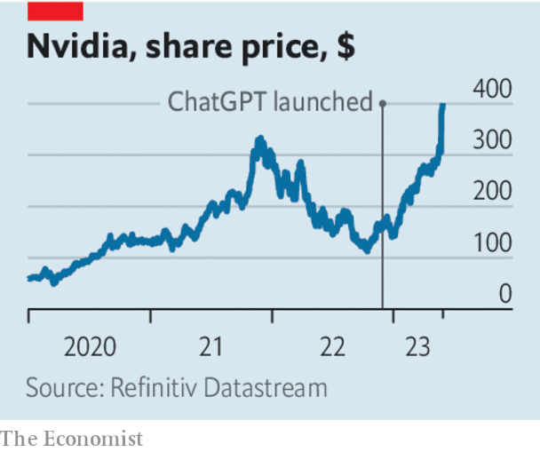

###### Nvincible?

# The AI boom has turbocharged Nvidia’s fortunes. Can it hold its position? 

##### Competition and regulation may pose a threat—but only eventually 

 

> Jun 1st 2023 

Waves OF INNOVATION often create giants. Microsoft rode the upsurge in desktop computers, as Apple did with the smartphone. Artificial intelligence (AI) may well be the next big , transforming the way businesses are run and society functions. If so, plenty of firms selling the software and hardware that underpin AI stand to gain. But none is better positioned than Nvidia, an American firm that makes specialist AI chips. Its market value briefly passed $1trn this week. Will AI sweep Nvidia to big tech-dom?

The hype around AI makes the question hard to answer. Excitement about Nvidia began to mount in November, after the release of ChatGPT, an . Since then all manner of firms have launched , adding to the fervour. Jensen Huang, Nvidia’s boss, is unsurprisingly bullish, talking of a “new computing era”. Investors seem just as jubilant. Nvidia’s share price has more than doubled since the start of the year.

Much of the excitement is justified. Nvidia is in an enviable position. Its core business is designing high-performance chips. At first it sold these to video-game enthusiasts. The chips were also highly efficient at training AI models, and a new, booming market emerged. But the firm has not just been lucky. With each generation of new chips, it has improved performance many times over. Today it holds over 80% of the market in specialist AI chips. 

 


Nvidia also had the forethought to invest in two areas that helped cement its supremacy. One is advanced networking. Because training AI models requires vast amounts of processing power, many chips—sometimes thousands—are used simultaneously. These chips exchange data along a high-performance, AI-tailored network. Today Nvidia controls 78% of that market, thanks to its purchase of Mellanox, a specialist, in 2019.

Nvidia’s other strength is its software. CUDA, its ai platform, is popular with programmers and runs only on the company’s chips. By, for instance, giving free access to its chips and software to some AI researchers, the firm focused on encouraging developers to use its software long before its competitors set out to woo them. 

Despite all these advantages, however, Nvidia’s lasting dominance is not assured. For a start, some of the may die down. The juicier the firm’s prospects, the more competitors it will attract. Startups and big chipmakers, such as AMD and Intel, want a share of Nvidia’s network and chip businesses. Others are working on open-source and proprietary software that may weaken CUDA’s hold. The biggest challenge, though, may come from Nvidia’s own customers. The cloud-computing arms of both Amazon and Alphabet are designing their own AI-tailored chips. Both have the scale and the deep pockets to become fearsome rivals.

Governments also pose a risk. Regulators worried about the dangers AI poses to society and national security are searching for ways to control the technology. Last year America restricted the sale of high-performance chips and chipmaking tools to some Chinese firms, which dented Nvidia’s sales in the third quarter. If Nvidia is dominant, politicians will find it easier to act. 

Still, for now the future looks bright. Even if ai mania cools, the technology is bound to be more useful than crypto, another craze that Nvidia cashed in on. Regulation may crimp growth, but is unlikely to kill it. And none of Nvidia’s rivals is yet offering ai products that bundle together software, chips and networking. Nvidia’s chief advantage lies in its ability to package these up and create an attractive ecosystem. That sounds a lot like Microsoft and Apple. ■

