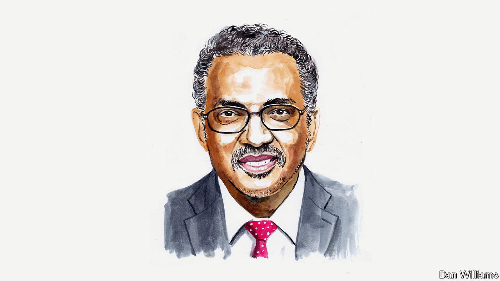

###### On Congress and China, the WHO and covid, Martin Luther King, English nationalism, building homes, artificial intelligence, Vegemite, Dutch

# Letters to the editor 

##### A selection of correspondence 

 

> Jun 1st 2023 


Congress investigates China

“” (May 20th) suggested that Congress’s House Select Committee on the Chinese Communist Party needs some “serious debate” in its proceedings. But just because both Democrats and Republicans jointly condemn the Communist Party’s persecution of the Uyghurs does not mean there is groupthink on the panel. Indeed, the lack of political theatre points to how Washington should work. 

The select committee is finding facts and engaging experts in order to build a bipartisan consensus around tough and thoughtful statecraft. In that process there is productive debate both within and between parties. For example, I do not agree with Washington’s fixation on industrial policy, in general, and bilateral trade deficits with China in particular. 

The United States will outcompete China by doubling down on our strengths as a market democracy, not by aping China’s five-year plans at home and mercantilism abroad. We should pursue more trade deals, with the bipartisan support for the United States-Mexico-Canada Agreement as a template to move forward. And we should invest in industry-agnostic basics: superb education, especially in mathematics, where American students have lost ground since covid; a world-leading research and development complex; and a top-tier business environment characterised by democracy, rule of law, quality infrastructure and stream-lined regulation. 

As we used to say in the Marines, these initiatives are simple, but not easy. 

Jake Auchincloss

Representative for the 4th congressional district in Massachusetts

 

 


The WHO and covid-19

Although Dr Tedros Adhanom Ghebreyesus must avoid offending any of his member governments at the World Health Organisation, I am disappointed by how cautious he was in his reflections on the lessons from covid-19 (, digital editions, May 15th). The disproportionate initial impact of the pandemic on the developed world was strikingly more than just the underfunding of public health. This ignores the significance of mobile populations and other factors related to the way the disease spread so quickly. I would have had more to say, too, about vaccine nationalism, the failure of the visionary COVAX initiative and the continued impasse on intellectual property rights. 

Regardless of the claims to the contrary about its relevance, the fact that NGOs and the pharmaceutical industry are at such loggerheads on the issue discourages the kind of consensus building and collaboration in global health policy that is so sorely needed. And, of course, Dr Tedros also avoided criticising the way the Chinese have stonewalled vital information about covid’s origins.

Katherine Hagen

Former deputy director-general of the International Labour Organisation


 


MLK’s Christian faith

“” (May 13th) minimised the religious beliefs of Martin Luther King, by saying that Mohandas Gandhi “was perhaps the single greatest influence” on his life and work. King would be deeply offended by this remark, not because he didn’t admire Gandhi, but because the “single greatest influence” on his life and work was Jesus Christ. It seems that  is following the thinking of people like Steven Pinker, who, in “The Better Angels of our Nature”, ignored King’s faith, the only true source of his immense reservoir of vital and intellectual energy. 

Tommaso Todesca


 


Defining English nationalism

We are the “pair of academics” who took to task for over-hyping the political significance of English nationalism (April 22nd). Given both the scatter-gun nature of the condemnation and the fact that your columnist’s ire expands to include nothing less than “the intelligentsia” as a whole, working out the nature of our particular sins is not altogether easy. Nonetheless, a few corrective points are in order.

As is clear from the very first pages of our book, “Englishness: The Political Force Transforming Britain”, the argument is not that English nationalism represents a rejection of Britishness. It is not to be understood as simply another version of contemporary Irish, Scottish or Welsh nationalisms. Rather, alongside a sense of injustice around the alleged unfair treatment of England within the domestic union, English nationalism manifests as a very strong commitment to a particular understanding of Britain’s past and vision of its potential future.

Bagehot seems to see no merit in attempts to understand why the results of the Brexit referendum were territorially differentiated. Given the amount of resources that politicians have devoted to addressing the alleged drivers of referendum voting (“left behind”’ and the rest) this seems a curious position. But at any rate, as academics we make no apology for seeking to do so, and the fact of the matter is that, in England, those who cleave to an English identity voted overwhelmingly to Leave while those who feel solely or predominately British tended to vote Remain. It is not the increase in English identity, but its salience to contemporary politics that warrants careful investigation.

Finally, Bagehot claims that the Conservative Party’s attempt to mobilise English identity in the 2015 general election made no difference to the overall result. The deliberate mobilisation of territorial grievance by one of the state’s major parties is, of course, inherently significant, but the evidence also suggests that large numbers of unsuccessful Labour, Liberal Democrat and UKIP candidates at that election are adamant that the Conservatives benefited electorally by doing so.

Professor Richard Wyn Jones

Cardiff University

Professor Ailsa Henderson

University of Edinburgh

 


Building homes in Britain

’s assessment of the politics of new housing in Britain was spot-on (May 13th). Public opinion is such that there is plenty of room for excuses not to build, but it is also very conditional, more “maybe” than “nimby” or “yimby”. In fact, there is consensus about what to aim for. A clear majority of both Remain and Leave voters agree that “unless we build a lot more homes, we will never solve the country’s housing problems”. 

The challenge is two-fold. The public don’t like the new homes they see being built (unaffordable, often ugly and plonked somewhere). Related to this, nimbyism is not always a knee-jerk reaction but motivated by some legitimate concerns. This takes us back to the planning system and the need for political leadership. As the saying goes, you probably wouldn’t start from here. But start we must.

Ben Marshall

Research director

Ipsos


Although new builds are important they only part of the solution for more housing. Britain contains 27m houses and many are not fit for purpose, either requiring retrofit or benefitting from modifications to make them into suitable homes. We need to expand the thinking and measurement around housing to include the improvement and addition of living space to existing structures. Perhaps making existing homes better is something even the Blockers would agree with. 

GUY MARSHALL

Chief technology officer

PorthouseDean


 


A case of the BLEU’s

I enjoyed your article looking beyond the hype about the effects of artificial intelligence on work (“”, May 13th). Resistance to technological change is common, including among researchers in AI and large language models. A small example of this, which frustrates me and many of my colleagues, is that many researchers continue to use the BLEU (bilingual evaluation understudy) algorithm to assess the quality of machine translation and computer-generated texts (I have also seen  do this). 

Numerous studies have shown that there are far better ways to measure text quality. If AI researchers can’t be bothered to update obsolete techniques in their own research, they shouldn’t expect the rest of the world to instantly and radically change in order to use AI technology.

Ehud Reiter

Professor of computing science

University of Aberdeen

 


As disgusting as Vegemite

I read with interest your article on how insects can better serve the food chain (“”, May 20th). The idea of feeding insects wastewater from beer brewing so that they become feedstock for farm animals sounds ingenious. Vegemite is also made using the yeast by-product from brewing. Many people consider eating Vegemite about as appealing as eating insects, though our Australian friends would passionately disagree. I will do my best to keep the peace by drinking more beer.

Brian Hadden


 


A puff of smoke

Reading about the slow legalisation of cannabis in Europe I was struck by the name of a Dutch MEP, Dorien Rookmaker (”, May 13th). Dutch speakers might have thought it was a joke: Rookmaker translates as smokemaker in Dutch. 

Arjen Levison


