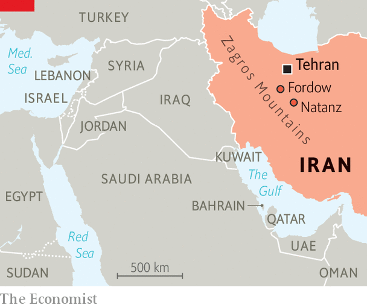

###### Nearly nuclear

# Iran puts its nuclear programme beyond the reach of American bombs 

##### Burrowing deeper into the mountains 

 

> May 30th 2023 

It is exactly five years since Donald Trump pulled America out of the  to constrain its nuclear programme in exchange for economic-sanctions relief. Since then, Iran . Satellite pictures appear to confirm that Iran is building a nuclear facility in the Zagros mountains, near the existing Natanz enrichment site (shown above). It seems to be so deep under the ground that it will be invulnerable even to America’s most powerful bunker-busting bomb.

If analysis of these pictures by the James Martin Centre for Non-proliferation Studies, an American NGO, is correct, four entrances have been dug into the mountainside, each six metres wide by eight metres high. The facility is 80-100 metres deep down inside. The Americans had developed a bomb, known as the gbu-57, specifically to be able to destroy an earlier underground facility, at Fordow. Also known as the Massive Ordinance Penetrator (mop), the 14,000kg precision-guided bomb can burrow through 60 metres of earth and rock before detonating. But that may no longer be enough to destroy Iran’s hideout.

 


The Institute for Science and International Security (ISIS), a think-tank in Washington founded by David Albright, a former weapons inspector, reckons that the deepest part of the chamber could be used as a hall for a small number of advanced centrifuges that could rapidly produce enough weapons-grade uranium (WGU) to make Iran capable of an unstoppable nuclear breakout.

Whatever the criticisms of the  of 2015 known as the Joint Comprehensive Plan of Action (JCPOA), which Barack Obama’s administration had concocted in partnership with the four other permanent members of the UN Security Council and the European Union (the P5+1), it did ensure that it would take Iran about a year to produce enough fissile material for a nuclear device. Now it could probably achieve it almost immediately.

Since Mr Trump’s reckless decision to trash “the worst deal ever” and renew sanctions that were designed to exert “maximum pressure” on the Iranian regime, Iran has brought online new, faster centrifuges that have hugely expanded its enrichment capacity. Based on the quarterly inspection report in February of the International Atomic Energy Agency (IAEA), the UN’s nuclear watchdog, Mr Albright’s team estimates that Iran could produce enough WGU for a nuclear weapon in just 12 days. It would need to use only three advanced-centrifuge cascades and half of its current stock of 60%-enriched uranium.

More worrying still, if Iran used all its stock of highly enriched uranium, it could produce WGU for four more nuclear weapons in a month. In another two months, using its stock of low-enriched uranium (ie, less than 5%-enriched), it could get enough material for two more weapons. It would take about six months to test and deploy a bomb for a crude delivery system, such as a plane or a ship. A missile-delivered warhead might be feasible in a year or two. Testifying to Congress in March, General Mark Milley, chair of the joint chiefs of staff, drew a similar timeline.

None of which means that Iran is about to break out and become a fully fledged nuclear-weapons state. But it does mean, as Mr Albright puts it, that it can produce nuclear weapons pretty much “on demand”. Given America’s oft-repeated commitment never to allow Iran to have the bomb and its fear of escalation in a volatile part of the world, it might be thought that intense diplomatic efforts to revive the JCPOA, or at least to find some alternative means to constrain Iran’s nuclear threat, would be urgently under way.

Far from it. Despite intensive indirect talks between America and Iran, chaired by the EU’s top diplomat, Josep Borrell, which continued for many months in Vienna last year, the attempt to breathe some new life into the JCPOA got nowhere. By September the sides were even farther apart. The Iranians refused to accept a new probe by the IAEA into their past nuclear activities and insisted that they be given guarantees that they would continue to benefit from sanctions relief, including financial compensation, in case a future American administration again walked away from a deal.

Russia’s invasion stymied a new deal

Ali Ansari, the director of the Institute of Iranian Studies at St Andrews University in Scotland, reckons the Iranians were never “genuine about a return to the JCPOA and nor was there much real enthusiasm within the State Department: it was negotiations for the sake of negotiations.” Emile Hokayem, a Middle East security specialist at the International Institute for Strategic Studies in London, agrees: “The Iranians had already decided they were beyond the JCPOA by the time the Biden administration came in. They were playing a complicated game with the IAEA.”

Both believe that the death knell for a nuclear deal was Russia’s invasion of Ukraine last year. By bringing Russia and Iran into a much closer defence relationship, it killed off any lingering hopes of restoring the P5+1 process. As energy prices soared, it also removed some of the immediate economic pressures on Iran. Besides, reckons Mr Ansari, Iran presumed that Russia would prevail in Ukraine, which would boost Iran’s narrative of Western decline and get it better terms on sanctions by exploiting divisions between America’s European allies. Although that expectation has for the moment been dashed, Iran thinks it can strengthen its own hand in its relationship with a weaker Russia.

Mr Hokayem thinks that the assessment in most of the six countries of the Gulf Co-operation Council (GCC), including Saudi Arabia and the United Arab Emirates, is that an isolated Russia, keen to buy drones and missiles from Iran, will become a far more valuable transactional partner. In particular, it is now assumed, Russia will be readier to transfer high-tech weapons systems that could plug big gaps in Iran’s inventory, such as advanced S-400 surface-to-air missiles and Russia’s highly capable Su-35 fighter aircraft.

In any case, some in Washington want the Gulf countries to do more for their own security, especially at a time when the American administration is embroiled in handling the war in Ukraine, not to mention its constant rivalry with China. Many Gulf-watchers think America has already begun to pack its bags in the region.

Moreover, the Gulf Arabs have become much less interested in the Iran nuclear file than either America or Israel. They already regard Iran as a de facto nuclear power. Nor do they have the technical expertise to negotiate with the Iranians on nuclear constraints, even if they wanted to. What they worry about, says Mr Hokayem, is Iran’s missiles, drones and militias. By contrast, Israel feels it can cope pretty well with those. But time and again it has said it cannot live with a nuclear-capable Iran.

The result is a kind of weary but nonetheless dangerous equilibrium whereby the regional powers are trying to gain some leverage over Iran by investing in its economy, making goodwill gestures such as readmitting Iran’s Syrian protégé back into the Arab League, and deferring to China—the one real influence on Iran—whenever possible. The smaller Gulf states plainly accepted the Chinese-brokered restoration of relations between Saudi Arabia and Iran in March. At the same time they hope Iran will choose to meddle less in the region. On the nuclear front they would prefer Iran to hold back from breakout and let the IAEA have the figleaf of routine inspections.

From the Gulf Arabs’ perspective the biggest wild cards are the outcome of the next American election and the behaviour of Israel. Despite the Abraham accords of 2020, which normalised Israel’s relations with four more Arab countries, governments in the Gulf know they have little influence on what Israel might decide to do over Iran. While Iran pushes to get those game-changing S-400 missiles and modern jets from Russia and buries its enrichment cascades ever deeper in the mountainside, Israel may see its window for action closing. “Iran has made more progress in uranium enrichment than ever before,” said General Herzi Halevi, chief of staff of Israel’s army, on May 23rd. But Israel has a constraint of its own. It probably needs a type of aerial tanker, the KC-46 Pegasus, to carry out an attack on Iran, which would anyway be difficult and risky. Boeing is not expected to deliver them until 2025.

In any case, Israel’s intelligence services are not yet convinced that Iran has decided to break out into weapons-grade enrichment or that it has taken the key steps towards weaponisation by enabling fissile material to be put into an operational nuclear warhead. Meanwhile, it is concentrating on pegging back Iran’s regional proxies, such as the Palestinian Islamist group Hamas and the Lebanese group Hizbullah. It is also keen to cement friendlier relations with the Saudis.

Henry Rome, an Iran specialist at the Washington Institute for Near East Policy, says that the situation is like trying to thread a ball down a bowling alley where one gutter represents a new nuclear agreement and the other stands for conflict escalation with potentially catastrophic consequences. Keeping the ball down the middle will require concentration, prudence and luck. None of which is guaranteed. ■

