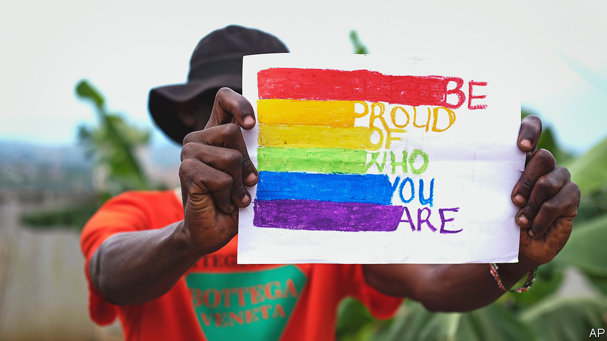

###### Africa’s persecuted gays

# Uganda’s harsh anti-gay bill is now law 

##### It is part of a culture war in Africa that has ties to the West 

 

> Jun 1st 2023 

Homosexuality in Uganda has been punishable by life imprisonment since colonial Britain outlawed it in 1950. But today’s lawmakers have deemed that too lenient. A new law signed on May 26th by President Yoweri Museveni provides for the death penalty for some same-sex acts, including those that might spread HIV. Other clauses envisage long prison sentences for “promoting” homosexuality or even for renting a room to a gay couple. “We have a culture to protect,” said Anita Among, parliament’s speaker. “The Western world will not come to rule Uganda.”

It is not just Ugandan homophobes who cloak themselves in anti-colonial garb. In Ghana, the preface to a similar bill warns of “the infiltration of foreign cultures”. Some Kenyan politicians, who hope to pass a law of their own, have described LGBT rights as “a second colonisation” designed to shrink Africa’s population. 

Western governments have indeed become more assertive about sexual rights as their voters have become more liberal. But the West’s conservative culture warriors are also pushing their ideas in Africa, feeding a moral panic in societies where homophobia is already routine. Uganda’s bill is “the end product of a propaganda war that was started long ago,” says Fox Odoi-Oywelowo, Uganda’s sole MP to vote against it.

The politics of the family crosses borders and continents. Consider a conference on “family values and sovereignty” organised by the Ugandan parliament in March. It brought together religious leaders, youth activists and MPs from 20 African countries. Others attending included delegates from Family Watch International (FWI), an American group that helped develop the programme, and Christian Council International, from the Netherlands. Afterwards they met Mr Museveni and his wife Janet, the education minister, who is a born-again Christian. Some speakers at the conference denounced homosexuality, sex education and other threats—as they see them—to the African family.

Sharon Slater, the president of FWI, spoke about “the child sexualisation agenda”. For two decades she has been building networks in Africa to oppose “comprehensive sexuality education”, which she says sexualises children without parental consent. In a written statement FWI said it has never supported anti-homosexuality bills in Africa and opposes several sections of Uganda’s new law. It urged Mr Museveni to include provisions for “voluntary counselling” for people who experience “unwanted same-sex attraction”.

Other speakers at the conference were enthusiastic proponents of the legislation. One of them was George Peter Kaluma, an MP from Kenya, where he has submitted a bill modelled on the Ugandan one. Another was Sam George, the man behind Ghana’s proposed law. He was also a guest at FWI’s African Family Policy Conference last October, held, with no sense of irony, in Utah.

Many of those attending share a belief that the liberal West is trying to sexualise children (in debates about Uganda’s new law, politicians routinely conflate homosexuality and paedophilia). For African conservatives, Western culture wars offer inspiration. “The language has been globalised,” says Kapya John Kaoma, a Zambian priest at Boston University who has studied anti-LGBT politics. Gillian Kane of Ipas, an American group that campaigns for safe abortion and contraception, argues that aspects of FWI advocacy are “fear-based” and widen the space for such politics, though African politicians bear most responsibility for the laws. 

A meeting in Moscow in 1995 between an American historian and two Russian sociologists who blamed homosexuality for population decline laid the ground for the World Congress of Families, an American anti-gay network that opposes same-sex marriage, promotes “the natural family” and has organised conferences in Africa. For many years its representative in Russia was Alexey Komov, a right-wing activist close to figures allied to the Orthodox church. Until Russia’s invasion of Ukraine he also sat on the board of CitizenGO, an online community which has co-ordinated social-media campaigns against abortion and gay rights in Africa. 

Local sources and Western diplomats in Uganda speculate, without so far producing evidence, that Russian money may have oiled the progress of the anti-gay bill through parliament. Russia’s embassy in Kenya has gone out of its way to praise Ugandan politicians for “stand[ing] firm to protect traditional values”.

Tradition can be widely interpreted. Sylvia Tamale, a Ugandan academic, has argued that African societies once had a nuanced understanding of sexuality, before colonial missionaries imposed rigid moral codes. Some countries are recovering a lost culture of tolerance. In 2019 a court in Botswana struck down the country’s sodomy laws, saying they were “imported” by the British.

Nowadays most Western governments support gay rights. America, which gives almost $1bn a year in development aid to Uganda, has hinted at economic repercussions in response to the new law. President Joe Biden has already forcefully criticised it. Ghana’s president, Nana Akufo-Addo, distanced himself from his country’s bill after meeting Kamala Harris, America’s vice-president. Some African politicians cite this as evidence of the West using its leverage to undermine laws that many Africans support.

The best chance of change comes from within. In Uganda gay people have been arrested, blackmailed, denied health care and evicted from their homes. “We live in fear and uncertainty every day,” says Clare Byarugaba, an LGBT activist at Chapter Four Uganda, a rights group. But she and her comrades are not backing down. Some have already filed a court challenge to the law. “One way or another,” she says, “we will once and for all destroy this bill.” ■

