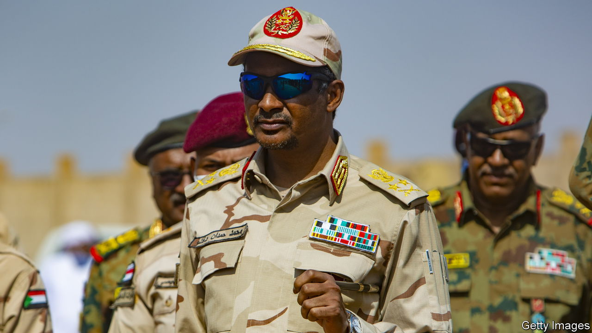
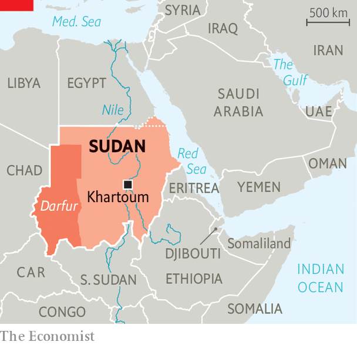

###### The worse of two bad men

# What next for Sudan’s most notorious rebel leader, known as Hemedti? 

##### It won’t be easy to defeat him 

 

> May 31st 2023 

The journey of Muhammad Hamdan Dagalo, better known as Hemedti, from the deserts of remotest Darfur to a gilded mansion on the banks of the Nile in Khartoum,  embattled capital, is hard to fathom. Once a lowly camel rustler and small-time businessman, he started out with neither formal education nor military training. Yet by the late 2000s he was the most  in all of Darfur, the country’s vast western region, holding a key to Sudan’s future. His infamous force of fellow camel-herding Arabs, known as the Janjaweed, was accused of committing genocide against the region’s African tribes on behalf of the country’s long-serving dictator, General Omar al-Bashir. As a veteran Sudan-watching diplomat puts it, Hemedti was like “a Mafia don who started on a street corner and then took over the city”. 

Within a decade the Janjaweed, officially recognised by the central government as the Rapid Support Forces (RSF), had morphed into a paramilitary body with tens of thousands of well-equipped troops. Mr Dagalo, now a brigadier-general, had struck lucrative deals with the United Arab Emirates and Saudi Arabia and had sent men to aid their war in Yemen. Thanks to the RSF’s control of Sudan’s gold mines, he had established a sprawling transnational business empire. 

 


By the time Mr Bashir was ousted by a combination of popular protests followed by an army coup in 2019, Mr Dagalo may have become Sudan’s most powerful man. Western diplomats shook hands with him; Russian mercenaries are said to have armed him; and a Canadian public-relations firm lobbied for him. Backed by what was, in effect, his own private army, he deftly manoeuvred himself into the post of de facto vice-president in the interim government that was set up after the fall of Mr Bashir. Few doubted that Hemedti had his eye on the very top job. 

Now, though, Mr Dagalo is . Since mid-April, his RSF has been battling the regular army, the Sudanese Armed Forces (SAF), in a deadly power struggle which threatens to ruin the central state and uproot millions of civilians. Though the RSF has overrun much of Khartoum in the past seven weeks, and still controls key spots such as the international airport, the central bank and the country’s main oil refinery, Mr Dagalo remains the underdog. 

A string of patchily observed ceasefires brokered by America and Saudi Arabia may have helped the RSF strengthen its foothold in the capital, letting it rearm and deploy fresh troops. But Mr Dagalo has little chance of defeating the army outright. 

Though both sides are quarrelsome coalitions, the RSF may be the more effectively commanded. Mr Dagalo and a close-knit circle of his family and clansmen will have to decide whether their troops should capitulate, raze the capital, or flee to their stronghold in Darfur, where they could inflict even more damage. The priority of the army, under General Abdel Fattah Burhan, is to kill or capture him and his brother, Abdul-Rahim Dagalo, the paramilitaries’ deputy commander. The rebel leader has not been seen in public since late April. 

Jérôme Tubiana, a French researcher who has known Mr Dagalo since the late 2000s, calls him “a pragmatist”. Once upon a time his chief allies were the Arab supremacists of Darfur. These days he claims to be fighting for democracy. But as recently as 2021 he joined forces with his rival, General Burhan, the de facto president, to oust the civilian-led government. To win support from potential allies in the Gulf, he portrays himself as a staunch opponent of political Islam, even though he was for years an enthusiastic participant in the Islamist regime of Mr Bashir. 

Mr Dagalo’s weakness is that he lacks a wider popular base. Despite his recent efforts to portray himself as the authentic tribune of Sudan’s downtrodden masses, the RSF remains at core a family concern centred on Mr Dagalo’s own Rezeigat tribe. Its exceptionally brutal conduct since the civil war began in April has alienated people still more. “He lost the hearts and minds of the people,” says a former official in Sudan’s interim government. If forced to choose between the RSF and the SAF, most Sudanese would opt for the latter. 

Mr Dagalo’s biggest bonus is money. He has used his gold to buy up a web of private and public assets, enabling him to smuggle in arms and fuel from Libya and reportedly from states across the Red Sea. Mr Dagalo has also been able to pay for mercenaries who have been recruited from Arab tribes right across the Sahel. Since the civil war began, foreign fighters are said to have been coming to his side from Chad and the Central African Republic. 

It is unclear whether the RSF could fight a protracted war. Most of Mr Dagalo’s troops may be motivated more by money and clan solidarity than ideology. Despite the sporadic ceasefire, the fighting in their Darfuri stronghold seems to be getting more vicious as the . “It’s a black hole—we don’t know what’s going on there,” frets Martin Griffiths, the UN’s humanitarian chief. 

Resentment of Mr Dagalo inside the RSF may yet begin to grow, even among his own tribe. His whereabouts are puzzling. Many of his family are said to be ensconced safely in the Gulf. “He’s making [his people] pay a very high price for his ambition,” says Magdi el-Gizouli of the Rift Valley Institute, a think-tank that operates across the region. “At what point do they decide it’s not worth it?” ■

