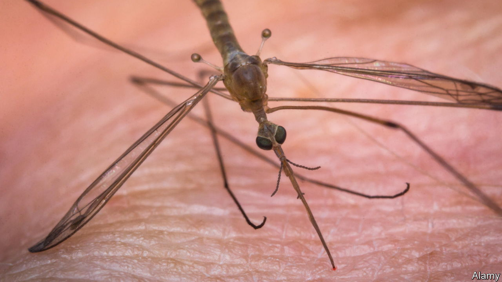

###### This will only hurt a little

# Mosquitoes, wasps and parasitic worms could help make injections less painful 

##### How to improve the humble hypodermic 

 

> May 31st 2023 

Using hypodermic needles to deliver drugs has been common for more than a century. The past hundred years have seen all manner of medical advances, from antibiotics and x-rays to mRNA vaccines and immunological cancer treatments. Yet the needle has stayed mostly unchanged. Although now available in a variety of different sizes, it remains, in essence, a hollow, pointy tube. 

With luck, that may soon change. As Yichi Ma, a mechanical engineer at the University of California, Berkeley, and his colleagues outline in a review paper in , researchers around the world are looking for ways to ease the passage of needles into the skin. Many have been inspired by nature.

An obvious source of ideas has been mosquitoes, which manage to extract their blood meals almost painlessly. One reason is that the insects deploy anaesthetic chemicals when they first pierce the skin. But another has to do with the shape and action of their mouthparts. 

The point of a mosquito’s proboscis is serrated and softer at its tip. The insect stretches the skin of its prey before biting, and vibrates its proboscis as it pushes it in. All of this helps to reduce the force needed to puncture the skin. One paper, published in 2020 by a group of researchers in America and China, found that a mosquito-inspired needle required 27% less insertion force than an ordinary one. And less puncture force means less pain. 

Mosquito-inspired needles might also be useful for delicate procedures such as biopsies. A paper from the University of Michigan, also published in 2020, found that they could improve biopsies of small tumours in the prostate gland. The lower insertion force led to less movement of the gland itself, ensuring that the needles were guided accurately to the area that needed sampling, rather than veering off-target. 

Since needles are long and thin, another challenge is pushing them deep into the body without them buckling or breaking. Such an approach might be needed, for instance, to get precision drugs into a tumour. Insects can help here too. Researchers have sought inspiration from the way female wasps use needle-like structures called ovipositors to drill into wood or fruit before depositing eggs. Ovipositors are made up of three sections. Like an extending telescope, each segment can slide longitudinally beyond the others.

Mimicking that structure with bundles of nickel and titanium wires, scientists at Delft University of Technology in the Netherlands have made needles less than a millimetre thick and 200 millimetres long that can be steered through artificial liver tissue without giving way. That could allow less traumatic access to parts of the body that currently require surgery to reach.

There are other ideas, too. One is a needle that swells at the end once inserted, inspired by a parasitic worm that attaches itself to fish intestines. That could be useful for cannulas, which must stay inserted for long periods. Another is a jab that can precisely steer the flow of drugs across its surfaces. It is modelled after European true bugs, a family which includes aphid and bed bugs. Some can use microstructures to steer defensive chemicals around the outsides of their bodies. 

For now, such devices remain confined to labs. But there is a big market for better needles. According to the World Health Organisation, around 16bn injections were given in 2018—and that was before the covid-19 pandemic. With one person in four saying they suffer from trypanophobia, or a fear of needles, the savings on stickers and sweets for the brave souls who roll up their sleeves would be considerable. ■


