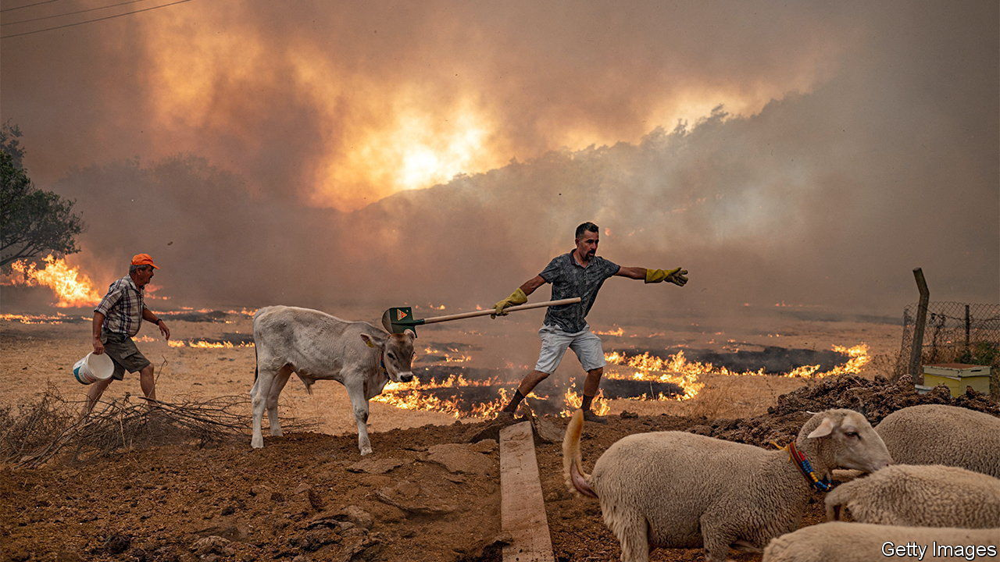

###### The climate in 2100

# Temperatures of 50°C will become much more common around the Mediterranean 

##### Spikes above 45°C are likely every year by 2100 

 

> Jun 1st 2023 

Spring was a scorcher in the Mediterranean. A heatwave in April saw temperatures up to 20°C higher than usual in Algeria, Morocco, Portugal and Spain. Scientists used to hesitate to blame a particular piece of weather on climate change. These days they are more confident. World Weather Attribution, a network of climate modellers, reckons that the heatwave was made around 100 times more likely by the greenhouse gases that are piling up in the atmosphere.

In a paper published on May 26th in  , Nikolaos Christidis, a climatologist at the Hadley Centre, a branch of the British Met Office, look at what might be in store for the Mediterranean and the Middle East in a future, even hotter world. They were particularly interested in how often the region can expect to see days in which the mercury rises above 50°C.

Dr Christidis and his colleagues used data from a dozen sites around the region, from Turkey and Spain to Egypt to Qatar. They first simulated a pre-industrial world, in which humans had not yet begun to significantly alter the atmosphere. They found that 50°C days were virtually impossible under those conditions. Only in Saudi Arabia and on the coast of Tunisia could they happen—and even then, only once a century or so. 

 


The team then re-ran their models using a standard “middle-of-the-road” scenario for future emissions. It assumes countries will make some effort to curb climate change, but few truly radical adjustments. In that world, the level of carbon dioxide in the air levels off at around 600 parts per million by 2100, up from around 420ppm today. 

They found the likelihood that at least one day each year will exceed 50°C increased rapidly by the middle of the century for all but the coolest Mediterranean locations, such as Spain (see chart). By 2100, such days will become once-in-a-decade events across the Mediterranean and the Middle East. Spikes above 45°C are likely every year. 

That means more droughts and fires (2022 was the second-worst European wildfire season on record, and most were in the Mediterranean). Extreme heat melts roads, buckles railways and makes outdoor work dangerous. Heatwaves already cause 8% of all weather-related deaths. Very high temperatures and humidity can even prevent people shedding heat through sweating, which can eventually kill them. Countries in the Mediterranean and the Middle East are used to the heat. But the future will be very different from the past. ■


