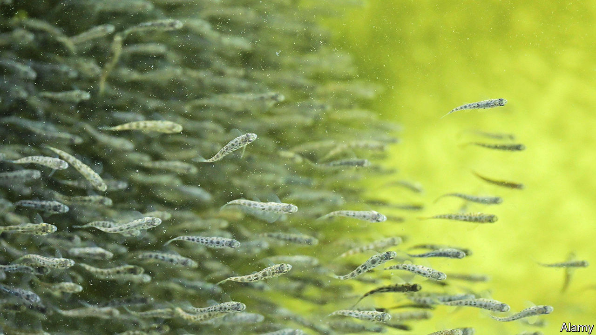
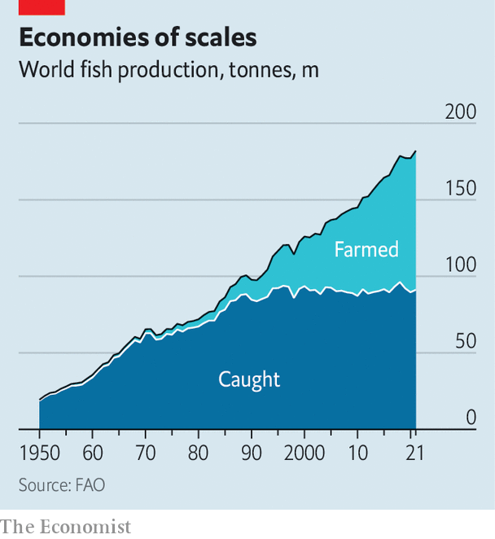

###### Fish out of water

# The future of fish farming is on land 

##### New systems cut pollution and allow fish to be raised anywhere in the world 

 

> May 31st 2023 

THE RUGGED, chilly coast of northern Norway, beyond the Arctic Circle, is not usually thought of as prime agricultural land. But far down a dead-end road on the shores of Skjerstad Fjord sits Salten Smolt, one of the most advanced farms in the world. Rather than crops or cows, though, the firm produces fish. Inside its 7,000 square metre main building are tanks capable of producing 8m smolt—juvenile Atlantic salmon—every year.

Fish farming is the fastest-growing form of food production in the world. Seafood accounts for around 17% of the world’s protein intake (in some parts of Asia and Africa, the number is nearer 50%). The OECD, a rich-country club, reckons that, thanks to population growth and rising incomes, global consumption of fish will reach 180m tonnes by the end of the decade, up from 158m tonnes in 2020. 

 


But the ocean has only so much to give. The World Bank reckons that 90% of the world’s fisheries are being fished either at or over their capacity. Aquaculture has therefore accounted for nearly all the growth in fish consumption since 1990 (see chart). It will have to account for almost all the growth to come, too. 

As with farming on land though, aquaculture can cause environmental damage. Many farmed fish are grown in net pens, either in rivers or the open ocean. Uneaten food and fish waste can pollute the surrounding waters. When net pens break, escaped farmed fish can damage the local ecosystem. Inland “flow-through” farms require continuous streams of freshwater from rivers or wells, competing with those who might wish to drink it instead. Rearing lots of fish in close proximity risks outbreaks of diseases and parasites, which sweep in from the open water. That requires antibiotics and other drugs to keep the fish healthy. 

It is these sorts of problems that newer fish farms, like Salten Smolt, hope to solve. It makes use of a technology called “recirculating aquaculture systems”, or RAS for short (pronounced “Rass”). Rather than relying on a constant flow of natural water to keep fish healthy, a RAS system grows fish on land in tanks whose water is continuously cleaned and recycled. That offers three big advantages. Compared with standard aquaculture systems, RAS farms use far less water, can take better care of their fish, and can allow picky species to be raised anywhere in the world.

RAS farms are, in essence, much bigger versions of home aquariums. Each consists of a tank in which the fish swim, and a set of water-cleaning components to dispose of the waste that they produce. Much of the technology is recycled from the sewage-treatment industry. 

Reduce, re-use and recycle

Unwanted solids—fish faeces and uneaten feed, mostly—are removed first. This is done mechanically, using a conical tank, gravity and a series of increasingly fine mesh filters. Most of the remaining waste is ammonia. Fish secrete the stuff through their gills, as a byproduct of their metabolisms, and too much is toxic. The ammonia-laden water is therefore pumped through colonies of bacteria which, given enough oxygen, will convert the ammonia into nitrite and nitrate. Further steps can remove other contaminants such as phosphorus and heavy metals. 

The cleaner the water, the more can be recirculated, and the less is needed from outside. A completely closed loop is impractical, at least for now. But state-of-the-art systems, such as Salten Smolt’s, can reduce water usage by more than 99%. Standard salmon-farming consumes about 50,000 litres of water for each kilogram of salmon produced. A RAS system might need just 150. The upshot, says Steve Sutton, the founder of TransparentSea, a RAS shrimp farm near Los Angeles, is that RAS farms “leave the wild environment alone so that [farmed fish] don’t spread pathogens or pollute the waterways”.

Concentrating the waste in one place offers advantages of its own. One of the biggest missed opportunities with standard aquaculture, says Kari Attramadal, head of research at Nofitech, another Norwegian aquaculture firm, is that the waste released into the environment from standard fish farms contains plenty of valuable nutrients. Nitrates can be used as food for hydroponically grown crops. John Sällebrant, Salten Smolt’s production manager, says that the firm recovers and dries fish faeces, as well as uneaten feed, for conversion into agricultural fertiliser.

Keeping fish alive in artificial tanks relies on keeping tight control of the entire system. Errors can be costly. If the oxygenation system fails, says Dr Attramadal, fish can start to die within eight minutes. But that need for careful monitoring also offers the ability to fine-tune the environment in which the fish are being raised. That allows ras systems to perform an aquatic version of what, on land, is called precision agriculture. 

Salmon, for instance, prefer cold water. A climate-controlled tank is able to provide the ideal temperature at all times, without worrying about currents, tides or weather, boosting the speed with which the fish grow. ReelData, a startup based in Nova Scotia, uses data from cameras and sensors in RAS tanks to estimate how hungry fish are, how much they weigh and even to assess how stressed they are. The firm says its technology can raise a farm’s productivity by up to 20%. 

And because they do not rely on the natural environment, RAS systems can, in principle, be built anywhere. Atlantic Sapphire, another Norwegian firm, has built an Atlantic salmon farm near Miami, a thousand miles south of the fish’s natural range. Being close to big cities reduces the distance that fish have to travel before arriving on a dinner plate. Pure Salmon Technology, a Norwegian ras provider, is building a farm in Japan. It reckons that lower transport costs will more than halve the carbon footprint of each kilogram of salmon, despite the extra energy costs involved in running a RAS system. 

As with any new technology, there have been teething troubles. Half a million fish, or about 5% of the total, died at Atlantic Sapphire’s plant in Florida in 2021, for instance, after problems with its filtration systems. (The firm describes the incident as a piece of “expensive learning” to be “seen in the context of RAS having been in the early stages of its rapid development”.)

Small fry

The biggest downside is cost. All those pipes, pumps and monitoring systems mean that capital costs are significantly higher for ras farms than for standard ones. (That is one reason why many existing systems focus on salmon, a comparatively pricey fish.) Even in Norway, where about half the country’s salmon farms use RAS, it is limited to the first stage of the fish’s life. Juvenile fish are still grown into adults in standard open-water pens. 

Tax changes in Norway may change that, says Matt Craze of Spheric Research, a firm of aquaculture market analysts. And there are other ways to keep costs down. Some firms are experimenting with hybrid systems. These dispense with the more expensive bits of waste-management kit, but can still cut overall water usage significantly. Economies of scale will help, too. Mr Craze reckons that, while smaller RAS farms might produce fish at twice the price of standard aquaculture, bigger ones should, if they can iron out the gremlins, eventually be able to match them. 

For now, though, RAS remains a tiddler. Kathrin Steinberg, head of research at the Aquaculture Stewardship Council, a Dutch non-profit organisation, says that less than 5% of the farms certified by her organisation make use of it. But with the world’s demand for fish rising inexorably, that share, she says, is growing. ■

