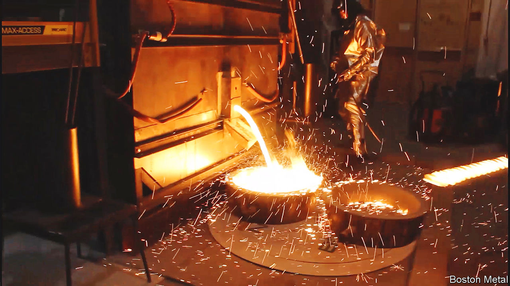

###### David vs Goliath

# There is more than one way to make green steel 

##### Why electricity may be better than hydrogen 

 

> May 31st 2023 

Steelmakers around the world hope to decarbonise by changing the way they pluck oxygen from iron-oxide ores. This is done using either carbon monoxide (CO) derived indirectly from coke in a blast furnace, or by “direct reduction” with syngas, a mixture of CO and hydrogen.

Both create carbon dioxide, a greenhouse gas. As a consequence, steelmaking is reckoned responsible for about 9% of man-made greenhouse-gas emissions. A widespread aspiration is thus to introduce direct reduction by hydrogen alone. The only by-product of such a reaction would be water (or rather, steam).

Clever. But, thinks Tadeu Carneiro, not clever enough. Mr Carneiro runs Boston Metal, a firm based not in Boston, but rather in Woburn, 17km to the north-west. Employing the insights of Donald Sadoway of the Massachusetts Institute of Technology, Boston Metal has created a way of separating iron from its ore by electrolysis. Instead of releasing CO or steam, its approach produces pure oxygen—which is not merely harmless, but actually valuable. 

Electrolytic separation of metals from their oxides is not new. Aluminium is made this way. But the process uses carbon electrodes, and the oxygen liberated at the anode reacts with this carbon to generate CO. Boston Metal employs, instead, anodes made of chromium, iron and a secret mix of other metals in an alloy that does not react with oxygen. The other electrode, the cathode, is the liquid metal itself.

Between these electrodes, as in any form of electrolysis, sits an electrolyte. In this case it is a molten mixture of metal oxides, into which the iron ore is dissolved. Passing a current through the mixture both heats it, keeping it molten, and splits the iron oxide into its component elements.

This arrangement has several advantages over direct reduction by hydrogen. Direct reduction produces “sponge iron”, a solid that must be melted before being used to make steel. Boston Metal’s process produces liquid iron directly. Sponge iron retains any impurities from the ore itself, meaning only high-grade ore can be employed for direct reduction. In Dr Sadoway’s process impurities are retained instead in the electrolyte. This means the iron itself is chemically pure, and immediately ready to receive the various alloying elements used to produce steel.

Another advantage of relying on electricity is that the world already produces and distributes plenty of it, whereas almost no infrastructure yet exists for making and supplying hydrogen. To top things off, Boston Metal’s approach is based on cells that are much smaller than furnaces. That makes electrolytic production modular and easy to scale up.

Mr Carneiro, who used to run CBMM, the world’s leading producer of niobium, reckons steel made this way could eventually compete on cost with the conventionally manufactured version, without needing the supporting bureaucracy of subsidies, tariffs and carbon taxes required for direct reduction by hydrogen. Working up from benchtop prototypes, Boston Metal now has a cell close to the size needed for commercial production. It is in discussions with ArcelorMittal and Cleveland-Cliffs, two big steelmakers, about building its first test production facility, probably at an existing American steel plant. On May 30th the International Finance Corporation, an offshoot of the World Bank, said it had invested $20m in Boston Metal.

If the company’s process takes off, the geography of steelmaking could change radically. Legacy mills sited in coalfields in America and Europe might be replaced by plants next door to iron-ore mines, fed their electricity by connectors to the local grid. Or those new plants could be built in places with cheap electricity. (Iceland, with its low-cost hydroelectric and geothermal power, and location half way between North America and Europe, might find steelmakers queuing up.)

Pure-hydrogen direct reduction does, it is true, have first-mover advantage in the race to green steel. It also benefits from being a mere modification of an already familiar technology. But familiarity can breed complacency. And complacency sometimes leaves the door open for truly disruptive new technologies. ■


