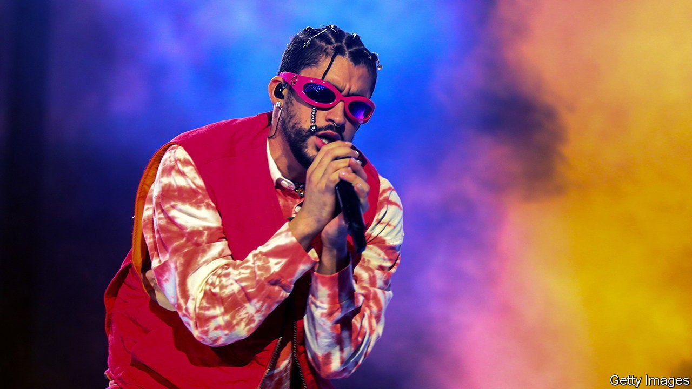
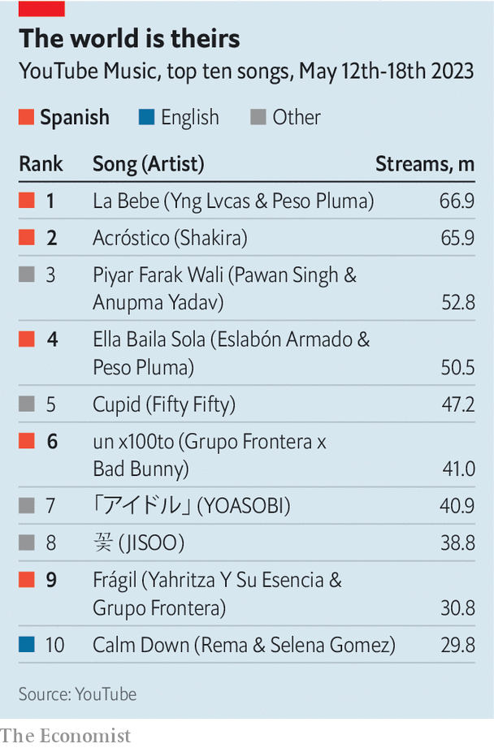
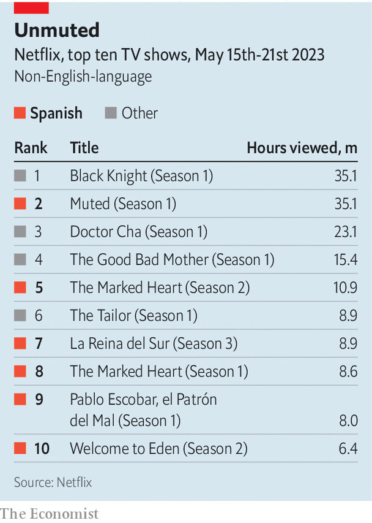

###### Latin America’s stream of soft power

# Bad Bunny, a superstar rapper, is good business 

##### On Spotify and Netflix Spanish seems to be taking over the world 

 

> May 29th 2023 

On one day last month Spotify’s four most-streamed songs were “Ella Baila Sola”, an upbeat tune with a prominent trombone; “Where She Goes”, mixing R&amp;B and rap; “un x100to”, medium-tempo and heavy on acoustic guitar and accordion, and “La Bebe”, a slow, mostly electronic bit of reggaeton, a style from Puerto Rico with a beat adapted from Jamaican dancehall. On the surface, these songs have little in common. But the world’s top four tunes, streamed over 20m times that day, do share one feature: they are all sung in Spanish. 

 


In November Spotify crowned Bad Bunny, a rapper from Puerto Rico, its most-streamed artist for the third year in a row. That is the first time in the streaming service’s history that anyone has dominated its charts for so long. On YouTube, Peso Pluma, a singer from Mexico, is out-charting even Bad Bunny, performing on three of its top 20 songs. In fact, of the top 20 songs in the week of May 18th, nine were in Spanish. In the United States last year Latin music generated $1bn in recorded music revenues, a 24% annual increase, according to the Recording Industry Association of America. That is 7% of all American music revenues, an all-time high.

 


Spanish music is having a moment. This success is crossing not just musical genres but different media, too. Two seasons of “The Marked Heart”, a Colombian thriller about organ-trafficking, are in Netflix’s top ten of non-English speaking shows (see tables). “Money Heist”, a Spanish TV series, is Netflix’s most viewed of all time by hours spent watching in the non-English charts. According to a new paper by Will Page, a visiting fellow at the London School of Economics, and Chris Dalla Riva, a musician, “Money Heist” is the most-viewed programme in Argentina, Brazil, Chile, France, Italy and Portugal. It is also popular in North Africa, the Middle East and Turkey. Three Spanish-language films rank in its top ten of all time in the non-English charts.

English-speaking culture is not going to lose its global prominence any time soon. But the inexorable rise of Spanish-language music, film and TV reflects several interconnected trends. For a start it shows the increasing importance of streaming services, such as Spotify and Netflix. It hints at how Latin Americans, particularly the young, are hungry to spend their cash on culture. It also demonstrates how Latin American migrants are moving abroad and bringing their cultures with them. In doing so, they are shaping tastes worldwide. 

 


Spanish media is not new on the world stage. Beginning in the 1960s, the fiction of Gabriel García Márquez and Mario Vargas Llosa captivated readers and prize juries. Film has long been a strength, from Spain’s Luis Buñuel and Pedro Almodóvar to Mexico’s “three amigos” (Guillermo del Toro, Alejandro Iñárritu and Alfonso Cuarón).  are a longstanding export; Egyptians as well as Ecuadoreans can relate to these universal dramas. 

Several things are aiding the new boom. The first is the internet-savvy nature of Latin America. Around half a billion people in the region own a mobile phone. They are also likely to spend more of their time on social media: Argentines, Brazilians, Colombians and Mexicans are estimated to spend a combined average of three and a half hours a day on social media, one hour more than the global average. 

A second reason for this boom is that these musicians operate across national boundaries. This collaborative nature of the music means that the big hitters appeal far more widely than just in their home countries. Fans appear to be dedicated, too. According to ’s analysis of five years of data from Spotify, in Spanish-language countries the share of streams in Spanish increased from 74% in 2017 to 86% in 2021, while the share of English-language streams fell from 25% to 14%.

 


This may surprise many in the region. The world’s Hispanophones have not always acted as though they shared a culture. Boundaries between both genres and countries have often got in the way: Puerto Rican salsa musicians went on strike in protest at Dominican musicians bringing merengue to their island in the 1970s. 

Today, more often than not, hit songs feature a guest star alongside the main attraction. Take the example of “Despacito”, a song from 2017 by Luis Fonsi, a Puerto Rican singer, featuring Daddy Yankee, a rapper also from Puerto Rico. It spent 11 weeks in the top spot in 36 countries, partly because of a remix featuring Justin Bieber, a Canadian pop superstar. Sales and streams of the song exceeded 13m in the United States. Until “Baby Shark”, a children’s video, surpassed it in 2020, the original song was the most-watched YouTube video of all time. It has so far attracted over 8bn views. Similarly, Rosalía, a Spanish mega-star, sings not only with Bad Bunny but with her fiancé Rauw Alejandro, from Puerto Rico. She has been streamed over 8bn times on Spotify, and packs out huge venues. In May she drew 160,000 fans in Mexico City. 

Likewise Becky G (from California) sings with Peso Pluma and Feid (Colombia) with Young Miko (Puerto Rico). Bizarrap, an Argentine producer, has made collaboration his brand, churning out hits with a parade of others from around Latin America. His song with Shakira (Colombia) venting at her ex-husband Gerard Piqué, a Spanish former footballer, quickly smashed streaming records by becoming the most-streamed track in Latin music on Spotify in 24 hours and the fastest Latin track to reach 100m views on YouTube, taking just over two days.

But the biggest factor is the role of the United States. Though Spanish music and television are popular elsewhere, Latin America’s northern neighbour is crucial. The Hispanic population in the United States reached 62.5m, or 19% of the total, in 2021. Hispanics account for 52% of the country’s population growth since 2010. This means there is a huge audience for Spanish-speaking media. It also seems that the children of Latin American immigrants still share the identity of their parents’ home. Fully 72% of Hispanics are Spanish-dominant or bilingual. Even in the third generation about a quarter remain bilingual.

As a result, Spanish may be getting a boost. The language has about half a billion native speakers, more than any other but Mandarin and perhaps Hindi. The coolness of Bad Bunny et al may spur new learners. After “Squid Game”, a Netflix megahit, Duolingo, a language-learning app, saw sudden spikes in sign-ups to learn Korean. Customer interest in Spanish is broader and more sustained: after English it engages by far the most active users on the app, according to Cindy Blanco, an executive. Likewise Babbel, a paid language app, saw 42% growth in Spanish learners between the first quarters of 2022 and 2023. Most were in the United States.

This is influencing other parts of the Spanish-speaking world. Ramiro Villapadierna, head of Madrid’s Office of Spanish, notes that there is little local snobbery about the Latin American accents and expressions making their way into Spanish children’s speech. The government is even trying to ride the Latin wave by boosting film and music production in Madrid. By contrast the media in Portugal is having a minor moral panic about Brazlianisms among the country’s YouTube-watching youth. One recent newspaper headline warned: “Children [are] addicted to Portuguese from Brazil”.

Another result of the increasing clout of Hispanophone culture is more subtle. The signature three-beat “tresillo” rhythm of reggaeton can now be heard all over the English-language music of singers such as Ed Sheeran, Dua Lipa and Drake. Even if listeners do not know it, they are hearing a Latin beat. ■


