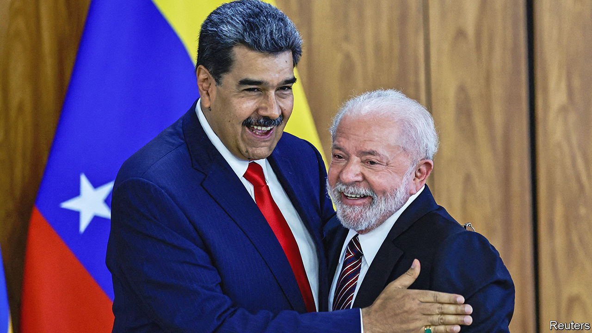

###### Grand plans, poor execution

# Lula cosies up to Nicolás Maduro, Venezuela’s autocrat 

##### Brazil’s new president appears to be motivated by ambitious plans for foreign policy 

 

> Jun 1st 2023 

In 2005 Luiz Inácio Lula da Silva, who was then just two years into his first term as Brazil’s president, declared that Venezuela had “an excess of democracy”. In fact even then democracy was under threat. Hugo Chávez, Venezuela’s left-wing populist president, had recently introduced a law that restricted what could be broadcast about state officials on radio and TV. In 2007 he called for a constitutional referendum that sought to expand his own powers while abolishing term limits. Nearly two decades later, Nicolás Maduro, Chávez’s unpopular successor, has taken advantage of his mentor’s anti-democratic policies and is ruling as a dictator. During his decade in power the economy has collapsed by 75%. Some 7m people, or a quarter of the population, have emigrated. Despite this, Lula’s views appear to remain stubbornly the same. 

On May 29th Lula, who won the presidential election last year for a third term, received Mr Maduro in Brasília, the capital. It was the first time Mr Maduro had visited Brazil since 2015. His visit was part of a regional summit of South American leaders. After a series of hugs and backslaps, Lula described his guest, who in 2020 had a $15m bounty placed upon him by the United States government for “narco-terrorism”, as the victim of “a constructed narrative of authoritarianism”. He declared it “absurd” to label Mr Maduro an illegitimate leader given that he was “elected by the people”; a sophistic argument which sidesteps the context of the rigged election in 2018, which 60 governments globally declared to be fraudulent.

Mr Maduro’s regime also faces grave human-rights allegations, including torture. Under Donald Trump, American sanctions were placed on the country and its oil industry. But this did not deter Lula in his fulsome praise. “Our opponents”, he declared, “will have to apologise for the damage they did in Venezuela.”

Why is Lula cosying up to his unsavoury neighbour? The simplest explanation is that the president is an old-school left-winger, and the instinct of the founder of Brazil’s Workers’ Party will always be to see Mr Maduro’s regime not as a corrupt cabal but as a victim of the machinations of “imperialist” outsiders, such as the United States. Indeed, in some ways it seems as if Lula has not updated his arguments for nearly 20 years. On May 30th he cited the penchant of Chávez, who died in 2013, for referendums as examples of how democratic the country is today. Mr Maduro has blocked referendums by the opposition. 

However, Lula’s effusive support for Mr Maduro may also have a more practical purpose. The two countries share a 2,200km (1,400-mile) border, most of it in the Amazonian region. This area is a key focus of Lula’s attention as he has promised to curb deforestation, which rose sharply under his predecessor, Jair Bolsonaro, a right-wing populist. One driver of tree-felling is illegal gold-mining. Tackling that, an enormously complex task, requires co-operation with Mr Maduro. Similarly, reducing migration from Venezuela is another challenge, as it is pushing up unemployment in northern Brazil.

But the primary reason appears to be that Lula, now 77 years old, is keen to become a global peacemaker. Guilherme Casarões at the Getúlio Vargas Foundation, a university, believes that the president has decided to take charge of foreign-policy decisions himself, rather than listen to his advisers. Since Lula’s inauguration in January, when he declared that “Brazil is back”, the president has taken about one official international trip a month, which has led allies to grumble privately that he is neglecting domestic issues. He wants to create a “peace club” to deal with the war in Ukraine. But his attempts at diplomacy have floundered, not least as he accused Volodymyr Zelensky, Ukraine’s president, of being “as responsible as [Vladimir] Putin for the war”. Lula may be motivated by an ambition “to negotiate a democratic transition in Venezuela”, says Rubens Barbosa, a former ambassador for Brazil.

Whatever the reasons for Lula’s staunch defence of Mr Maduro, it appears to have backfired. Sergio Moro, a judge who in 2017 sentenced Lula to prison on charges of corruption (the convictions of which were later annulled), tweeted that “Brazil is back to welcoming South American dictators with state honours”. Mr Moro, who was elected as a senator last year, has requested that Brazil’s Senate hold a hearing on human-rights abuses in Venezuela and that Maria Corina Machado, a prominent Venezuelan opposition leader, be invited. She could not attend in person, as she is banned from travelling by Mr Maduro’s regime.

Maduro’s new mates

Similarly, on May 30th many of Lula’s presidential guests took him to task for glossing over Mr Maduro’s record on human rights. Luis Lacalle Pou, Uruguay’s conservative president, warned of the risks of ignoring reality. Chile’s left-wing leader, Gabriel Boric, said that he disagreed with Lula that human-rights violations are a “narrative construction”, adding that: “It is a reality, it is serious.” However, he agreed that sanctions on Venezuela should be lifted. 

Lula and Mr Boric are not alone in wanting to lessen Mr Maduro’s isolation. Even the United States government has begun to reduce some of its sanctions on the Venezuelan oil industry. But Lula’s latest comments “went beyond what was reasonable”, says Mr Casarões. ■

