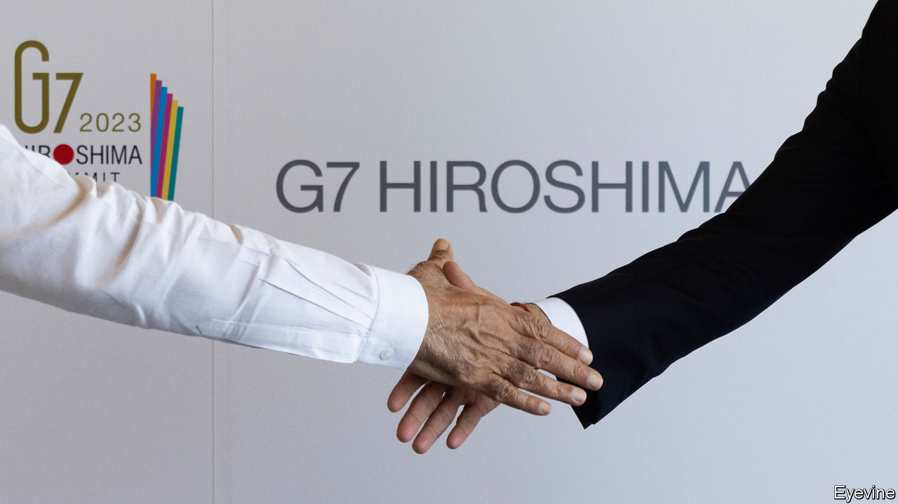

###### The Economist explains

# What does “de-risking” trade with China mean? 

##### Europe wants to reduce its exposure to, but not decouple from, the country 

 

> May 31st 2023 

AT THEIR SUMMIT in Hiroshima on May 20th, the leaders of the G7 group of rich democracies talked about “” their economic ties with China, but not decoupling from it. The same phrase appeared in an important speech by Ursula von der Leyen, president of the European Commision, in March. What does “de-risking” mean? 

In principle, the idea is easy to illustrate. Consider Europe prior to the invasion of Ukraine. Many countries, notably Germany, piped much of their imported gas from Russia, creating a worrying economic vulnerability. They could have stopped, despite the costs. That would have counted as decoupling. Alternatively, Europe might have prepared a more robust back-up plan, investing more heavily in terminals and storage tanks that would allow it to import gas from elsewhere in a pinch. That is economic de-risking. It is an attempt to reduce economic vulnerability with the least possible damage to trade and investment.

After Russia’s invasion, Europe has become more worried about its economic dependence on other geopolitical rivals, especially China. The EU, Mrs von der Leyen pointed out, relies on China for 98% of its rare-earth supply, 93% of its magnesium and 97% of its lithium, a critical input for electric-vehicle batteries. In a dispute, China could restrict supplies, just as it briefly curtailed exports to Japan during a territorial squabble in 2010. China is also a vital market for many EU companies. They could face the kind of boycotts, arbitrary inspections and delays imposed on Australian wine, beef and other products after the two countries fell out in late 2017. Mrs von der Leyen also worried that European technology could help China modernise its military and improve its intelligence capabilities.

How is the EU trying to reduce these risks? The first step is to , through “stress tests” and supply-chain audits. The bloc plans to cultivate alternative trading partners, Mrs von der Leyen said, including India, Australia and the Association of South-East Asian Nations. The Commission has recently proposed the Critical Raw Materials Act, which aims to increase mining of resources like lithium and graphite within the EU and diversify its foreign suppliers. Members such as France, Germany and Italy have increased their scrutiny of direct investment from China, especially in sensitive high-tech sectors, and the European Commission has tried to make this screening more consistent and co-ordinated. It is harder now to imagine a deal like that in 2016 when Kuka, a German robotics firm, was acquired by Midea, a Chinese firm. In March the EU agreed on the text of a new, more predictable protocol for responding to “economic coercion” with tariffs and similar measures. The union is also contemplating the use of export controls and more screening of outward direct investment. 

“De-risking” is sometimes seen as a label for a more commercially minded approach to China than the tougher decoupling that is popular with . But the distinction is not so clear in practice. America’s national security adviser, Jake Sullivan, has been happy to borrow the term to describe his government’s approach, which includes stricter export controls than Europe has adopted. And since a clean economic break with China is hard to imagine (last year American imports of goods and services from China reached a record high), the partial or piecemeal decoupling that some in America advocate may be hard to distinguish from de-risking. If the EU eventually imposes export controls or blocks a European investment project in China, it will no doubt call it de-risking. And China will probably call it decoupling. ■

