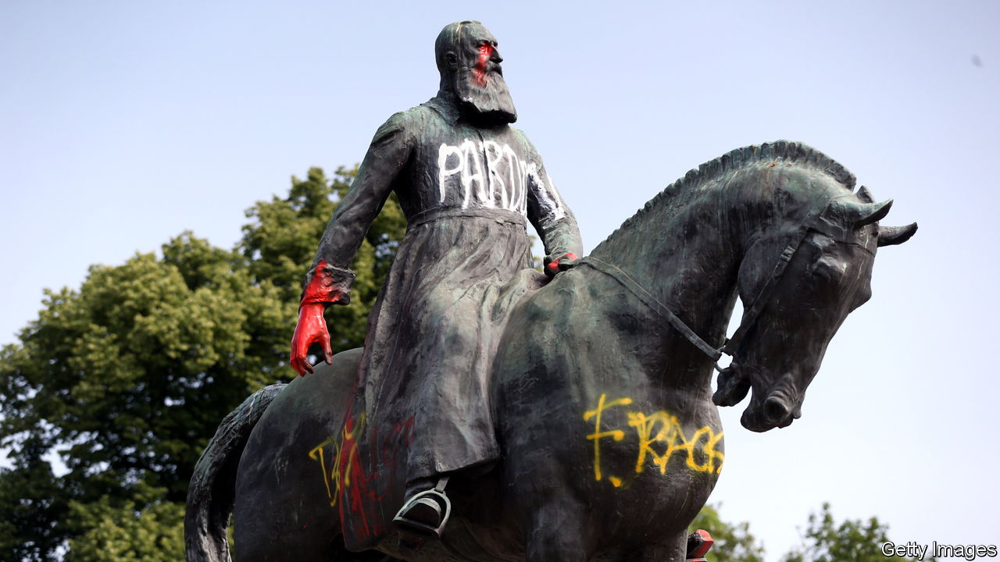

###### The anti-imperialists strike back

# What to read to understand imperialism and colonialism 

##### Seven books about a fraught subject that influences many of today’s political debates 

 

> Jun 1st 2023 

THE HISTORY of colonialism and imperialism used to be an academic backwater. The subject was widely thought to be irrelevant, and those who studied it fogeyish and reactionary. Their younger colleagues were colonising the airwaves with fashionable new theses on feminist history, post-modern anything and cultural studies. But the rise of , followed by the movement, changed the intellectual landscape dramatically. Colonialism and imperialism have come to be blamed by many, especially on the political left, for a lot of present ills, from systemic racism to economic inequality, and thus worthy of more attention. “Post-colonial studies”, practised largely by literary theorists, and imperial history have become intellectual battlegrounds. They are a new frontline in the culture wars, especially in Britain and America. These seven books provide clarity about a subject that now suffers from over-simplification and invective.

 By John Darwin. 

John Darwin, a British historian, has been called the “don of big-book imperial history”. “After Tamerlane” is the most useful of his tomes. His survey sets the subject of empires and colonialism in the widest possible context. The first chapter, “Orientations”, is particularly valuable, dispassionately examining the passionate debates that now characterise the field. The book makes two important arguments. First, Mr Darwin punctures the common assumption that empire is “the original sin of European peoples, who corrupted an innocent world”. Rather, he demonstrates that empire has been “the default mode of political organisation throughout most of history”. Second, he shifts the focus away from western Europe and towards the great empires of Eurasia: those of Russia and Persia, the Mongols and . Revisiting the power of these vast empires helps to explain revanchism in contemporary Russia and Iran. 

 By Kwasi Kwarteng. 

Much of the wrangling over the legacy of colonialism and the rights and wrongs of imperialism focuses on the British Empire. It was the largest of them all, and had the most significant impact on the modern world. Of the recent crop of books on the subject “Ghosts of Empire” is the most sensible, informative and readable. Kwasi Kwarteng, a British Conservative MP of Ghanaian descent, was educated at Eton and Cambridge. He brings both objectivity and insider knowledge to the subject. He is certainly a better  than he was a . Surveying the empire at work in countries such as Burma (now Myanmar), Sudan and Iraq, Mr Kwarteng shows just what a haphazard enterprise it really was, “a series of improvisations, conducted by men who shared a common culture, but who often had very different ideas about government and administration”. British imperialism came in lots of varieties, so its legacies were also diverse. 

 By Shashi Tharoor. 

There is nothing dispassionate about this book, by Shashi Tharoor, an MP for the Congress party, which governed India for decades after independence. Provoked by claims that British rule brought benefits to India—democracy, the rule of law and political unity—the author demolishes them one by one in a polemic argued at full pelt. He acknowledges some positive consequences of British rule but argues, rightly, that these were merely “by-products” of that rule. Railways, for instance, were not intended to benefit Indians, but have proved beneficial nonetheless. Charting India’s precipitous economic decline under the Raj, he writes: “India was governed for the benefit of Britain. Britain’s rise for 200 years was financed by its depredations in India.” Mr Tharoor delights in using the Brits themselves to support his arguments. Thus, one official of the , considering his own good fortune, reflects: “The Englishman flourishes, and acts like a sponge, drawing up riches from the banks of the Ganges, and squeezing them down upon the banks of the Thames.” So much for the “civilising mission” of imperial rule.

. By Adam Hochschild. 

Even more damning of European colonialism than Mr Tharoor’s book, but written in a very different style, is the brilliant , by an American historian and author. This is the horrifying story of the Belgian Congo, the paramount example of the dreadful excesses of colonialism in the 19th century, when the “scramble for Africa” was at its height. Adam Hochschild shows how the Congolese were treated every bit as cruelly as Joseph Conrad alleged in “Heart of Darkness”, still one of the best, and most scathing, novels about imperialism. About 10m Congolese, half the population, died during the era of the Congo Free State, from 1885 to 1908. The heroes of Mr Hochschild’s story are the Irish-born diplomat Roger Casement and the French-born British journalist Edmund Morel, who first exposed slavery and other abuses. In Belgium Mr Hochschild’s book provoked a debate that led to a shift in attitudes towards the country’s  (The graffitied statue pictured above is of King Leopold II.)

. By Pieter Judson. 

Austria-Hungary is the only European empire that has come to be studied as much for its achievements as for its iniquities. Assembled largely through dynastic marriages and treaties,  dominated central Europe for centuries. Yet it collapsed quickly at the end of the first world war, giving way to successor states such as Poland, Yugoslavia and Czechoslovakia. The disintegration of some of those successor countries in the 20th century, sometimes accompanied by civil war, has led to a reassessment of the empire. Historians like Pieter Judson de-emphasise its divisions and tensions. Instead they write about how the monarchy bound together a prosperous, multi-ethnic and -cultural entity. Some argue that  could learn a lot from  about how to reconcile ethno-nationalist aspirations with federal political structures. The European Union has absorbed some of those lessons. 

 By Ryan Gingeras.

In 1700 the Ottoman sultan ruled an extraordinary empire, encompassing much of the modern Middle East, North Africa, the Balkans and the Black Sea. Over the following 200 years or so rival powers seized territories on the periphery while nationalists in its constituent parts conspired against the sultans from within. Eventually they brought the empire to its knees. Ryan Gingeras, an American academic, focuses on the last years of , when the modern secular state of Turkey emerged from the debris of the sultanate. This is an account of the often unpredictable and bloody consequences of imperial collapse. Mr Gingeras shows how they continue to shape events in Kurdistan, Armenia and elsewhere. Turkey’s president, Recep Tayyip Erdogan, has cultivated  for the empire, and has made himself a modern-day sultan.

 By Peter Jackson. Yale University Press; 640 pages; $80 and £30

Peter Jackson’s monumentally erudite account of the Mongol conquests follows Mr Darwin’s work in widening the horizons of imperial history. The Mongols’ realm was the largest contiguous land empire in history, yet it was governed by nomads from a moveable court consisting of thousands of tents. Mr Jackson fully acknowledges the brutality of Genghis Khan, the empire’s founder, who died in 1227. He and his army massacred urban populations as they moved westwards from their homeland in the central Asian steppe. Yet they established what has been called the in a vast part of Eurasia. The Mongols were at least partly responsible for “a marked growth in trade between the Islamic world, on the one hand, and China and other regions of the Far East”, writes Mr Jackson. He argues that, contrary to their image as savage barbarians, the Mongols “also stimulated intellectual and cultural activity in the Islamic world”. Original and surprising at every turn, this book suggests how much imperial history remains to be written.


 recently reviewed another good book on the British Empire, , by Sathnam Sanghera.  argues that the second world war had its origins in European colonialism. We wrote about , a documentary series that rightly indicts acts of genocide by Western imperialists but largely ignores outrages committed by non-Western perpetrators.  we examine the imperialist bent of the greatest Russian writers (which is no reason not to read them). In  Noam Chomsky, a critic of America’s foreign policy, argues that the country still behaves like an . 

