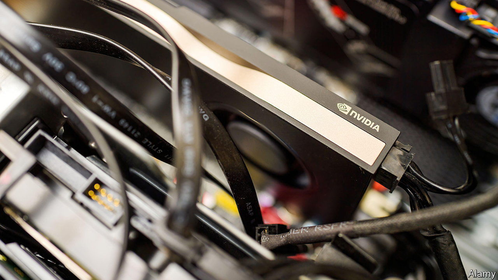
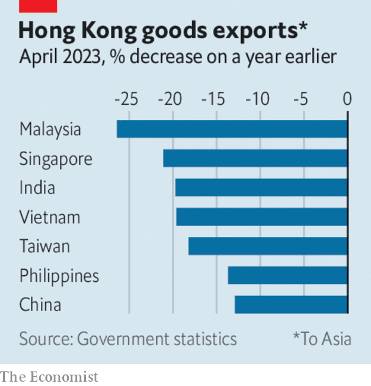

###### The world this week

# Business 

#####  

 

> Jun 1st 2023 

A surge in  share price pushed it briefly past $1trn in stockmarket value. The American company makes high-performance chips that are used in artificial intelligence and has seen its stock double in value since the release of ChatGPT, a chatbot, last November. This week’s jump in the share price was triggered by Nvidia forecasting a huge increase in quarterly sales and assuring markets that it could increase supplies of its H100 chips, used in large-language AI models. Nvidia is getting orders from a wide range of companies, from cloud-computing providers to online-shopping websites, in their rush to adopt generative AI. 

Profits from doom

A group of heavyweights who work in AI, including the bosses of Google’s DeepMind and OpenAI, signed a statement warning that “mitigating the  from AI should be a global priority”, on the same scale as pandemics and nuclear war. Many scientists think that fears of AI wiping out humanity are overblown, and point to less apocalyptic problems with the technology, such as its generation of fake imagery. 

 reported a solid set of quarterly earnings and higher net profit proving that its turnaround, after a run-in with activist investors over spiralling costs, is working. The share price of the business-software company is up by 68% this year. 

America’s Supreme Court declined to hear a case claiming that Reddit, an online platform, is responsible for child-pornography images hosted on the site. The court’s denial of the case is another indication that the justices are unwilling to tackle liability issues under the , leaving the matter to Congress. In , the court recently ruled that charges against Twitter for hosting tweets from Islamic State were not permissible. And it dismissed , another case centred on moderating terrorist content. 

 


 slumped again in April, decreasing by 13%, year on year. In March outward-bound goods had dipped by 1.5%, an improvement on the 9% drop in February and 37% fall in January. Exports to mainland China were down by 13% in April, to America by 20% and Germany by 16%. South Korea’s exports also fell sharply again, by 15% in May.

Chinese media heralded the inaugural commercial flight of the C919, a  built by Comac, a state-owned planemaker. The C919 is touted by the Chinese government as a potential rival to Airbus and Boeing in China’s aviation market, stressing the country’s technological independence in the face of some American sanctions. The first flight was operated by China Eastern from Shanghai to Beijing. Comac already has 1,000 orders for the plane, according to state media. 

 in America increased again in March, as measured by the S&amp;P CoreLogic Case-Shiller index, rising by 0.4% over February. S&amp;P said that the decline in house prices that started last June may now be over, but that high interest and mortgage rates still posed “challenges”. 

 began her 11-year prison sentence, 18 months after she was convicted of defrauding investors in Theranos, a blood-testing Silicon Valley startup that she ran. Ms Holmes’s request to be granted bail while she appeals against the verdict was denied recently. She is serving her sentence at a women’s minimum-security prison in Texas.

Proposals by  at the annual shareholders’ meetings at Chevron and ExxonMobil received less support than in previous years. The proposals want the energy giants to set higher emissions targets and were supported by around 10% of stockholders. By contrast, a similar proposal at the AGM of TotalEnergies was backed by 30% of investors. Police fired pepper spray and tear-gas at protesters as they tried to block entry to the meeting in Paris. Total’s chief executive, Patrick Pouyanné, defended the climate-transition plan of the French company, describing the naysayers as “grumps”. 

Hundreds of employees are leaving  each week ahead of its impending takeover by UBS, according to reports. In a final humiliation for the Swiss bank a court has ordered it to pay $926m to Bidzina Ivanishvili, a former prime minister of Georgia, in a fraud case. The firm is appealing against the judgment. 

ChatGPT in the dock

Amid all the hoopla about   it emerged that ChatGPT had invented more than half a dozen legal precedents when a lawyer used it for research in a lawsuit against an airline. The lawyer presented the brief to the court when arguing the case. When the judge found out he had used ChatGPT, the lawyer pleaded for mercy: his source “has revealed itself to be unreliable”, he said. 

