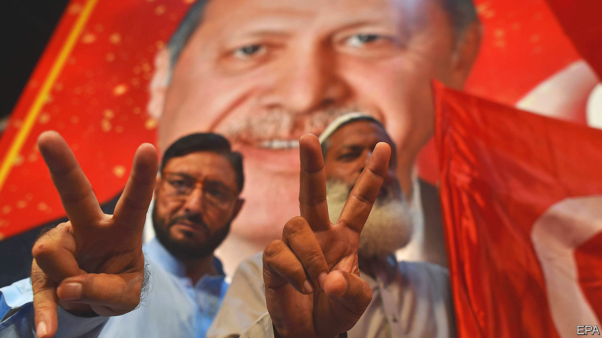

###### The world this week

# Politics 

#####  

 

> Jun 1st 2023 

 won another term as  president, taking 52% of the vote in a run-off election against the opposition candidate, Kemal Kilicdaroglu. Observers from the Organisation for Security and Co-operation in Europe reported that the election was well run, but that media bias and restrictions on freedom of expression “created an unlevel playing field” in favour of Mr Erdogan. The Turkish lira hit a new low against the dollar. 

Soft and hard power

Turkey warned  to rein in domestic Kurdish activists, after a pro-Kurdish group projected a flag onto the parliament building in Stockholm. Turkey is the last hold-out in NATO against Sweden’s membership of the alliance. Joe Biden said he had called Mr Erdogan after his victory and asked him to drop his opposition to Sweden’s bid. The pair also discussed the possibility of sending F-16s to Turkey. 

The Ukrainian capital, Kyiv, was attacked again by waves of Russian . Officials said most were shot down. Following one assault Moscow was also hit by several drones, causing minor damage. It was the most significant strike on the Russian capital since the start of the war. Ukraine denied that it was behind that attack. Russia blamed the West for encouraging Ukraine. 

Mikhail Mishustin, Russia’s prime minister, said that 1.5m  had been issued to people in the parts of Ukraine it claimed to annex last year (Russia does not fully control the regions). Under a decree signed by Vladimir Putin those who do not accept Russian citizenship face possible deportation. 

In  the president, Andrzej Duda, signed a bill to investigate Russian influence in the country’s politics. The ruling Law and Justice party says this is necessary to weed out Russian agents. But its opponents say the intention is to scrutinise previous governments headed by Donald Tusk, who now leads the opposition, and to harass him ahead of an election later this year. 

NATO is sending another 700 peacekeeping troops to  amid a surge in violence in the country. Clashes between NATO peacekeepers and ethnic Serbs protesting against the installation of ethnic Albanian mayors in northern Kosovo, where Serbs form the majority of the population, has led to dozens of injuries on both sides. America and the EU have blamed Kosovar authorities for the trouble. 

 Socialist prime minister, , called a snap general election, after his party was trounced in regional and local elections. The Socialists lost control of Aragón, Extremadura and Valencia to the conservative People’s Party, and also the city of Seville in Andalucía. The PP will probably rely on the support of the right-wing Vox party to govern. Mr Sánchez is calling a national vote “to define the country’s political direction”. 

Police in the  arrested 1,500 climate-change protesters and deployed water cannon when they refused to leave a motorway they had blocked in The Hague. Forty are to be prosecuted. 

At least 153 people have died in custody in the year since President Nayib Bukele started a crackdown on gangs in , according to a local human-rights group. Cristosal said that 75 of the dead showed signs of torture. Gang activity and murders have fallen, but at a huge cost to human rights: almost 2% of the adult population is behind bars. 

,  autocratic president, made his first trip to since 2015. He was warmly welcomed by Luiz Inácio Lula da Silva, the new left-wing president, who said that the Venezuelan dictator was the victim of “a constructed narrative of authoritarianism”.

The White House and Republicans in Congress released the details of their agreement on increasing the limit on federal debt. The deal suspends the  for two years, past the elections in 2024, and cuts some government spending, but nowhere near as much as the Republicans had wanted. The deal passed the House of Representatives, although some Democrats and Republicans voted against it. 

 


Bola Tinubu was sworn in as president of  amid worries about the economy and insecurity across the country, especially in the north. Some projections suggest that Nigeria’s population could draw level with America’s at more than 400m by around 2050, thus becoming the world’s third-most-populous country after India and China.

 said it had killed 55 jihadists in a three-week joint operation with Nigeria along their border. Meanwhile, violence perpetrated by jihadists reportedly led to at least 40 deaths in . 

Jihadists from al-Shabab, an al-Qaeda-linked group that has been fighting to take over  since 2006, attacked a Ugandan army unit that is part of an African Union peacekeeping mission, reportedly killing scores of soldiers at a base south-west of Mogadishu, the capital. The exact tally was unclear. 

 civil war persisted, with fierce fighting in at least three districts of Khartoum, the capital. The army, which is battling against a paramilitary rebel force, said it had suspended a truce, which has been extended several times under the aegis of Saudi Arabia and America. 

A court in sentenced to death 23 Islamists attached to the jihadist group Islamic State and imposed life imprisonment on another 14. They had all taken part in killing, and in some cases beheading, dozens of Egyptian Christians who had been visiting the country in 2015.

Partisan advantage

Opposition parties boycotted the opening of a  in . They had wanted the country’s president, Droupadi Murmu, to lead the ceremony rather than the prime minister, Narendra Modi. Mr Modi is accused of turning what should have been a nonpartisan occasion into a political advertisement for his brand of Hindu nationalism. 

 said that its first attempt to launch a spy satellite failed and it had crashed into the sea. It will try to send up another satellite soon. Emergency-evacuation texts were transmitted in error in Seoul, South Korea’s capital. 

The first summit between  and  states was held in Seoul. South Korea pledged to double its development aid to the Pacific region and collaborate on security. It is the latest in a series of international meetings aimed at countering China’s growing influence in the Pacific. 

