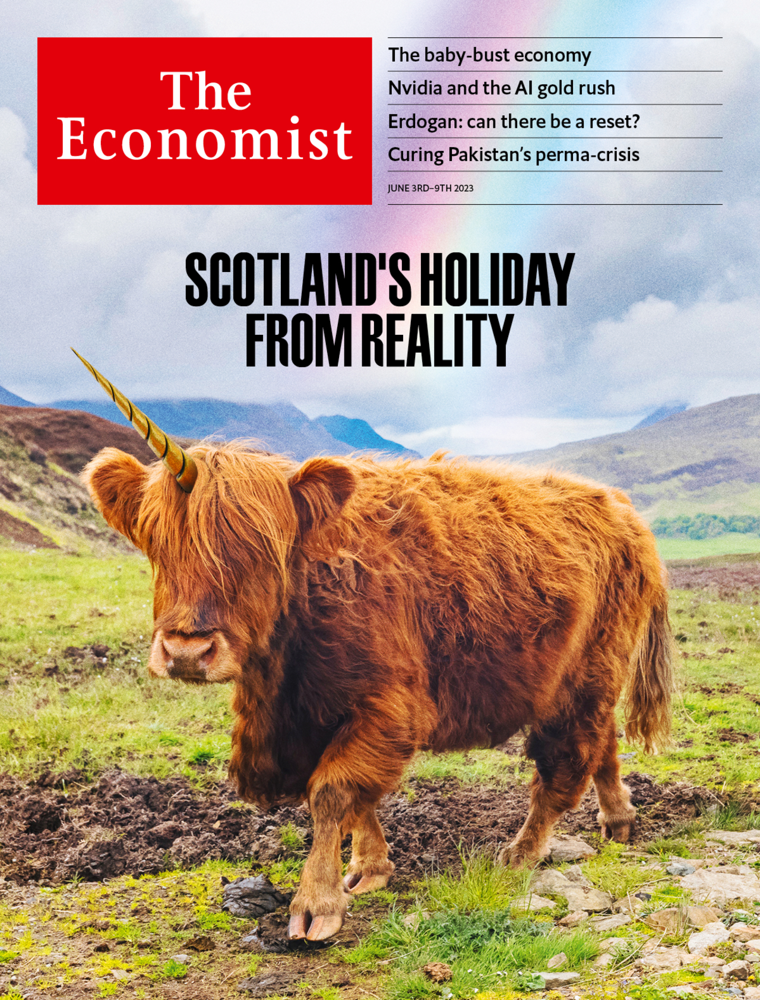

###### The Economist

# This week’s covers 

##### How we saw the world 

> Jun 1st 2023 

We had two covers this week. Our British edition looks at . Everywhere else we focus on the profound economic consequences of .

In 2000 the world’s fertility rate was 2.7 births per woman, comfortably above the “replacement rate” of 2.1, at which a population is stable. Today it is 2.3 and falling. The largest 15 countries by GDP all have a fertility rate below the replacement rate. That includes America and much of the rich world, but also China and India. The upshot is that before the end of this century the number of people on the planet could shrink for the first time since the Black Death.

For most of history, age distributions have been shaped like a pyramid, with lots of children at the bottom supporting a small number of elderly at the top. Today, the world has a bad case of middle-age spread, with relatively few children, a few of the very elderly and a big bulge in between. 

It is said that storks symbolise babies because they are migratory, leaving Europe each summer and returning nine months later—carrying a baby in a white cloth. Today babies are in short supply, so we created an image of a stork that has tucked its beak under its wing and is taking a nap. But we wanted to get across not only the widespread collapse in fertility, but also its consequences.

One of these is that innovation is likely to be rarer in ageing societies—an idea we illustrated with an elderly boffin in a deserted lab. Younger people have more of what psychologists call “fluid intelligence”, the ability to solve problems in entirely new ways by thinking creatively. Youthful dynamism complements the accumulated knowledge of older workers. Patents filed by the youngest inventors are much more likely to cover breakthrough innovations. Older countries—and, it turns out, their young people—are less enterprising and less comfortable taking risks. All this is likely to compound into an enormous missed opportunity. 

Ageing societies risk higher taxes, later retirements, lower real returns for savers and, possibly, government budget crises. That is because retired folk draw on the output of the working-aged, either through the state (which levies taxes on workers to pay public pensions), or by cashing in savings to buy goods and services, or because relatives provide unpaid care. Whereas the rich world currently has around three people between 20 and 64 years old for every one over 65, by 2050 it will have less than two. 

We opted for a cover based on this idea. In one sketch a slide becomes the downward-sloping graph of the global fertility rate. An alternative was simply to have a slide that stopped short of the ground—as a symbol of societies in which children are lacking. The perilous drop signals the dangers ahead. 

 


: 

: 


For many years the Scottish Nationalists have been Britain’s most successful political party. Scotland was the first of Britain’s nations to get high on populist referendums. The party SNP has triumphed in election after election. It has made the intoxicating cause of independence the principal dividing-line among Scottish voters. Nicola Sturgeon, the party’s leader until her resignation in February, managed to make liberals giddy, too, by being not just populist but progressive. 

Ms Sturgeon’s abrupt exit amid a police investigation into her party’s finances has shattered the SNP’s credibility. The inability of the Scottish government to call another referendum unilaterally means that the path to independence is blocked. Under Humza Yousaf, the party’s new leader, the SNP is projected to suffer heavy losses to Labour in the next Westminster election. The SNP’s grip on Holyrood, where it has held power continuously since 2007, is in serious doubt. 

The investigations into Ms Sturgeon involve the purchase of a camper van—–and so we have it teetering on the edge of precipice, in the style of “The Italian Job” and head on, with the wheels falling off. 

We liked that image but our cover in Britain last week, on the National Health Service, featured an ambulance on life-support. We don’t want  to seem like a relaunch of the exalted monthly  which, sadly, folded during covid.

An alternative featuring the Loch Ness Monster, titled “Loch Mess”, was better. The SNP’s travails are a parable with lessons that both encourage and dismay: that a populist movement can suddenly unravel and that the damage it causes can still endure. The party has become incapable of thinking beyond the next strategic gambit for divorce. Elementary tasks—procuring ferries, conducting a census—confound an administration that once claimed it could build an independent state in just 18 months.

We illustrated that combination with the party as Nessie, sinking beneath the chilly waters of the famous loch—–but never to disappear.

Even a pretend plesiosaur cannot compete with a ball of ginger fluff. Enhanced with a single horn and a rainbow, the highland cow illustrates how living off the intoxicating dream of independence is electorally easier and more instantly rewarding than the long haul of fixing real problems. Scotland’s political class has been on a long holiday from reality. Their country cannot afford another wasted decade. 

 


: 

: 

