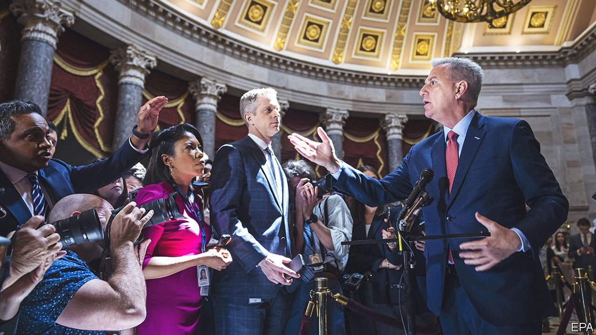

###### Debt ceiling

# America avoids financial Armageddon but stays in fiscal hell 

##### High stakes but limited results from the country’s latest debt-ceiling drama 

 

> Jun 1st 2023 

Soap operas must run indefinitely and therefore never conclude satisfactorily. So it is with the latest episode of a long-running Washington soap opera—its roughly biennial —which is wending towards a predictably short-lived conclusion. Having threatened the world with a sovereign default and financial disaster in order to achieve their aims, Republicans in Congress have gathered modest concessions from President Joe Biden and agreed that America ought to honour its obligations, after all. The two sides  to raise the government’s debt ceiling, which will let it resume borrowing money—staving off Armageddon for at least the next 18 months. Republican leaders have called the deal, known as the Fiscal Responsibility Act, a historic victory for budgetary prudence. In reality it does nothing to tackle the main sources of .

This current drama is not fully done yet. On May 31st the deal cleared its toughest hurdle when the House of Representatives approved it by a margin of 314 to 117. It now moves to the Senate, which must pass the bill by June 5th, or Treasury has warned it may run out of cash. A few conservative senators have threatened procedural delays, but in the end passage seems assured. Both Chuck Schumer, the Democratic majority leader in the Senate, and Mitch McConnell, the Republican minority leader, have come out strongly in favour of the deal. In the House support was about as bipartisan as anything is these days in Washington, with backing from two-thirds of Republicans and four-fifths of Democrats.

The headline summary of the deal seems impressive. The Congressional Budget Office, a neutral scorekeeper, calculates that it will reduce spending by about $1.3trn over the next decade. When cuts are measured in the trillions rather than the billions, they are, by definition, big. The trouble is that federal spending is in the tens of trillions: the CBO expects about $80trn in outlays over the next decade. Moreover, its debt-deal estimates are too optimistic. Side agreements between the White House and Kevin McCarthy, the Republican speaker of the House, will soften the reductions. Donald Schneider, a budget expert, thinks that creative accounting alone could shave off more than $90bn from the cuts. And crucially, spending caps are only enforceable in 2024 and 2025.

Totting up the full economic impact of the deal thus points to trifling outcomes. Michael Feroli of J.P. Morgan, a bank, estimates that it will lower federal spending by about 0.2% of GDP next year relative to the CBO’s prior baseline. That is much smaller than the 0.7% reduction in 2011 following a debt-ceiling standoff during Barack Obama’s presidency. The welcome news for Mr Biden is that the downside from the cuts is likely to be scarcely noticeable. Mark Zandi of Moody’s Analytics, a subsidiary of the credit-rating agency, reckons that the drag may push up the unemployment rate by just 0.1 percentage points next year. The less welcome corollary is that spending cuts will do little to tame high inflation.

A weak deal is infinitely preferable to no deal, which might have provoked a meltdown in global markets. Nevertheless, the contrast between the high-stakes game of debt-ceiling chicken and its piddling resolution is incongruous. America’s fiscal path remains worrisome. On May 26th the International Monetary Fund was the latest to raise the alarm about the country’s finances. Federal debt held by investors at home and abroad has reached about 93% of GDP, almost triple its level on the eve of the global financial crisis of 2007-9. By the end of this decade the American government is on track to spend more annually on interest payments than on national defence.

Two parts of America’s budget are most critical to defusing its fiscal problems. The first is its entitlement spending—notably, state-provided pensions and medical insurance for the elderly. These already account for nearly two-thirds of federal expenditures, and are set to expand as the population ages. The other is tax revenues, with the American government taking in considerably less as a share of GDP than most other high-income countries. Both of these elements were, however, entirely absent from the debt-ceiling negotiations: Democrats worry about the electoral consequences of calling for higher taxes, while Republicans fear blowback from trying to shrink entitlement spending. With both parties agreeing to increase the defence budget, the result is that the spending cuts will be entirely focused on “non-defence discretionary” programmes, which account for just about 15% of the budget. Cuts, yet to be hashed out, will hit national parks, schools, health care and more.

Perhaps some good will yet come of the debacle. Mr McCarthy has called for a bipartisan commission to figure out how to fix the country’s finances—an idea that has prompted guffaws. Brian Riedl of the Manhattan Institute, a conservative think-tank in New York, is less dismissive. “Commissions can be useful if both parties are truly committed to achieving an outcome rather than just checking a box,” he says. Mr Biden, meanwhile, has suggested that he might yet launch a legal challenge, long urged by progressive Democrats, to test whether the debt ceiling is constitutional.

A daydreamer can just about imagine a future in which the two efforts come together: the fiscal commission would lead to serious budgetary reforms, while a successful legal case would free America from its metronomic debt-ceiling lunacy. Soon enough, though, harsh political realities will intrude on such reverie. The new agreement to raise America’s borrowing limit runs until early 2025, at which point its next episode of debt-ceiling drama is all but certain to kick off. ■


