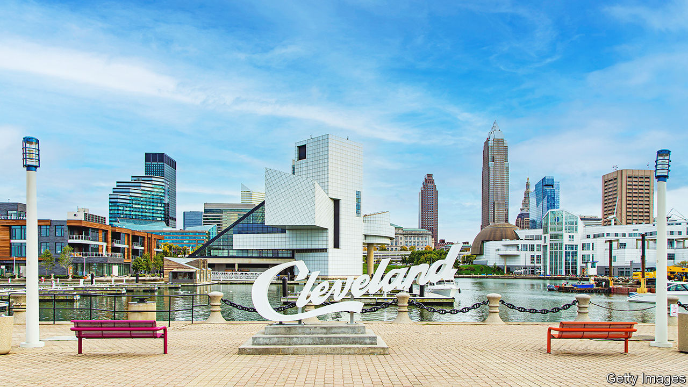

###### Where the neon signs are pretty

# Can downtown densification rescue Cleveland? 

##### Dan Gilbert, a Detroit-based billionaire, thinks so 

 

> Jun 1st 2023 

Justin Bibb, the mayor of Cleveland, Ohio, has a good idea which neighbourhood needs to be fixed if his city is to thrive. That is, his own. Mr Bibb, a 36-year-old former consultant who took over as mayor at the start of last year, lives in a one-bedroom apartment in downtown Cleveland, just a short walk away from his office in the city’s grand neoclassical city hall. For exercise, he jogs in the park outside. And he thinks that if Cleveland, a city of 362,000 people that was once home to almost three times as many, is to start growing again, it needs more people to be able to live lives like his. 

“If we don’t have a thriving urban core… we don’t have tax revenue to fix potholes, to pay police officers more, to hire more folks to pick up trash and do recycling,” he says. “The urban core of any city is its heart and the soul.” It “feeds all of the arteries” that keep other neighbourhoods alive.

Mr Bibb’s enthusiasm for downtown is far from unique. In the decade or so up to the pandemic, revitalising historic downtowns was the big hope of many leaders of struggling cities in the rustbelt. And to a remarkable extent they were succeeding. 

Between the two most recent censuses, in 2010 and 2020, though the city of Cleveland as a whole lost 24,000 residents, the “downtown core” grew by over 3,000 people, or around 22%. Beautiful buildings once occupied by banks and offices are now smart apartment blocks. Milwaukee’s downtown population grew by a quarter, even as its overall population shrank. Detroit’s downtown, parts of which were abandoned when the city declared bankruptcy a decade ago, has been transformed, with cranes dotting the skyline. 

Yet the pandemic has been a terrible setback. The wealthy office workers whom developers hoped to coax into cities with walkable commutes now have the option of working from home. In Cleveland, only around three-fifths of office workers are regularly back at their desks, according to data from the Cleveland Downtown Alliance, a local lobby group. Shopping centres and restaurants are reeling, even as their competitors in the suburbs thrive. 

Mr Bibb believes the pandemic in fact strengthens his argument: if your downtown is to thrive, you need people to live in it, not just commute to it through punishing traffic from the suburbs. Yet there is a catch-22. Wannabe urbanites will not give up the comforts of the suburbs to move to a place that is dead; but new bars and restaurants will not open without them.

At least some developers still like the plan. One of the most prominent is Bedrock, a firm owned by Dan Gilbert, a Detroit-based billionaire who is the co-founder of Rocket Mortgage, and who owns the Cavaliers, Cleveland’s basketball team. Mr Gilbert’s approach to property investing is to concentrate enormous resources in one place, something he calls a “big-bang approach”. In Detroit over a decade ago, when the city was close to bankruptcy, Mr Gilbert bought up a swathe of the city centre—he owns at least 100 buildings—and poured investment into all of them simultaneously, even giving subsidies to his workers to move into the new condos.

Mr Gilbert’s idea is, in essence, that scale allows you to internalise spillover benefits. Restoring a single derelict skyscraper on its own might not be profitable enough to be worth it. But when you bring a building back to life, the ones next to it also go up in value. If you own those buildings too, perhaps the project becomes profitable. In Detroit, “we knew that an influx of investment in the city core would attract additional capital”, he says. 

He is now trying to do something similar in Cleveland. In 2016 Bedrock bought most of Tower City Centre, a long-neglected art-deco skyscraper built over what was the city’s central rail terminus. In February the firm announced it intends to expand onto some 35 acres of land that drop steeply from the back of Tower City to the Cuyahoga river, and are now occupied mostly by parking spaces and a potholed road. 

Over the next two decades, the asphalt will be replaced by 2,000 new homes, as well as a vast amount of office and non-residential space, linked together with a park, all designed by Sir David Adjaye, a famous Ghanaian-British architect. The total cost will be around $3.5bn—a huge sum for a single developer in a relatively poor city. But the idea is that the new buildings will not only make a profit directly. When they fill up with well-off new residents, that will also raise the value of Tower City, which Bedrock imagines turning from a slightly dingy shopping mall into one stuffed with fancy restaurants and high-end shops, as well as several other buildings that Bedrock has acquired nearby. That in turn makes the whole project viable.

Will it work? Mr Gilbert says that the pandemic shows how city centres need to be exciting places to visit and live in, not just warehouses for office workers. Commercial landlords may be struggling, but “developers can’t bring residential housing online fast enough”, he says. Vacancy rates for homes are extremely low. 

What Mr Gilbert has, apart from lots of money, is a perhaps even rarer commodity: patience. Politicians like Mr Bibb, desperate to stop the shrinking of their tax bases, may have to find it too. ■


