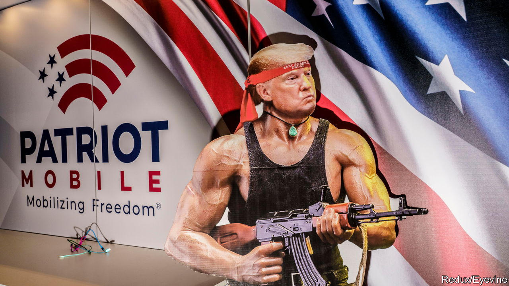
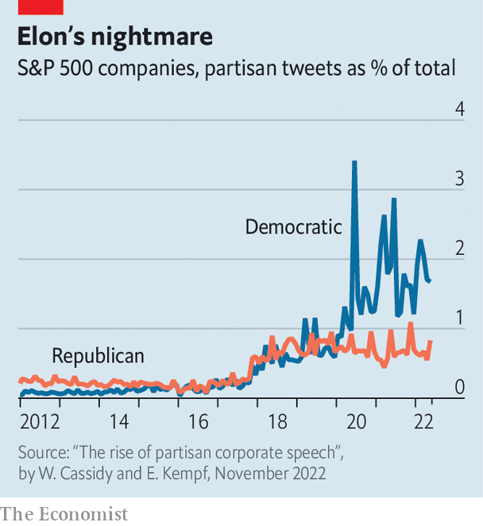

###### The red and the black

# Conservative Americans are building a parallel economy 

##### For-profit polarisation 

 

> Jun 1st 2023 

If you are a God-fearing, gun-toting patriot, conservative companies are hungry for your business. If Google and YouTube have become too woke for you, consider ditching them for Tusk and Rumble. Before paying your monthly AT&amp;T bill, you might want to switch to Patriot Mobile, the nation’s one-and-only Christian conservative wireless network. Rather than fruitlessly scouring Hinge for fellow right-wingers you can now make a profile on the Right Stuff, a dating app that helps users get to know each other by eliciting responses to prompts like “January 6th was” or “favourite liberal lie”. To get java roasted by veterans, consider sipping on Black Rifle Coffee’s “Silencer Smooth” (light roast), “AK-47” (medium roast), or “Murdered Out” (extra dark roast). And to protest against Hershey honouring a transgender activist on international women’s day, you can instead buy Jeremy’s Chocolate, where the HeHim bar contains nuts and the SheHer one is unequivocally nutless. 

And that’s just the beginning. PublicSq, an online marketplace, is home to 40,000 firms devoted to freedom, the family unit and the constitution. Click through and you can find skin care and artisan jerky, probiotics, banks, app developers and accountants. The businesses listed hope to capture the hearts and wallets of as many as 100m patriots, who together, according to Michael Seifert, PublicSq’s founder, make up “the third-largest economy in the world by GDP”. Its CEOs, sellers and most avid customers dream of a parallel economy where conservatives need never buy from liberals. Is such a vision feasible?

 


Today’s populist Republicans have jettisoned many classical conservative values, but their departure from a decades-long alliance with America’s corporations is one of the most notable rebellions. “Old-fashioned corporate Republicanism won’t do in a world where the left has hijacked big business,” Ron DeSantis, Florida’s governor, recently wrote. The backlash came after Disney condemned Florida’s so-called “Don’t Say Gay” bill, Google halted midterm donations from candidates who had refused to certify Joe Biden’s 2020 win and Delta, Coca-Cola and Microsoft denounced new voting laws in Republican states. Some argue that these public displays of liberal values go beyond economic self-interest. When researchers at the University of Chicago analysed every S&amp;P 500 company tweet since 2011, they found that over time statements from companies and Democratic politicians came to sound more and more alike (see chart). 

With big business on Republican hit-lists, entrepreneurs saw an opening. The parallel economy has two major draws. For consumers, it offers the opportunity to buy from firms that reflect their values. Surveys show that Americans want brands to get political and would sometimes even pay a premium for products if they did. For firms, politically aligned suppliers serve as an insurance policy. Businesses can be burnt when companies they rely on back out over politics. Parler, a far-right social network, was paralysed when Amazon pulled its web-hosting services and Apple and Google dropped it from their app stores after January 6th 2021. The withdrawal came just as Twitter froze Donald Trump’s account and his army of apostles were hungry for a fresh platform. Politically aligned backend firms would ensure business opportunities are not missed. 

Companies are quickly learning that building viable alternatives to common products—and pulling patrons from big-shot firms—is hard. Writing and maintaining code to run Google and YouTube is so costly that no small startup could hope to compete. For services like Facebook and Tinder, the value is vastly improved with more participants. For these reasons many of the conservative tech firms are fizzling out. Tusk and Rumble have little-to-no name recognition outside far-right circles. Downloads of Truth Social, Donald Trump’s social-media site, are dwindling; its stock price has plummeted since last year. The Right Stuff captured over 50,000 hopeful singles in the two months after its debut, but has barely attracted more since (women are especially lacking). Its seed money from Peter Thiel, a libertarian billionaire, runs out this summer. 

Others hope to entice customers by not only pledging devotion to conservative values, but by actually getting their hands dirty. Last spring Patriot Mobile, the wireless network, found and funded 11 candidates to run for school boards in the Fort Worth suburbs. Their $600,000 propelled each to victory, flipping four boards, one of which has since pulled “The Diary of Anne Frank” and LGBTQ-themed novels off library shelves. But patrons who came for phone services are frustrated by the inattention to them, saying in reviews that the firm’s poor customer service is “NOT what Jesus would do!” and claiming the management is so bad “they run it like Biden”. 

MyPillow’s founder, Mike Lindell, a conspiracy-theorist, also privileged politics over product. After Dominion, a voting-machine maker, sued him for spreading false claims about election rigging, Costco, Bed Bath &amp; Beyond, Wayfair and more than a dozen other stores stopped stocking his pillows. The company lost $65m because of it, Mr Lindell says. 

A third genre of firm, which works to strengthen conservative hotbeds, may be more of a hit. According to its CEO, Conservative Move, a property broker that helps clients sell their house in a Democratic state and buy in a Republican one, has moved “tens of thousands” of people to new neighbourhoods since 2016. Revenue at RedBalloon, a job board that helps workers escape “woke” firms and get hired at right-leaning ones that, for example, respect employees’ right to be unvaccinated, grew by 90% in the first quarter of 2023. (The company’s founder bought the domain RedBalloon.work because .com “sounded too much like communist”.)

This is not Americans’ first shot at a parallel economy. Forced out of local shops during the Jim Crow era, black people built independent commercial districts. Community leaders spoke of using the “double-duty dollar” at black-owned shops to simultaneously purchase goods and support their own. Later, in the 1970s, a band of lesbians tried to withdraw from the “male economy” with the utopian goal of creating a labour market void of husbands. 

Separate yet together

Neither group achieved the self-sufficiency they dreamed of. In the South money was sparse and discrimination was not: black businessmen sold flour and dresses, but lacked the means and connections to open car dealerships or banks. Some feminist firms were lucrative at first—a record company and printing press led the way—but over time sales suffered, pioneers’ energy waned and money dried up. Today’s conservatives have better access to capital than past separatists, and may be greater in number. But the movement uses old strategies that failed in the past, says Lizabeth Cohen, a historian at Harvard University.

Not long ago Brave Books, an anti-woke children’s-book publisher, came out with “Elephants are Not Birds”, the tale of an elephant who, egged on by Culture the vulture, yearns to be a bird. Culture fits him with a beak and some clip-on wings, but after a demoralising attempt to fly the elephant learns that it is not his feelings that dictate who he is, but rather his body. The children who will be read this book may live in Republican states that bar transgender athletes from playing school sports, ban abortions and allow their parents to carry unlicensed pistols. But when Dad finishes reading the story he may just jump in his Jeep to pick up dinner from Shake Shack. When he gets home with food everyone will snuggle onto the IKEA couch to watch a Netflix film. Mom will probably open a pint of her favourite Ben &amp; Jerry’s. Even if it feels as if everything else is becoming more polarised, for now, Americans are still bound by what they buy.■


