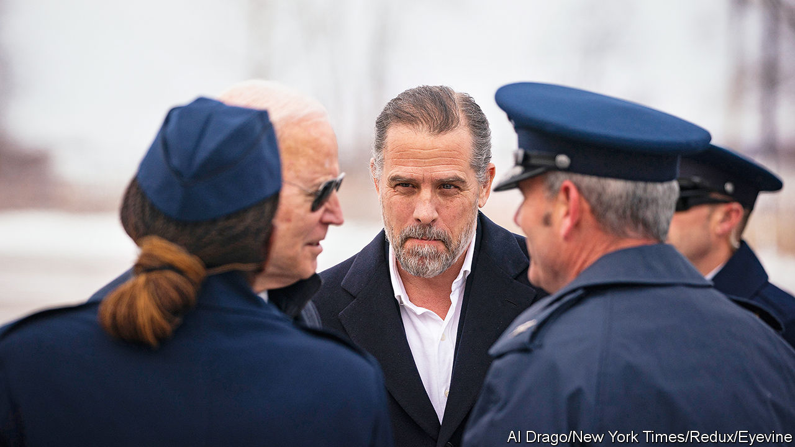

###### The prodigal son

# House Republicans are no closer to tying Hunter Biden’s activities to Joe 

##### Yet the president’s wayward son could still cause Democrats damage 

 

> May 28th 2023 

At the start of his memoir, “Beautiful Things”, published in 2021, Hunter Biden, the second son of the president of the United States, begins with a single claim that summarises the argument of the book. “I am not Eric Trump or Donald Trump, Jr,” he writes. “I’ve worked for someone other than my father, rose and fell on my own.” 

Over the next 220 pages, he takes readers through his childhood, his deep love of his brother Beau, who died in 2015 at the age of 46, his businesses and, in sordid detail, his use of crack cocaine and alcohol. Yet the theme that keeps coming back is his independence. “There is no question that my last name has opened doors,” the younger Mr Biden admits. And his accomplishments “sometimes crossed into my father’s spheres of influence during his two terms as vice-president”. But they were, he maintains, still very much his own, just as his failures and addiction were too, and nothing to do with his father.

Republicans desperately wish they could . Since January, the House Committee on Oversight and Accountability, and its Republican chairman, James Comer, have been digging through the younger Mr Biden’s records, in a search for something incriminating that would tie President Joe Biden to his son’s chaotic business practices. On May 10th Mr Comer held a press conference to unveil more details about the $10m or so that was paid between 2015 and 2017 to firms owned by Hunter, as well as to his uncle, James, both their wives, Beau’s widow and their children, by various foreign sources. 

What Mr Comer’s committee has not succeeded in showing, however, is anything illegal, or any wrongdoing by the president. Even so, Mr Biden may still be hurt by the  about his son, not least because Hunter’s problems are far from over.

The committee’s reports until now have highlighted the colossal extent to which the Biden name did indeed open doors. Payments of several million dollars came directly and indirectly from one Chinese tycoon, Ye Jianming. It is far from clear what services Hunter or his uncle provided in exchange for the cash. Mr Ye seemed to harbour unrealistic hopes of influencing the then vice-president by hiring his relatives, and was strung along. In 2018 he was detained for questioning by the Chinese authorities about unrelated corruption, and has since disappeared. 

Another lucrative job taken by Hunter Biden, with Burisma, a Ukrainian natural-gas firm, seems similarly to have come with relatively few work requirements. He himself admits that he took it because it was not much work. “Its robust compensation initially gave me more time and resources to look after my brother,” he observes in his book.

But despite their access to Mr Comer’s subpoena powers, his team have uncovered nothing so far that shows the president benefiting. The extensive private correspondence taken from Hunter Biden’s leaked laptop hard drive, which included dozens of voicemails left on his phone by his father, shows nothing either. 

Rather, it is a parallel Justice Department investigation into the younger Mr Biden’s conduct that is the more imminent headache for the president. The investigation became public in 2020. In late April Hunter Biden’s lawyers are said to have met officials at the Justice Department to discuss four potential criminal charges (two misdemeanours and two felonies) that could be brought against him. That led to speculation that the investigation might well be wrapping up, and that an indictment could be issued relatively soon. Some think matters have not moved fast enough. On May 23rd a whistleblower from the Internal Revenue Service told CBS News that the Justice Department had “slow-walked” its probe of Hunter’s finances. 

Fathers and sons

The potential charges include three related to his taxes, and a fourth related to the purchase of a gun in 2018—Mr Biden is suspected of having lied about his extensive illegal-drug use on a background-check form. He has denied any wrongdoing. Morally the potential charges hardly compare to the many awful things Mr Biden freely admits to having done himself in his memoir (which include driving on crack cocaine, hanging out with pimps and trying to fight bouncers). None relates to his alleged “influence-peddling”. 

But if Hunter is charged, it will be uncomfortable for President Biden, who has been fiercely loyal throughout the saga of his son’s addiction. “My son has done nothing wrong,” he said (inappropriately, given the Justice Department’s ongoing investigation) in an interview with MSNBC, a cable-news channel, in early May. 

An irony is that Republicans are pursuing this even as Donald Trump’s own relatives are also involved in legal influence-peddling that is orders of magnitude larger—at least in terms of the money involved. Last year the  reported that Jared Kushner, Mr Trump’s son-in-law, received a $2bn investment in his private-equity fund with a 1.25% management fee from a fund led by the crown prince of Saudi Arabia, despite the fact that Mr Kushner was a newcomer to the private-equity business. And Mr Trump himself faces his own criminal indictment, related to hush-money payments he made to Stormy Daniels, an adult-film star, before the 2016 election. 

For Mr Trump, though, that merely makes Hunter’s problems all the more useful. “Hunter Biden is a criminal, and nothing happened to him,” the former president said at a big conservative conference in March. “Joe Biden is a criminal and nothing ever seems to happen to him,” he added, without any evidence at all. The reek of hypocrisy spoils the point. But whether it is Hunter or one of Mr Trump’s children, there seem to be few consequences for using your powerful father’s name to make money.■


