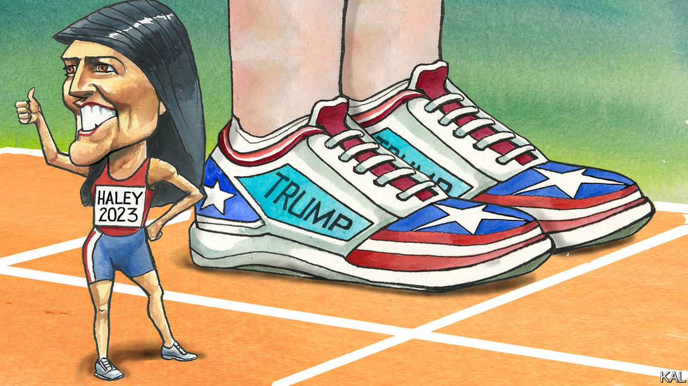

###### Lexington

# Nikki Haley, like other long shots, sees a path to victory 

##### It runs through Iowa, and over Donald Trump 

 

> Jun 1st 2023 

The romance of America as a land of boundless hope and possibility may have lost some lustre for Americans in general. But there is one place, for at least a handful of Americans, where the dream shines bright as ever. These idealistic few can be fascinating to watch, even inspiring, as they slip the reins of doubt, buck the burden of low expectations, and allow themselves, as dark-horse Republican presidential candidates, to run free through Iowa’s fields of dreams.

So it can be to chase after Nikki Haley, the former ambassador to the United Nations and governor of South Carolina, as she races from event to event—22 in Iowa since she announced her run less than four months ago. Polling puts her in single digits in the state and nationally, and she is far behind in raising money as well. 

Yet like others in the back of the pack, Ms Haley campaigns in a bubble of plausibility. As she differentiates herself by means of policy, tone and identity, jabbing the occasional elbow at Donald Trump, she makes a case that sounds persuasive, and the crowds of one-or-two hundred at her town-hall gatherings seem rapt. Where she goes, local press coverage blooms. If Iowans had the gumption to pick such improbable candidates as Jimmy Carter in 1976 and Barack Obama in 2008, delivering victories in the first-in-the-nation contest that ignited the national imagination, why not anoint the first female, Indian-American president in 2024?

Part of the case for Ms Haley, her allies believe, is that the Republican race will come down to Mr Trump and someone who is not Mr Trump. In this view Ron DeSantis, the governor of Florida, is not not-Trump enough. He may be running second in the polls, in Iowa and nationally, but he will not ultimately emerge as the alternative because, in terms of policy and personality, he is the front-runner’s mini-me. 

Of the other announced candidates so far only Asa Hutchinson, the former governor of Arkansas, attacks the former president as unworthy to hold office again. Ms Haley is not that not-Trump, not yet anyway. In her nimble, well-paced town-hall spiel, she mentions Mr Trump just once, describing his reaction when, as UN ambassador, she gave him a comparison of how far American aid to countries tallied with their General Assembly votes on American priorities. “He lost his mind!” she likes to say. “He’s flipping pages, he’s yelling out countries.” It is a deft thrust of the knife, reminding her audience of Mr Trump’s volatility as she takes some credit for his America-first foreign policy.

Yet for the close listener Ms Haley, who is 51, also points to important policy differences. She blames Republicans as well as Democrats for the national debt and promises to reform entitlement programmes Mr Trump has called untouchable. She is a hawk on Ukraine, saying a victory for Russia would be a victory for China. Mr DeSantis has tied himself in knots on Ukraine and said he would not “mess with Social Security”, notwithstanding his votes as a congressman to do so.

When pressed about efforts to overthrow the 2020 election, Ms Haley begins to sound more like Mr Hutchinson. Asked in mid-May at a town hall in Ankeny, Iowa, how she would ensure fair trials for the insurrectionists of January 6th, she replied, “I will continue to say it was a terrible day, it was not a beautiful day,” as Mr Trump has described it. As some members of the audience clapped, she added, “If they broke the law, they should pay the price.” Mr DeSantis has suggested that, like Mr Trump, he might pardon insurrectionists.

Like another long-shot candidate, Senator Tim Scott of South Carolina, who is black, Ms Haley plays identity politics the Republican way. She presents her identity as a rebuff to claims that America is racist, and also as something powerful enough to help her unite America. “We weren’t white enough to be white, we weren’t black enough to be black,” she tells audiences as she describes growing up in the only Indian-American family in Bamberg, South Carolina. “When I would get teased on the playground, my mom would always say, ‘Your job is not to show them how you’re different. Your job is to show them how you’re similar.’ Our country could use my mom’s advice right now.” 

None of it may matter, not even the Iowa caucus. Mr Carter and Mr Obama were exceptions, not the Iowa rule. Mr Trump is better organised there this time than in 2106, when he lost to Senator Ted Cruz of Texas, and his opponents may splinter the not-Trump vote.

When the centre held

Still, not only long-shot candidates should entertain hope as Iowa Republicans weigh their options. Many respect the job Mr Trump did. But they also lament the way he behaves, including toward fellow Republicans. “I mean, I love the guy, but I hate him, too, you know?” Ben Leifker, 38, said with a laugh after attending a Haley town hall in Dubuque. “I want somebody who can win.”

The next day, at a town hall farther south along the Mississippi in Davenport, Maxine Russman, a retired teacher, drew applause when she stood to say, “Nikki, I want you to make America civil again.” Ms Haley responded with what may come as a tonic to anyone who has felt bludgeoned by a Trump speech. She described her decision to remove the Confederate battle flag from South Carolina’s capitol in 2015 after a white supremacist murdered nine black people during a church prayer service in Columbia. 

Ms Haley recalled the courage and goodness of the victims, naming some, then turned to the flag. “Half of South Carolina saw that flag as heritage and service, the other half of South Carolina saw it as slavery and hate,” she said. “My job wasn’t to judge any of them. My job was to bring out the best in them.” Her ambition as president, she said, would be to “treat every person with respect”. America is well past the point where it can indulge a sentimental view of the Confederate flag. But maybe Iowa can still help it hope again for a more generous Republican politics. ■


