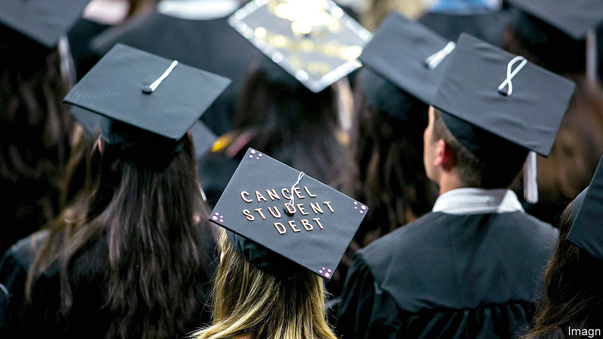
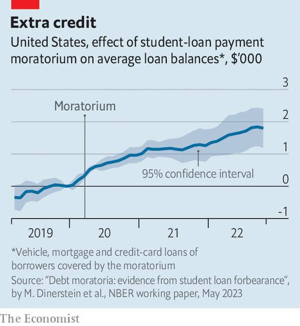

###### Forgive and forget

# The moratorium on repaying student loans in America was a bad idea 

##### How bad is now becoming clearer 

 

> Jun 1st 2023 

Milton friedman used to joke that nothing is so permanent as a temporary government programme. So it nearly was with America’s moratorium on student-loan payments. The debt-relief scheme—which suspended payments, interest charges and collections on more than $1trn in federal student loans—was passed by Congress in the early days of the pandemic. Although meant to expire after just six months, it proved popular with voters and was extended eight times, despite a price tag of $5bn a month. Now the programme may at last be ending for good. The debt-ceiling deal negotiated by President Joe Biden and the House speaker, Kevin McCarthy, would resume student-loan payments on August 30th, without the possibility of an extension. 

 


Has the student-debt-relief scheme left borrowers better off? The Biden administration has called the payment freeze a “critical lifeline” that helped borrowers pay for basic necessities while preventing millions of delinquencies and defaults. Media reports and surveys suggest that the pause allowed young people to make ends meet, pay down debt and build up savings. Early evidence seemed to bolster this view. An analysis published in March 2022 by researchers at the California Policy Lab, a group based at the University of California, found that the payment freeze lowered monthly bills, boosted credit scores and pushed some borrowers to increase their payments on mortgages, car loans and other outstanding debts.

But a new paper by economists at the University of Chicago suggests that the pause in student-loan payments caused borrowers to rack up more debt, not less. Using data from TransUnion, a credit-reporting firm, the researchers compared the personal finances of students whose loans were frozen in 2020 because they borrowed directly from the United States Treasury with those of students who borrowed from private banks and were therefore ineligible for the moratorium.

They found that the payment freeze reduced delinquency rates on student loans and boosted credit scores, but did not affect delinquencies on other debts. Nor did the policy reduce loan balances—in fact, it did the opposite. By the end of 2022 beneficiaries of the moratorium accumulated an additional $2,500 in student-loan debt and an additional $2,000 in credit-card, mortgage and car-loan debt, boosting total household indebtedness by 8%.

Jefferies, an investment bank, reckons that the return of student-loan payments, which are around $200 a month for the typical borrower, will weigh on consumer spending and push up delinquency rates. For those borrowers who took advantage of the student-debt moratorium, and accumulated additional debt over the past three years, the financial pressure could be especially acute. Back in April 2022 Mr Biden warned that the resumption of student-loan payments could lead to “significant economic hardship” for millions of borrowers. Little did he know that his own policies would be partly to blame. ■


