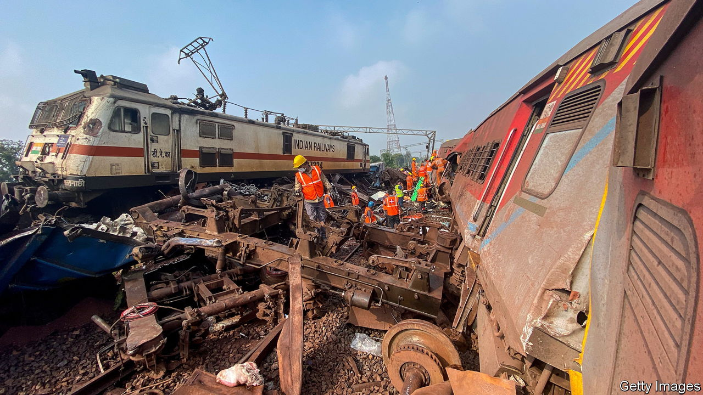

###### In the wreckage

# Despite a crash, Indian railways have an impressive safety record 

##### Narendra Modi’s government denies skimping on rail upkeep 

 

> Jun 6th 2023 

IT WAS AROUND 7pm on June 2nd when a train travelling from Kolkata in West Bengal to Chennai, 1,700km down India’s east coast, smashed at full speed into a parked freight train in the state of Odisha, 250km south of Kolkata. The passenger train’s coaches were derailed and collided with the rear coaches of another train travelling in the opposite direction. 

The trains were carrying around 2,000 people, many of them migrants from West Bengal off to seek work in the . At least 288 were killed and more than 1,100 injured, many of them gravely. 

The cause of the accident, the deadliest on  since 1999, when at least 290 people died in a train collision in West Bengal, was still unclear. An initial report pointed to a signal failure, but experts suggested that would not normally lead to such a calamity. The railways minister has hinted that equipment was tampered with and ordered a criminal probe.

Notwithstanding this disaster, rail travel is not especially dangerous in India, where some 20m people take a train every day. Of the roughly 25,000 who died in train-related accidents every year before the pandemic (a number that had changed little in a decade), most were run over or fell from trains. A tiny minority died in derailments or collisions. And the number of such serious incidents is decreasing. By contrast, some 300,000 people are estimated to die on  each year. 

Even so, the tragedy in Odisha is potentially embarrassing for the government of Narendra Modi, given its  on developing India’s railways and roads. This year it plans to spend the equivalent of 1.7% of GDP on them, more than four times as much as India was spending a decade ago, and around double the proportion spent by most developed countries. Mr Modi had been due to inaugurate a new high-speed Vande Bharat service the day after the disaster. Instead he visited the crash site, where he, too, promised to find the culprit: “Whoever is found guilty will be punished severely”.

Despite the railways’ reasonable safety record, the crash is likely to exacerbate claims that, in its push for new tracks and faster trains, his government is neglecting upgrades to existing tracks and equipment. Last year an audit of derailments by India’s comptroller-general found railway officials had not spent the budget set aside for track repairs, even though it had declined. A special fund to pay for safety improvements was not adequately replenished in any year between 2017 and 2022. Two days after the collision in Odisha, a new bridge being built over the Ganges in the northern state of Bihar collapsed for the second time in just over a year, killing nobody but casting doubt on the quality of flagship construction projects.

The government denies that it is skimping on safety. It notes that it has accelerated the elimination of dangerous level-crossings, particularly on lines where trains travel at higher speeds, and begun the roll-out of an anti-collision system on some trains. In the wake of the tragedy in Odisha, it vowed to install additional security features on signalling equipment. ■

