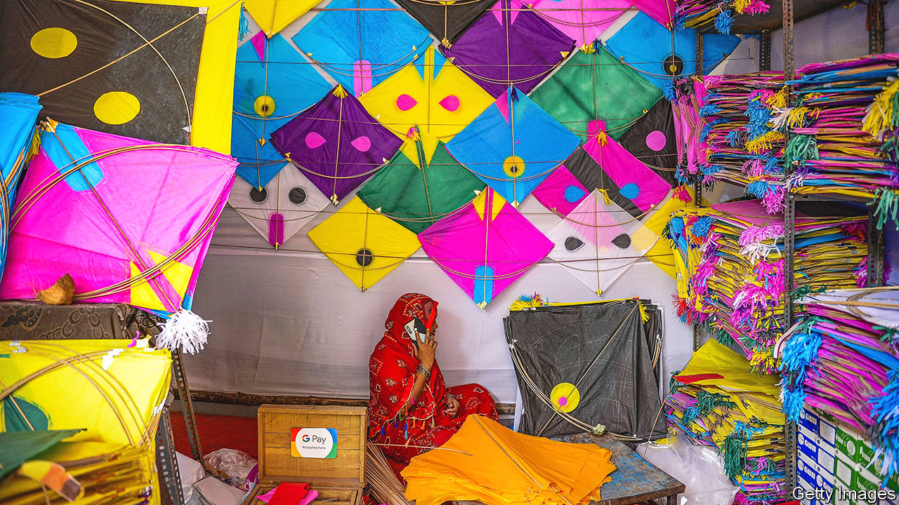
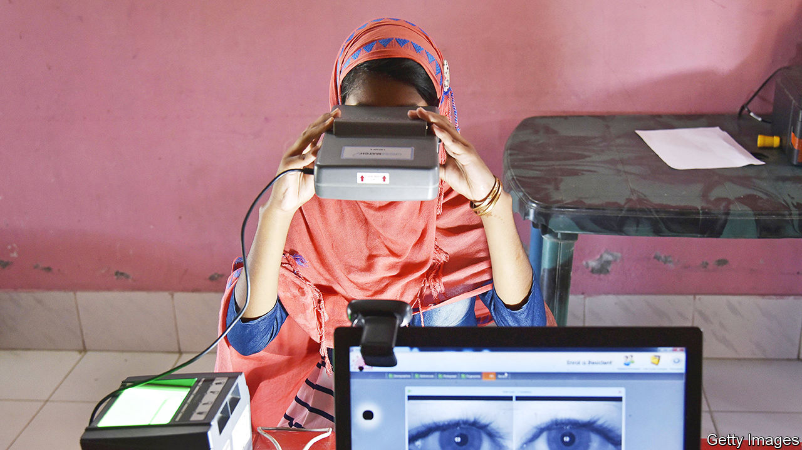

###### Soft(ware) power

# How India is using digital technology to project power 

##### Narendra Modi sees his country’s digital public infrastructure as an Indian Belt and Road Initiative 

 

> Jun 4th 2023 

NARENDRA MODI aspires to turn India into a , or “teacher to the world”. But what pedagogical gift, beyond its prime minister’s sage-like appearance, does a rapidly growing and ambitious India have for other countries?

Technological prowess, is the Modi government’s answer. In a little over a decade India has built a collection of public-facing digital platforms that have transformed its citizens’ lives. Once known as the “India Stack”, they have been rebranded “digital public infrastructure” (DPI) as the number and ambition of the platforms have grown. It is this DPI that India hopes to export—and in the process build its economy and influence. Think of it as India’s low-cost, software-based version of China’s infrastructure-led Belt and Road Initiative. “The benefits of digital transformation should not be confined to a small part of the human race,” said Mr Modi at the G20 summit in Indonesia last year.

DPI involves a triad of identity, payments and data management. It started with the aptly named Aadhaar, or “foundation”, a biometric digital-identity system rolled out under the former Congress-led government in 2010, which now covers nearly all of India’s 1.4bn people. Next came the Unified Payments Interface (UPI), which makes digital payment as easy as sending a text or scanning a QR code. Launched in 2016, the platform accounted for 73% of all non-cash retail payments in India in the year to March. The third dpi pillar involves data management. Using their 12-digit Aadhaar number, Indians can access online documents whose authenticity is guaranteed by the government. This system, called Digilocker, is connected to tax documents, vaccine certificates and more. To make payments, verify her identity and get access to crucial documents, an Indian can rely on her phone. 

For the affluent, such innovations are convenient. For millions of others they are transformative. Vendors of everything from coconuts to jewellery can now accept digital payments. This has made their lives easier, more profitable and secure. The hundreds of millions in India’s welfare system receive “direct benefit transfers” straight to their Aadhaar-linked bank accounts, which has slashed corruption. The IMF thinks the government thereby saved 2.2trn rupees ($34bn), or 1.1% of GDP, between 2013 and March 2021. The system also helps disburse emergency funds, such as during the pandemic. 

Several other digital platforms have recently been launched or soon will be. The Open Network for Digital Commerce is a newish government-backed non-profit dedicated to helping e-commerce services work together. The idea is to help millions of small businesses connect to third-party payments and logistics providers. Sahamati, an NGO, is setting up a platform to allow “account aggregators” to enable individuals to share financial information in a standardised format with, for instance, lenders. It hopes this will mitigate the need for the forests-worth of documents applying for a loan in India entails. 

The digital ecosystem behind these developments is complex. Its members include government agencies, regulators, tech firms, quasi-public corporations, ngos and universities, all building different parts of the digital edifice. Aadhaar is run by the government; UPI is managed by a public-private venture, the National Payments Corporation of India (NPCI). Other platforms, such as for health and sanitation management, are created by NGOs and sold to state and local governments. Many have been designed by IT experts with private-sector experience.

India wants to coax other developing countries to follow its example. It views this as a way to push its claim to lead the developing world. Partly to that end, India invited 125 such countries to a “Voice of the Global South Summit” in Delhi in January. “I firmly believe that countries of the global south have a lot to learn from each other’s development,” Mr Modi told their delegates, offering DPI as an example.

The Indian sales pitch is attractive. Starting without legacy systems such as credit cards and desktop computers, developing countries can leapfrog the West. The digital prize, as India has shown, is a means to accelerate connectedness, social-service provision, growth prospects and, ultimately, the building of a state and civic identity. Significant investment is required. But, as India’s example also suggests, it is likely to be cost-effective. And it need not require the massive splurge on 4G networks that India’s biggest private company, Reliance Industries, has conducted.

India is promoting its digital offer through its year-long leadership of the G20. At the club’s meetings, delegates are hammering out a definition of DPI. India is also trying to launch a multilateral funding body to push DPI globally. It hopes to unveil both at a g20 leaders’ summit in September, marking the end of its presidency. 

India’s claims for its technology have been widely endorsed. “The key idea behind DPI is not digitalisation of specific public services,” reads a recent IMF paper. “But rather building minimal digital building blocks that can be used modularly…to enable society-wide transformation.” Central to that vision is the notion of private innovators and firms accessing and adding to the infrastructure, as they do in India. DPI is “infrastructure that can enable not just government transactions and welfare but also private innovation and competition,” says C.V. Madhukar of Co-Develop, a fund recently launched to help countries interested in building DPI pool resources.

An emerging cohort of Indian organisations is dedicated to exporting the technology. NPCI International, a subsidiary of the NPCI, was set up in 2020 to deploy India’s payments systems abroad. The International Institute of Information Technology, a university in Bangalore, launched the Modular Open Source Identity Platform (MOSIP) in 2018 to offer a publicly accessible version of Aadhaar-like technology to other countries. The Philippines was the first to sign up; 76m of its 110m people have been issued with digital IDs using MOSIP’s technology, says its boss, S. Rajagopalan. Morocco conducted a trial of the technology in 2021 and has made it available to 7m of its 36m people. Other countries using or piloting MOSIP include Ethiopia, Guinea, Sierra Leone, Sri Lanka and Togo. 

Such countries can customise whatever bits of dpi they want. Morocco already had a database of fingerprints, which MOSIP’s platform had to be integrated with. “We are not going to tell countries: ‘Here is a health system, here is a payment system.’ What we are trying to do is get them to build their own systems with building blocks which are interoperable,” says Mr Rajagopalan.

India is offering its technologies and platforms for free. Yet it stands to gain in many ways from propagating them. Indian IT firms can expect bumper development and maintenance contracts. And just as Europe’s influence on global technology has been boosted by its regulatory power, so India’s will grow if many countries adopt Indian-made digital systems.

India everywhere

Some hope that influence might one day extend to an Indian alternative to the Western-run global financial plumbing, which includes clearing systems in New York and the SWIFT messaging system upon which thousands of banks rely for cross-border transfers. America’s weaponisation of this system after Russia’s invasion of Ukraine last year, which included sanctioning most Russian banks, spooked governments from Brasília to Beijing. The exit of Western payments systems such as Visa and MasterCard from Russia was less extreme, but also disruptive. In the event of a future crisis, domestic payments systems based on UPI could be insulated; they would be harder for American sanctions to target. Cross-border linkages of such systems could bypass America’s financial architecture. In February NPCI connected UPI with Singapore’s digital payments systems, PayNow. In April it did the same with the United Arab Emirates’ system. Indians should, in theory, now be able to use UPI in shops and restaurants in Dubai. “India is self-sufficient on the domestic payments. We would like to be self-sufficient on cross-border payments and remittances as well,” says Dilip Asbe, NPCI’s boss. 

 


That is a distant prospect. For now, the main benefit to India may be in boosting its prestige. “India usually wants something from outside. Now we have something others may want,” says an Indian participant in the G20 meetings. “That is quite powerful when it comes to foreign policy.” By promoting its technology as a means to transform poor countries, India hopes to position itself as a neutral third force between what it sees as the transactional West and an authoritarian China.

There are risks to that. India’s reputation as a country full of software engineers is especially strong among developing countries. Bulelani Jili, a Harvard academic who studies technology in Africa, recalls a Kenyan official gushing about India’s institutes of technology. Yet dpi technology can be unreliable. Aadhaar has performed poorly in places with bad internet connections or where manual workers have worn finger pads. The system also suffers security breaches. Experts say it is very easy to access it with false credentials or spoof fingerprints. India’s technology offer, says one analyst, includes a lot of “hot air”. 

Such problems could lead India’s projection of digital power to backfire—especially, some argue, because there is uncertainty in Africa and elsewhere about its intentions. “India has not done enough on the continent for people to have formed judgments,” says Mr Jili. In that context the Modi government’s continuing assault on pluralism and democratic institutions could be a turn-off. For that matter, DPI’s success in India is not without controversy. The government does not let UPI apps charge a fee to consumers or businesses, giving the system an edge over rivals such as Visa and MasterCard. Though Aadhaar was supposed to be optional, it is hard to function without it. India’s technology could in such ways be tainted by the s growing authoritarianism.

Yet trust and state efficiency are relative qualities. India’s reputation is much better in the global south than America’s or China’s. And its digital technology, even if glitchy, is a huge improvement on the largely analogue states operating in most developing countries. India’s digital progress is proof of that. It seems likely that many poor countries will want to emulate it, to their advantage—and India’s too. ■

