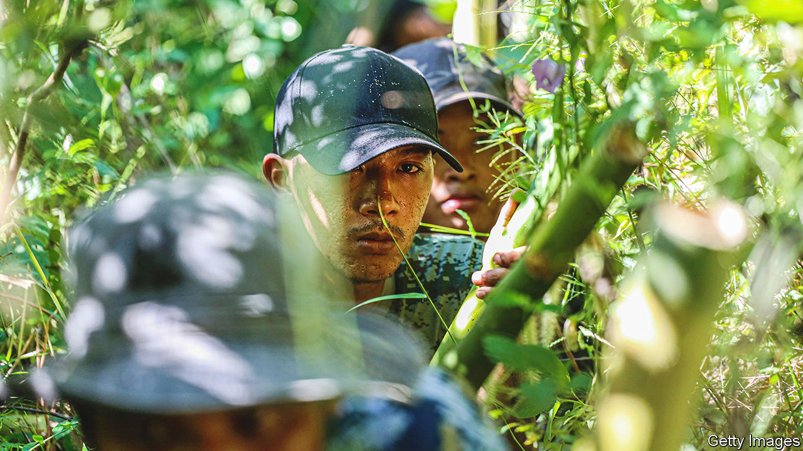

###### Jungle shelters and jerry-rigged drones

# Inside the armed Burmese resistance 

##### Myanmar’s wretched civil war has reached a stalemate 

 

> Jun 8th 2023 

In thick jungle, in southern Myanmar, two soldiers cover a freshly dug pit with tree trunks. The floor of the emerging air-raid shelter, which will fit a dozen people, is already covered with rattan mats. Such makeshift defences are dotted about this hideout of Myanmar’s National Unity Government (NUG), whose forces are battling the ruling junta. The camp is the headquarters of the NUG’s Southern Command, one of three command posts established as part of a broad effort to reorganise the scattered Burmese resistance.  spent several days inside NUG-controlled Myanmar assessing its progress.

The country has a long history of insurgency. Ethnically based militias have been fighting its government, dominated by the majority Bamar group, for decades. But the resistance sparked by an army takeover in 2021 is on a different scale. Armed dissident groups have mushroomed across the country, including for the first time in the Bamar heartland. There are estimated to be over 300 of these People’s Defence Forces (PDFs), with more than 65,000 fighters. Most are affiliated with the NUG, which was launched by members of the parliament elected in 2020, and also includes ethnic and civil-society leaders.

More than 30,000 people are estimated to have been killed and 2m displaced in two years of fighting between the army and these militias. The opposition is estimated to control up to half Myanmar’s territory, though most towns are in junta hands. Some think the conflict could escalate, due to the NUG’s effort to turn the PDFs and its ethnic allies into a more coherent force.

Organising the PDFs has taken longer than expected, admits Ko Bate, an NUG official in the jungle camp. The PDFs are poorly co-ordinated and equipped; only 30% of their forces are thought to have guns. But, claims Mr Bate, a former senior civil servant, in charge of finance, logistics and supplies for the southern sector, around 80% are now organised into battalions, with names like Lion, Cobra and Unicorn. 

Despite sending a delegation to Europe and America, the NUG has failed to win foreign recognition or support. To feed and equip its troops, it relies on crowdfunding. Last year it ran a digital lottery and set up a digital-wallet app, NUGpay, to solicit donations. It also “sells” the rights to property belonging to the coup leader, General Min Aung Hlaing, and shares in future developments on army-controlled land.

The NUG’s munitions are similarly jerry-rigged. Saw Min is part of “Federal Wings”, a unit refitting drones to drop homemade rockets. A former civil engineer and Singapore resident, he says he has given his life savings to the cause: “All that matters is to get the army out of politics.” On his phone he has a video of a drone blowing up an army truck. On the next frame is a picture of a tiny baby, his first-born, whom he has not yet met.

Despite their lack of firepower, the PDFs and their ethnic allies have killed 15,000 troops, estimates Anthony Davis, a security analyst who studies the conflict. (NUG estimates are much higher.) That is not enough to threaten an army of 170,000. But it is driving the junta to arm veterans and convicts. Even wives and children of military personnel are receiving basic training. 

Unable to move large convoys without being ambushed, the army is attacking from the air. “After an engagement with our troops they drop bombs indiscriminately,” claims U. Yarma, an NUG intelligence chief. Nearly 200 people were killed on April 11th in an aerial attack on villagers in Sagaing, in central Myanmar. They had gathered for the opening of an NUG administrative office. The UN says such air strikes might constitute war crimes. NUG officials say the junta has killed 13,000 people, including PDF fighters and civilians.

Though the NUG and allied forces are currently restricted to guerrilla tactics, their leaders suggest a more sustained assault is coming. “In the near future the whole country will be inflamed by war,” predicts an NUG commander. It seems a bit unlikely. The NUG looks unready to launch a conventional attack. For now, the junta is too unpopular to control the countryside, yet too powerful to yield the towns. And so the country’s wretched, extensive but mostly low-level conflict will endure. ■

