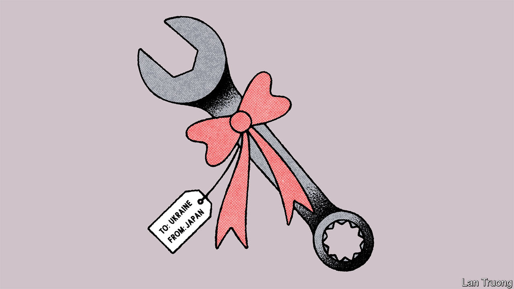

###### Banyan

# Japan offers Ukraine a lesson in reconstruction 

##### Asia’s expertise in rebuilding after disasters and wars has much to offer Ukraine 

 

> Jun 8th 2023 

Kobe, in western Japan, is best known for its marbled beef. But feasting on the delicacy was not what brought Igor Korkhovyi to town last month. At an auditorium in the city centre, he and a group of other officials from Ukraine tucked into a day of meetings and lectures. “We should learn from your experience,” he told the region’s governor. 

Japan’s armed forces, which have not fired a shot in combat since 1945, have little to teach Ukraine’s battle-hardened warriors. Yet Japan has plenty of useful lessons to impart when it comes to weathering disasters and rebuilding in their wake. The second world war devastated many Japanese cities, including Tokyo. While visiting for the G7 summit last month, Volodymyr Zelensky, Ukraine’s president, remarked on the resemblance between the “ruins of our cities” and the pictures he saw of Hiroshima after the atomic bombing. Natural hazards, from earthquakes to typhoons to floods, are also common in Japan. The north-eastern region of Tohoku suffered from an earthquake, tsunami and nuclear meltdown in 2011. Much of the country’s disaster-management system traces back to the experience of Kobe’s devastating earthquake in 1995. “Out of some successes and many failures, we learned some lessons,” explains Matsunaga Hideki of the Japan International Co-operation Agency (JICA), Japan’s overseas-development body. 

For Ukrainians, Japan is therefore a study in resilience. “Japan is a country living in permanent recovery,” says Mr Korkhovyi of Ukraine’s Ministry for Communities, Territories and Infrastructure Development. “How have they made this miracle? How can that approach be used or modified in Ukraine?” Sergiy Korsunsky, Ukraine’s ambassador to Japan, recently published a book in Ukrainian called “How Nations are Reborn: The Experience of East Asia”, which explores those questions, studying the experiences of China, Japan, South Korea and Vietnam. 

Three lessons stand out. The first involves prioritising people during reconstruction—infrastructure is worthless unless communities return to use it. The second is the importance of seizing the opportunity inherent in a blank slate. “Don’t rebuild the old, build anew,” says Mr Korsunsky. Thinking ahead is also essential. “What’s important is not just money—you have to plan,” he concludes. Ukraine should start that now. “When the war is finished, we’ll have no time for planning—everything has to be done in parallel,” Mr Korkhovyi says.

Ukrainian leaders would still prefer arms to urban plans. But Japanese law bars sending lethal aid (though some in Japan’s ruling party want to change that). So the government has focused on the financial and humanitarian sort. According to the Kiel Institute for the World Economy, a German think-tank, Japan’s total assistance to Ukraine comes to $6.7bn. As a share of GDP, that is a third of what America and Britain have given; but it is far more than other Asian democracies that have aligned themselves with Ukraine, such as Australia and South Korea. 

Study tours like the trip JICA arranged for Mr Korkhovyi and other officials from across Ukraine are part of the package. Mr Korkhovyi marvelled at Japan’s underground electrical substations. “If Ukraine had such substations in big cities, we’d avoid disruptions from drone attacks on critical infrastructure,” he mused. He also asked his hosts for copies of Japanese regulations related to the disposal of rubble from buildings destroyed by earthquakes, which could be applied to those flattened by bombs. Serhii Koreniev, the deputy mayor of Mykolaiv, a city in Ukraine’s south that struggled to provide fresh water after shelling disrupted its pipe network, found much to praise in the water management of Kobe. It constructed an innovative system of water pipes and reservoirs after suffering similar disruptions during the earthquake.

Such measures could indirectly help Ukraine fend off attacks and the environmental crises they can trigger, such as the flooding caused by the destruction of a dam in the country’s south this week. They will also be essential after the fighting ends. Ukraine will have to live with constant risk—in the form of its threatening neighbour. That will mean building cities and fostering communities that are ready for the worst—a bitter lesson Japan had to learn. As Valentyna Poliakova of Ukraine’s State Agency for Restoration and Infrastructure Development puts it: “We need to think of Russia as a natural disaster, like they do a tsunami or earthquake in Japan.” ■


