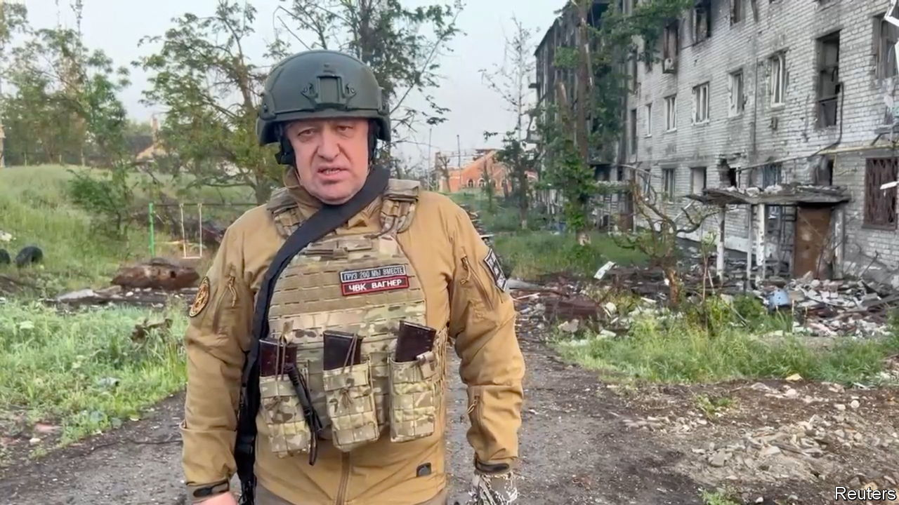

###### Nothing to see here

# Pretending that everything is under control in Russia 

##### It is getting ever harder 

 

> Jun 8th 2023 


A FEW HOURS after the Kakhovka dam collapsed, flooding a big slice of southern Ukraine, Vladimir Saldo, who runs the Russian-occupied parts of the affected region, released a video. Standing by the window of an administrative building in military fatigues and a helmet, he tried to project an air of normality. “Novaya Kakhovka and other settlements downstream carry on [as usual]. Driving along, I saw people calmly walking the streets. Petrol stations and shops are open.” Behind him, clearly visible through the window, the floodwaters were rising in the already inundated town square. 

Even back across the border in Russia, pretending that everything is normal 15 months into Vladimir Putin’s special military operation in Ukraine is becoming ever harder. A mixture of fierce repression and unrelenting propaganda have kept the public largely quiescent. But in recent weeks the war has been seeping into everyday life. In an affluent area in south-western Moscow military trucks roar past Teslas. Recruiters stationed outside supermarkets try to enlist passers-by in the army. At a speed-dating event young women complain of the difficulty of maintaining a steady relationship—because their boyfriends have been called up.

On May 30th a swarm of drones attacked Moscow. None hit its target: they were all either shot down or disabled by jamming. Some fell close to Barvikha Luxury Village, a posh suburb. Villages close to the border with Ukraine in Belgorod province have been shelled. A few have been briefly occupied by pro-Ukrainian militias making forays across the border. These incursions met little initial resistance: many of the troops who used to guard the border had been redeployed to Russian-occupied parts of Ukraine.

Lieutenants at loggerheads

There are also growing signs of disarray among Russia’s elite. For months Yevgeny Prigozhin, the leader of the Wagner Group, a mercenary force fighting on Russia’s behalf, has been denouncing Sergei Shoigu, the defence minister, and Valery Gerasimov, Russia’s top general, as incompetent foot-draggers. But his complaints are becoming steadily shriller. He recently claimed that Russian soldiers had laid mines behind Wagner’s positions. Wagner has also released a video of a Russian officer, who looked as if he had been beaten, confessing that he had shot at a vehicle used by Wagner’s forces while drunk.

The incursions in Belgorod have especially incensed Mr Prigozhin (pictured). “Why are tens of thousands of people, our Russian guys, dying advancing towards the West? So that we could start giving away, step by step, pieces of Belgorod province, our native Russian land? Why is everyone silent about the deaths of these civilians? Where is their explanation to the Russian people that we are handing over our territories and civilians to be devoured?”

Mr Putin has a habit of provoking conflict among his subordinates to reinforce his role as an indispensable arbiter. Mr Prigozhin also serves as a useful spur to the Russian army and as a scold for rich Russians unenthused by the war. But these conflicts typically do not spill into public view. Some speculate that Mr Prigozhin could be attacking the top brass in anticipation of territorial losses in Ukraine. By denigrating the generals, he may help deflect blame from Mr Putin. Alternatively, the bickering could be a reflection of infighting between powerful factions who sense weakness on the part of the arbiter.

Mr Putin has been keeping a low profile of late, presumably to avoid any association with military setbacks. A visit to a children’s clinic and meetings with regional officials have been his only recent public appearances. His apparent lack of interest in the war and the noisy squabbling in the top ranks, whatever the reason for them, are likely to have a demoralising effect on Russia’s soldiers and civilians alike.

Russia’s propagandists have been trying to reassure the public, insisting that Russia had thwarted the Ukrainian counter-offensive before it had even begun. But their jaunty footage of destroyed Ukrainian tanks has been scorned by Mr Prigozhin and military bloggers. Big territorial losses will presumably lead to further tension within the Russian elites. A weakened Mr Putin, in turn, would probably resort to even greater repression to compensate for losses at the front. Mr Prigozhin is calling for martial law, a general mobilisation and the restoration of the death penalty.

What comes next will depend not just on the progress of the counter-offensive, but on the pliability of the elite and the mood of the broader public. Mr Putin has had little trouble suppressing dissent so far. But the many military setbacks and the public disagreements among his own henchmen make that job harder. “We are moving into uncharted waters,” an American official says. “And it is not just Ukraine that needs liberation, so does Russia.” ■

