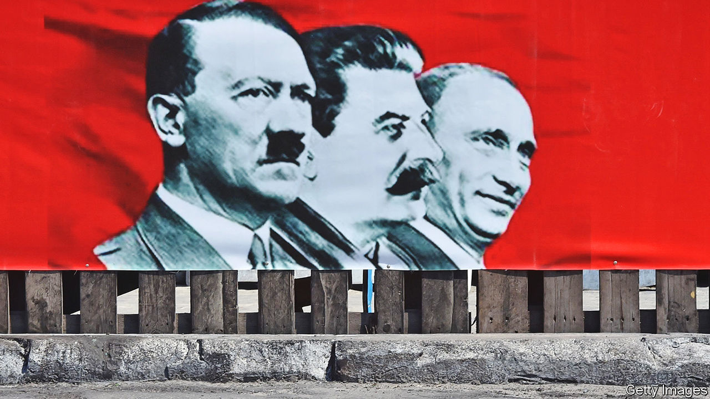
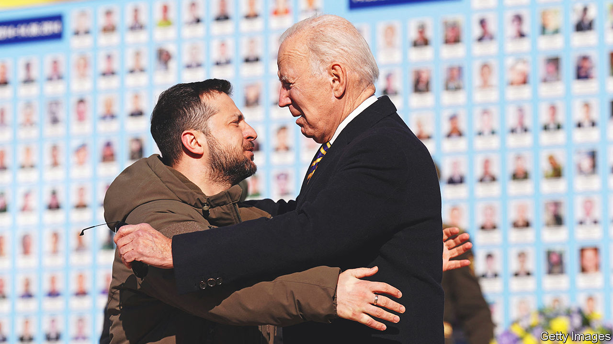

###### Ukraine’s D-Day

# The geopolitical stakes of Ukraine’s counter-offensive 

##### How to ensure Russia suffers a strategic defeat 

 

> Jun 6th 2023 


ON THE eve of the commemoration of the Allies’ D-Day landings in Normandy, General Mark Milley, America’s most senior general, drew a parallel with the Ukrainian counter-offensive starting some 2,800km to the east. The goal, he said, was the same as it had been nearly eight decades ago: “To liberate occupied territory and to free a country that has been unjustly attacked by an aggressor nation, in this case, Russia.”

Then as now, the battles will determine the future security order in Europe. But for Ukraine’s Western supporters, at least, the ultimate aim of the war is much less clear than it was for the Allies in 1944. Unlike Nazi Germany, Russia is a nuclear power. It is hard to imagine its complete capitulation. Ukraine’s professed goal is to reconquer all of the land Russia has seized since 2014, restoring the borders that were set in 1991, when the Soviet Union broke up. But even if the Ukrainian army can achieve that (and many Westerners, especially, have their doubts), there are fears that Russia might view such an outcome as a humiliation so abject that it would be worth using nuclear weapons to avoid it. 

The upshot is a much vaguer aim: for Ukraine to inflict as many losses and make as many territorial gains as possible, thereby strengthening its hand as it tries to reach a  with a weakened Russia. By this way of thinking, a positive outcome would be for Ukraine’s new Western-armed brigades to sever the land bridge between Russia and the Crimean peninsula or to get close enough to . Most Western officials expect more modest gains, however, with Ukraine recapturing and holding less strategic slices of the territory it has lost in the past year, but at least demonstrating that it can still make headway on the battlefield. In the pessimistic view, the Ukrainians struggle to get past Russian defences, make only minor gains and end up in a stalemate. Happily, the prospect of Ukrainian forces failing, suffering a counter-attack and retreating can be all but ruled out, because Russia .

Although it is the resolve and competence of the Ukrainian forces that will be decisive, external factors will influence the outcome. America’s president, Joe Biden, has declared two broad objectives: to ensure both that Ukraine is not defeated and that NATO does not get drawn into direct conflict with Russia with the attendant . Early on he declined to send troops to Ukraine or impose a “no-fly zone”. But he has delivered weapons of ever greater quantity and sophistication to help Ukraine defend itself. Equally vital has been the provision of intelligence, planning and training by America and its allies. Ukraine today has one of the largest armies in Europe backed by the most powerful military in the world. And while it is not trained to the standard of NATO, “it only has to be better than the Russian army” to get an upper hand, say Western officials. 

China’s leader, Xi Jinping, also appears to have set boundaries, according to American and European officials. He wants to prevent Russia’s complete defeat, but also a breakdown in relations with Europe or the use of nuclear weapons. So even though he and Russia’s president, Vladimir Putin, have declared that their countries’ friendship has “no limits”, there have been limits so far in the help China has been prepared to offer Russia. It buys Russian exports of oil and gas at a discount, and sells Chinese goods, some of which might be useful to the war effort. But Mr Xi has so far declined to provide big deliveries of weapons, of the kind the West has given Ukraine. That  if China thinks the Russians are about to be routed, Western officials worry.

Is never good for you? 

Even allowing for that risk, however, and while sticking to Mr Biden’s parameters, America’s generals increasingly think it is possible to engineer a “strategic defeat” for Russia. Over time they have become less fearful of nuclear escalation. In part their “boiled frog” strategy of gradually increasing conventional military aid has helped to mitigate the risk. And by prodding Russia itself, through attacks on the border region of Belgorod or small-drone attacks on the Kremlin, Ukraine also seeks to expose the emptiness of Russian threats. Increasingly, America’s top brass aims to ensure Russia loses both the military capacity and the inclination to launch another war of aggression. “Never again is not a difficult concept to grasp,” says a Western official.

This goal is especially enticing to America’s military planners because they have long dreaded the prospect of having to fight two wars at once: with Russia in Europe and with China in Asia. If the threat from Russia were to be substantially reduced, at least for some years, it would allow more resources to be directed towards deterring China, which has become America’s most pressing military concern. 

Western analysts have three broad scenarios for how the war might unfold. The first involves a big Ukrainian breakthrough, in which they either sever supply lines to Crimea or regain much of the territory in the eastern region of Donbas that Russia grabbed last year and in 2014. Such a devastating collapse of Russian forces might conceivably result in Mr Putin’s losing power. To some that is the best way to restore peace in Europe. But assessing Russia’s capacity to maintain discipline among its troops is hard; gauging the brittleness of Mr Putin’s regime is harder still. Nuclear worries are not entirely gone. Still, some American officials are less worried about Mr Putin’s use of nuclear arms than they are about Russia’s descent into chaos and a concomitant loss of control over its nuclear arsenal. 

A second scenario entails smaller Russian losses, but also the prospect of further defeats if the war goes on, which may be enough to chasten Russia and weaken Mr Putin. A third, gloomier outcome would be a stalemate that lets Russia hold on to most of what it has taken. That would undermine Western confidence in Ukraine and embolden Mr Putin. For all Russia’s military setbacks, says Alexander Gabuev of the​​ Carnegie Russia Eurasia Centre, a think-tank in Berlin, Mr Putin does not appear to have abandoned his intention of subjugating the whole of Ukraine, annexing more of its territory and installing a puppet government in Kyiv. He may imagine he can still achieve that by grinding out the conflict for years. His air force and navy are largely intact, and he can mobilise more soldiers, though that risks popular discontent in Russia. He will want to wait out the West.

 


In particular, Mr Putin will be hoping for a return to power of Donald Trump in next year’s presidential election in America. Mr Trump complains that America has been wasting billions on Ukraine, depleting its own arsenal and prolonging a bloody war. If elected he claims he could put an end to the conflict within 24 hours, without saying how. Ukrainians fear that he might either cut off the flow of aid or otherwise agree to Mr Putin’s terms. 

How to avert a protracted war? One hope is that Ukraine will inflict such a smarting military defeat as to prompt Mr Putin to revise his goals. Some Western officials, notably in Germany, hope Ukraine’s counter-offensive will soon be followed by peace talks. But others, especially in America, caution that Mr Putin is unlikely to be ready for serious negotiations unless he suffers a rout. Even if talks were to take place, Russia’s participation might be an entirely insincere stalling tactic. Genuine diplomacy may have to wait for a further round of fighting next year.

The West is therefore debating how to give greater credence to its promises to support Ukraine “for as long as it takes”. The thorniest questions surround what security guarantees the West might offer Ukraine, both in the short term and as part of a lasting settlement. Hitherto some Western leaders thought such matters were best left until after a cessation of hostilities. But given the scant chance of a negotiated peace, many argue the West should no longer wait; indeed, enhanced guarantees could hasten the end of the war by undermining Mr Putin’s dream of winning a drawn-out conflict. President Emmanuel Macron of France, long regarded in eastern Europe as resentful of America and soft on Russia, took a surprisingly hawkish turn in a recent speech in Slovakia in which he called for Ukraine to be given “tangible and credible security guarantees”. 

Regretting the memo

The security “assurances” Ukraine received in 1994 from America, Britain and Russia itself, in an agreement called the Budapest memorandum, in exchange for surrendering its share of the Soviet Union’s nuclear weapons, have proved wholly inadequate. Ukraine and its friends in eastern Europe argue that only membership of the nato alliance—with its strong mutual-defence commitment, known as Article 5—can protect Ukraine from future attack. 

Western allies are divided, however. Germany, in particular, argues that a country with unresolved territorial disputes, especially one at war, cannot become a member (to which others retort that West Germany joined NATO despite the partition of Germany during the cold war). In any case, it is difficult to see Mr Biden extending America’s nuclear guarantee to Ukraine in the near future, given his reluctance to send American troops to defend it now. 

Anders Fogh Rasmussen, a former secretary-general of nato, proposes a two-step plan. First, Western countries should issue “substantial” guarantees to Ukraine, ideally ahead of nato’s summit in Lithuania next month. Then the summit itself should issue an invitation for Ukraine to join the alliance, or at least signal that one will be forthcoming in the coming year. This would make clear that Russia has no veto on who joins. Ultimately, argues Mr Rasmussen, protecting Ukraine within NATO would be less costly than arming it to fend off Russia alone indefinitely.

One difficulty will be to ensure that the guarantees act as a bridge to membership rather than an alternative to it. In a , Eric Ciaramella of the Carnegie Endowment for International Peace, a think-tank in Washington, sets out a five-point plan to give Ukraine “less than Article 5 but more than the Budapest memorandum”. This includes legally codified commitments to help Ukraine defend itself, inspired in part by those that America gives to Israel and Taiwan, to ensure they endure regardless of who is in power in America and Europe. He also advocates multi-year allocation of funds to arm Ukraine; support to rebuild Ukraine’s arms industry; mechanisms for political consultation like nato’s Article 4; and a clear path to eu membership. As Mr Macron has belatedly come to recognise, “today Ukraine protects Europe”; better to integrate it firmly than leave it in a grey zone that only invites Russian aggression. ■

