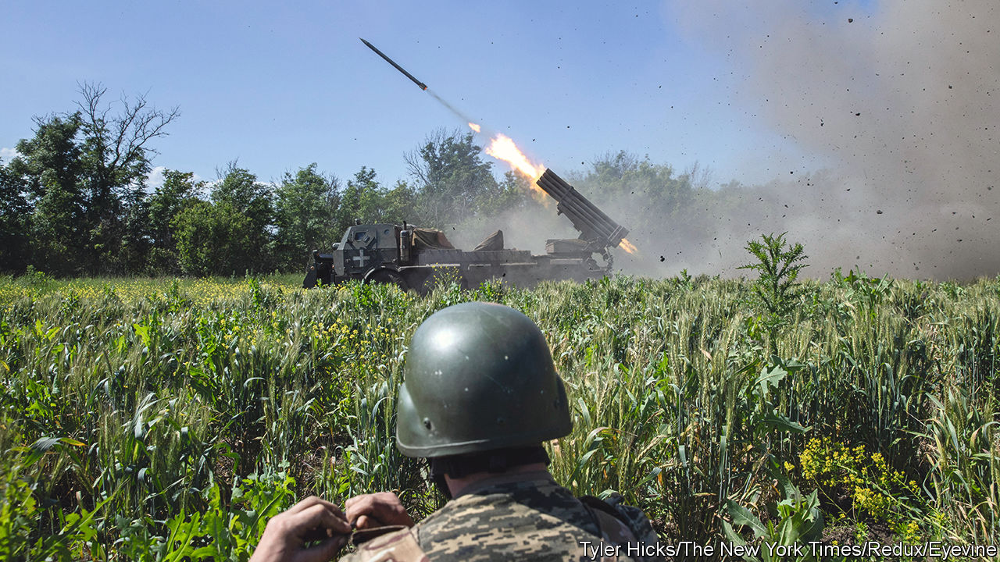
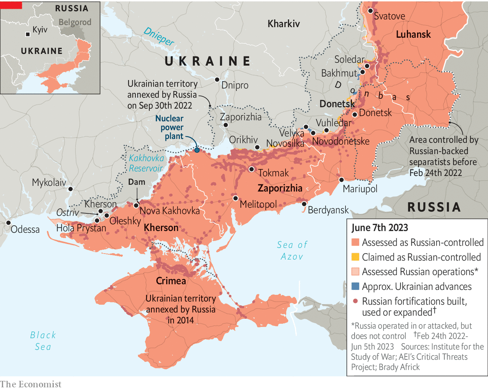

###### Probing questions

# Ukraine’s counter-offensive is gathering pace 

##### Its army is mounting big pushes in the south and east 

 

> Jun 7th 2023 


“Events are developing very dramatically,” warned a Russian military blogger on June 8th, as Ukrainian forces attacked Russian positions in Zaporizhia province. Ukraine had conducted “massive” artillery barrages before sending in tanks, the blogger said. Four columns of up to 120 armoured vehicles, each headed by a dozen or so tanks, were said to be advancing from Orikhiv to Tokmak, a town on the “land bridge” of occupied territory linking Russia to Crimea (see map).

The overnight advance in Zaporizhia is a milestone for Ukraine’s army. It represents its largest-scale fighting at night since the war began, with attacks from two directions. “It has all gone according to plan on that axis,” says a source with knowledge of the operation. Beyond Tokmak lies Melitopol, the city that General Valeriy Zaluzhny, Ukraine’s top soldier, identified as a prime target when he spoke to  in December. The thrust in Zaporizhia, along with others all along the 1,000km front line, mark the start of Ukraine’s long-awaited . 

 


It has been six months in the making. Last autumn Ukraine liberated Kharkiv province and a big part of Kherson province. But its Western allies were concerned that it lacked the muscle to build on these victories by pushing faster and farther. In January they resolved to provide it with the weapons to do so and, over the spring, in the German city of Wiesbaden, helped its generals to plan and wargame their options—a push towards Melitopol included. In May Ukraine began softening up Russian forces with rocket and missile attacks on command posts, barracks, depots and transport nodes far behind the front lines.

This week Ukraine launched the next phase. The first indication came on June 4th when several Ukrainian brigades advanced towards Velyka Novosilka and into Novodonetske, small settlements near Vuhledar, which is held by Russia. That area was vulnerable, notes Rob Lee of King’s College London, because Russian naval infantry there had taken huge losses in the spring, and because other units had been sent to , an eastern town which Russia captured in May after a . The attacks on Tokmak and near Vuhledar threaten not just Melitopol but also the port cities of Berdyansk and Mariupol, farther south on the Sea of Azov. They offer several chances to sever the land bridge, assuming Ukraine can breach the thick Russian defences.

The blast of war blows

Russia claimed that it had repulsed Ukraine’s attacks near Vuhledar, inflicting an implausible 3,715 casualties. Yet not only Ukrainians but also , head of Wagner Group, a mercenary outfit that led Russia’s fight for Bakhmut, dismissed such talk as “wild and absurd science fiction”. Western officials say that Ukraine made reasonable progress in the first day or two of fighting, though video footage showed tough battles. “With the capture of the height at Storozheve the Ukrainians are in a good place to continue offensive operations,” notes John Helin of the Black Bird Group, which uses open-source intelligence to track the war. Ukrainian attacks have probably fixed two Russian motorised divisions in place, he says. “Even then it’s still a long way to go to the Russian main defensive line.” 

But what is clear is that Ukraine is attacking not only in the south, but all along the huge front. Russian forces are arrayed in a crescent from Kherson in the south to Luhansk province in the north-east. There is frenetic activity at both ends. In the north, on Russia’s right flank, Ukraine has been attacking towards Svatove, a town in Luhansk province. The latest update from that area came from General Oleksandr Syrskyi, the commander of Ukraine’s ground forces, on June 4th. He said that his troops had advanced, albeit by only 400 metres. Ukrainian forces have repeatedly probed around Luhansk over the past six months: in November there was hope of a breakthrough which never materialised. Western officials say that Russian defences there still seem shaky.

Feints and thrusts

Moreover, Russia is increasingly distracted by raids even farther to the north of the established front line. In recent weeks militias largely manned by Russian exiles but backed by Ukraine have conducted brazen raids into Russia’s Belgorod province, forcing Russia to devote resources and attention to a part of the border that was previously quiet. On June 1st three Russian conscripts were reportedly killed in cross-border shelling, with seven other people injured. On June 5th the Russian Volunteer Corps, one of those militias, said it had killed a Russian colonel. And the following day a Russian unit sent to Belgorod from Pskov, 1,000km away, complained of heavy losses and a lack of supplies. 

At the other end of the front, in the south, on the Russians’ left flank, the most dramatic development came on June 6th when the , causing massive flooding across Kherson province. It is too early to assess the full damage. Yury Vaskov, Ukraine’s deputy minister for infrastructure, suggested on June 7th to  that more of the dam may be intact than initially thought. Working out how much is left will be clear only once the water level falls. But already more than 150 tonnes of oil have leaked into the Dnieper. “We already know it is the most terrible catastrophe Ukraine has experienced in decades,” Mr Vaskov said.

Both sides blame the other for the collapse, although Russia is the likelier culprit. Some locals report hearing an explosion in the morning. Ukraine had long warned that the Russian forces that controlled the dam had mined it. The scale of the damage suggested the dam had been demolished from the inside. Ukraine has already referred the matter to the International Criminal Court as a war crime. 

The worst-hit areas are those immediately downstream from the dam. Some of them are under Russian control, on the eastern shore of the Dnieper. A Ukrainian military spokesperson suggested Russia had lost many of its own defensive positions, forcing it to retreat to a second line of defence 5-15km away. 

In Kherson city, which is under Ukrainian control, the worst-hit area was Ostriv, meaning island, which sits in the middle of the Dnieper. It is low-lying. One of its upmarket local streets was even nicknamed “Venice”, in reference to the water that sometimes rose to its front porches. Now the whole of Kherson is Venice, jokes a volunteer, Serhiy Rybalchenko. He had brought a boat out of storage to help deliver nappies, water and other essentials to his stranded neighbours. “Sometimes, it’s more like the Atlantic.”

Despite the damage done to Russia’s own positions, it may have destroyed the dam to forestall Ukrainian attacks over the Dnieper, which might have threatened Russia’s left flank at a crucial time in the offensive. It is understood that at least some Ukrainian units had moved out from Kherson city in the days leading up to the blast. They may have been preparing for a risky operation to cross the Dnieper via or near the Kakhovka dam and bridge.

Such amphibious operations would have been difficult, but not impossible—small-scale raids had already taken place. Our analysis of  shows that Kherson was one of the most heavily bombarded areas on June 6th. A meaningful Ukrainian advance there looks improbable, for now, though falling water levels upstream from the dam, around the Zaporizhia nuclear power plant, could create other opportunities for Ukraine in the weeks ahead. 

Meanwhile, fighting has not ceased in the east. In messages published between June 5th and 7th, Ms Maliar, playing down other developments, said that Bakhmut was still the “epicentre of hostilities”. Ukraine was advancing on a “fairly broad front” there, she claimed, as much as 1.1km in places, capturing the commanding heights around the town. There was also fighting towards Soledar, to its north, suggesting that Ukraine might hope to encircle Bakhmut. Recapturing the town would erase Russia’s sole substantial gain of the past year. A bigger push in the surrounding Donbas region would also allow Ukraine to recapture territory it lost in 2014. That would be a humiliation for Russia, and undercut its stated rationale for the war—the “liberation” of the east. 

Unto the breach

Taken together these military developments indicate that, after weeks of preparatory missile strikes and other activity, the counter-offensive has entered a new and more aggressive phase. The infrared data, which show the fires that result from shelling and bombing, suggest that June 6th was one of the most intense days of fighting since the war began, with most of the fires occurring in Russian-held areas. The continuing confusion over the disposition of Ukraine’s forces and their primary targets is testimony to Ukraine’s success in keeping its plans under wraps.


Despite some claims from Russian bloggers—there have been reports that German Leopard tanks are in use in Zaporizhia province, for example—there is still no definitive sign of the bulk of Ukraine’s most advanced new kit, such as European armour and American Bradley infantry fighting vehicles. Western countries have helped Ukraine equip and train nine new “combat credible” brigades for offensive operations, according to documents written in February that have since leaked from the Pentagon. One of those brigades, the 37th, may have taken part in the Ukrainian attacks near Vuhledar, judging by sightings of French AMX-10rc light tanks and British Mastiff mine-resistant vehicles. Ukraine has also raised at least three other brigades on its own. On paper, that should be enough to break through Russia’s multi-layered defensive lines along a narrow—20km, say—stretch of the front.

Ukraine will need to concentrate its forces for such an attack without their being detected and struck. It will need to synchronise its different combat arms, ensuring, for instance, that dismounted infantry protect tanks from Russian anti-tank squads, and that mobile air defences keep up with advancing columns. And it will need to ensure that a relatively lightly trained force has the courage and confidence to keep moving forward in the face of intense shelling and potentially heavy losses—an issue that proved to be one of the biggest challenges for Ukraine during its offensive in Kherson last year. If it can do these things, Western military officials believe that Russia’s poorly motivated and badly trained troops, exhausted after months of fruitless offensives, may struggle to defend the trenches and fortifications built over recent months. Shock, speed and surprise will be crucial. 

The point of Ukraine’s current ground attacks may be to keep Russia guessing as to where the offensive brigades will appear, forcing it to defend a number of areas at once and stretching its units thinly—though Russian military insiders increasingly think that Ukraine’s attacks in Zaporizhia represent the main axis. The dilemma between reinforcing the east to protect Donbas and shoring up the south to shield Russian supply lines to Crimea is especially acute. Ukraine enjoys the additional advantage of so-called interior lines, a military term which refers to the fact that it can move units to different parts of the front, through its own territory, more quickly than Russia can do the same.

Even seasoned experts remain unsure where the heaviest blows will come. “I assume that there will be bigger attacks to draw Russian reserves before the actual main thrust,” says Pekka Toveri, a former head of Finland’s military intelligence. All options are on the table, he suggests: “I wouldn’t be surprised if there would be quite a big offensive to retake Bakhmut followed by another one towards Mariupol.” Or perhaps it will be Melitopol after all. ■

