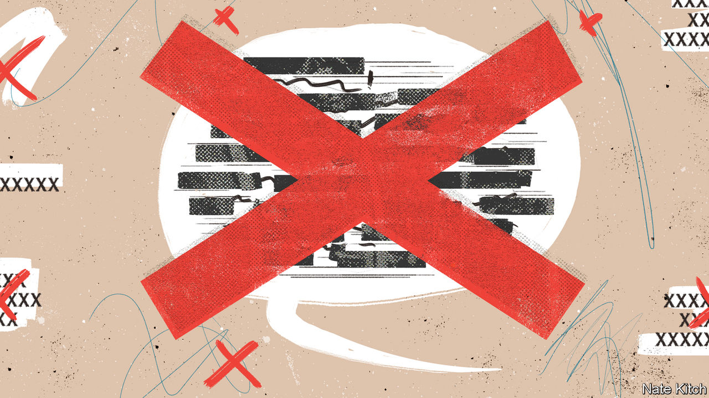

###### Bagehot

# British politics is littered with fake taboos 

##### But you can’t say that! 

 

> Jun 8th 2023 

“We’re in one hell of a mess,” declared Chris Patten, a former Conservative minister and establishment grandee, ruing the state of the nation. Inflation, slow economic growth and cack-handed monetary policy had condemned the country, he declared on “Question Time”, a current-affairs show. “It’s also, and this is a word one isn’t supposed to use any more, it’s also because of Brexit.” The Leicester audience nodded. Finally, someone had said it. The great Brexit taboo had been broken! 

If discussing the downsides of Brexit is taboo, people have been falling foul of it for years. Leaving the eu has dominated political discourse for approaching a decade. Economists and analysts have pored over its economic effects, filling newspapers, television and social media. Commentators wail about it daily. Rishi Sunak, the prime minister, boasted of fixing the myriad problems Brexit caused for Northern Ireland. Labour has promised to darn the obvious holes in Britain’s relationship with the eu. For a word that folk are no longer supposed to use, it is used a lot. 

British politics is littered with fake taboos: topics that are supposedly unmentionable, yet discussed incessantly. From reforming the National Health Service (nhs) to cutting immigration and Brexit, politicians and voters engage in the fiction that some topics are . It is a useful tool. Ideas that are unpopular can be laundered as forbidden. Impractical schemes can be painted as merely transgressive rather than foolish. Pretend taboos cover a host of failings. If there is a taboo in British politics, it is admitting that most political taboos do not exist. 

Pretending that they do has lots of upsides. A fake taboo can mask hard questions. An immaculate return to the eu, as offered by a polling question, would indeed be popular. About half of voters would support it, while a third would oppose it. But it is also impossible. The same problems that encouraged people to leave, such as free movement and the fundamental question of sovereignty, would emerge on re-entry. Would British voters still support rejoining if it meant Schengen or the euro? Crying taboo is far easier than grappling with reality. 

Leaving the eu is only the latest fake taboo. Ever since Enoch Powell’s “rivers of blood” speech in 1968 predicting racial strife, immigration has been supposedly off limits. Yet Britain has, somehow, managed to argue about it for 50-odd years. When statisticians revealed record net inward migration of 606,000 in 2022, those on the right insisted cutting immigration was beyond the political pale. This is backward. Cutting immigration is the stuff of political consensus: both main parties say it is too high, as do most voters. If governments are supposed to do what they say they will do, then immigration policy has been a failure. Conjuring a taboo is preferable to facing that. 

This is a common tactic. Consider the poor performance of white working-class boys in schools. “Why has it become such a taboo subject to speak out on behalf of the under-privileged?” wondered Ben Bradley, a backbench Conservative mp, on the topic. But sharpening up white working-class boys has been a goal of every government for a quarter of a century. In 1996 Chris Woodhead, the chief school inspector, labelled it the “most disturbing” problem in education. In the David Cameron years, mps discussed extending the school day to boost their performance. Throughout it all, white working-class boys have stayed near the bottom of the class. Every government has targeted them. Every one has failed. 

Sometimes a pseudo-taboo is an excuse for inertia. Any criticism of the nhs is a no-no, say some politicians. If it is a religion, as the cliché goes, then blasphemy is on the rise. The nhs has become the butt of jokes. TikTok is filled with spoof videos about grumpy receptionists telling the unwell to get lost. More Britons are dissatisfied with the nhs than at any point on record. 

Reforming the nhs, which is free at the point of use, is, apparently, another taboo. Sir Tony Blair and Gordon Brown spent years fighting over what now seem to be arcane debates about nhs structures; Mr Cameron pledged no top-down restructuring of the nhs, then noticed that his health secretary had, in fact, done a top-down restructuring of the nhs. A wholesale shift to a European-style insurance model is not taboo. It would merely be expensive, difficult and unpopular. Better to pretend something is forbidden rather than tricky or hated. 

Breaking supposed taboos is cheaper than fixing the problems they shroud. Politicians speak regularly about the need to “reduce the stigma” surrounding mental health. In an interview Mr Sunak revealed that his mental disposition was improved by the family dog. At the same time, Sir Mark Rowley, head of the Metropolitan Police, said the force would no longer respond to mental-health call-outs, in a change that is part husbanding of resources and part accelerationism. Ensuring that the police and hospitals are able to cope with psychosis is expensive. Reducing the stigma is free. 

So controversial, so brave

Building an imaginary taboo and then smashing it has long been a tactic of the populist fringe. “But you can’t say that!” is a line from the How To Speak Populist phrasebook. But now it is used by all wings of politics. Once influential populist parties such as the uk Independence Party may have all but died. Those politicians who played up to it, most notably Boris Johnson, have been booted out. Yet the style of politics they espoused—of enlightened voters speaking truth against the wishes of a complacent elite—lives on. 

And no wonder. Transgression is enjoyable for a life-long insider, such as Lord Patten. Establishment figures can paint themselves as revolutionaries, daring to speak truth to power. Even the tamest of events, such as attending a pro-eu rally, enjoy an added frisson if an idea is, supposedly, forbidden. Middle-of-the-road ideas —“Brexit is not going well, is it?”—can be laundered as thrillingly transgressive. Why let populists have all the fun? ■


