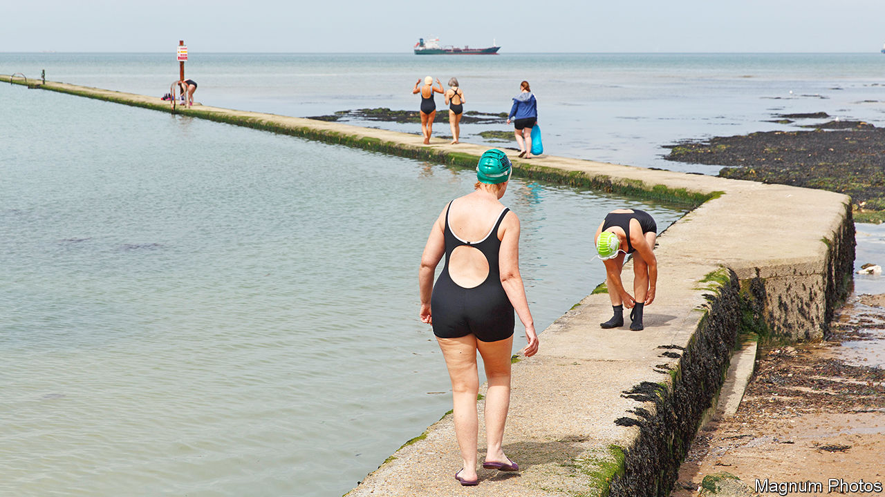

###### Ebb and flow

# Britons still do like to be beside the seaside 

##### The changing tides of coastal towns 

 

> Jun 3rd 2023 

In 1936 an enterprising businessman lit upon a way to make the  even more of an endurance test. To icy seas, leaden skies and average annual temperatures of 10°C, Billy Butlin added low, wooden huts to house holidaymakers; a Tannoy system to rouse them each morning; and stringent rules to confine them to those huts by 11.15pm. Butlin, observed the author Bill Bryson, had repackaged “the prisoner-of-war camp as holiday, and, this being Britain, people loved it.”

Britain invented the seaside resort in the 18th century and has regretted it on and off ever since. Economists wring their hands over seaside towns (they are, on average, older, more deprived and in deeper decline than those inland). Metropolitan politicians fret about them (their inhabitants were among the likeliest to vote for Brexit). Writers take social safaris to them to produce prose that is, broadly speaking, a variation on: “Good Lord, this is ghastly.” Never, wrote Paul Theroux of a visit to Morecambe, had he ever “felt more alien in Britain than when I was watching people enjoying their sort of seaside vacation.”

Yet despite the continuing distress to intellectuals, many Britons do enjoy the seaside, and not without cause. And they don’t just go there but live there, in large numbers. Partly this is an accident of geography—Britain is so narrow that everyone lives within 75 miles (120km) of the coast—but it is not just that. More than 5.3m people live in the coastal towns of England and Wales. An annual average of 12.5m people chose to visit Blackpool between 2017 and 2019, while Oxford attracted 8m. 

And these places matter. Britain’s coastline, historically seen as the nation’s bulwark against threat, is increasingly regarded as a threat itself. The populist tides that resulted in Brexit could be seen swelling in eastern coastal towns before they lapped inland. According to a poll by Unherd, a news website, places around Skegness regret Brexit less than any others. Robert Ford, a professor of political science at Manchester University who saw the tide coming in, thinks that they are “fertile soil for…any kind of resentment-based cause”. Mr Theroux’s incomprehension is not an option: to understand Britain, you need to understand its coasts.

In many resorts the decline is evident: the towns of today are housed like hermit crabs in structures—Imperial Hotels and Pleasure Piers—made for other eras and other inhabitants. The fashion for sea-bathing began in Britain in the 1700s. It was encouraged by royalty: the ailing, inbred Hanoverians took to the water in the hope of curing their ills. To an extent it was also enabled by it: the crown still owns long stretches of England’s foreshore (the area between high and low tide) but hasn’t done much with it, allowing generally easy access to the sea. The seaside’s decline was, arguably, royally marked too. It is often said that George V’s dying words were: “Bugger Bognor.”

Piercing breezes

Nonsense, probably (George’s final utterance was more likely the equally minty “God damn you!”), but they captured a truth. By the 1930s the seaside’s affluent heyday was almost over. Now, in Great Yarmouth, many of the advertisements feel frozen in time, as if after an apocalypse: one hotel promises “Colour TV in all Bedrooms”; “Ballroom for Various Dancing Groups” and the ominously opaque “Evening Entertainment” (unlikely to be as entertaining as it once was: many of the waitresses in early holiday camps were, according to one academic, prostitutes). Today, the old Edwardian names can add an air of irony. Few of those walking on Skegness’s “Pleasure Beach” in icy winds look like they are getting much pleasure from it.

If they ever did. When folk from Mass Observation, a social-research group, visited Blackpool in the 1930s they noted “how little laughter there was in Blackpool crowds”. It was less changes in fashion than in transport that did for the British seaside. Epidemiologists speak of “lifetime travel tracks”: the sum of all the plots of a person’s footprints on a map over the course of their life. The popular embrace of the seaside came as trains and paid holidays extended working Britons’ lifetime travel tracks from tens of miles to hundreds; the abandonment of it came when aeroplanes extended them to thousands. By 1981, more people were taking a summer fortnight abroad than at home. Britons did still like to be beside the seaside but, if they could afford it, someone else’s. 

In these years, the seaside slightly lost its self-assurance and its sense of self. The seafront at Great Yarmouth offers a disorienting blend of attractions, including a “California Cliffs” holiday park, a “Monte Carlo” café and a giant Tyrannosaurus rex. Some reasons for decline are good: in nearby Hemsby, a man repairs his Stonehenge-themed crazy golf. He blames coastal decline on a crackdown on school absence: he used to enjoy a 24-week season but, once parents were fined for taking children out of school, “the seasons collapsed”.

But to the south, in Margate, there are—quite literal—signs that things are changing. Londoners, priced out of the capital, are starting to arrive. As they come, the old neon seaside signs promising tropical beaches and T-rexes are being replaced by hand-painted wooden ones in muted middle-class colours for traditional pubs and ice cream. In a new bookshop, earnest sorts in knitwear fret about gentrification—a sure sign of increasing affluence. Today, the shop’s owner says, “you can’t move for flat whites” in Margate. The tide of the British seaside might, at last, be turning. ■


